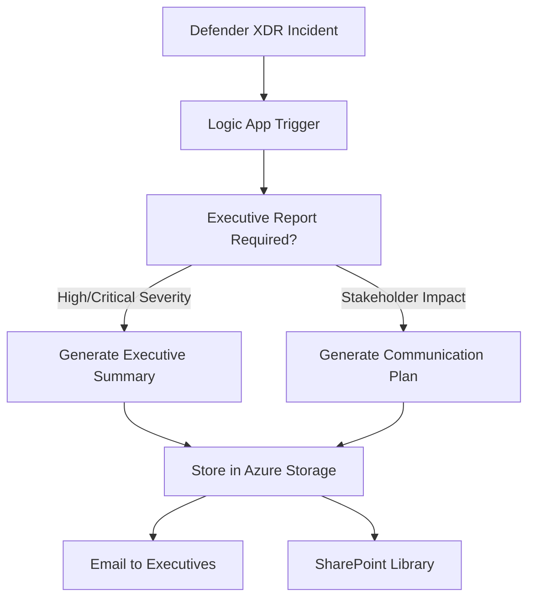

# Module 03.03: Executive AI Communication & Reporting

This module focuses on AI-assisted generation of comprehensive executive communications, stakeholder reports, and long-form security documentation. Unlike Module 03.02 which optimizes for SOC alert comments, this module generates complete documents suitable for leadership briefings, board presentations, and stakeholder communication.

## 📋 Module Overview

### Purpose

Generate comprehensive, professional security communications for executive and business stakeholders using AI analysis of security incidents from Microsoft Defender XDR. This module complements the SOC-focused analysis in Module 03.02 by providing business-oriented, strategic communications.

### Key Differences from Module 03.02

| Aspect | Module 03.02 (SOC Focus) | Module 03.03 (Executive Focus) |
|--------|--------------------------|-------------------------------|
| **Output Format** | Alert comments (900-1000 char limit) | Complete documents (no length restrictions) |
| **Audience** | SOC analysts, security teams | C-suite, board members, stakeholders |
| **Content Focus** | Technical analysis, IOCs, hunting queries | Business impact, strategic implications |
| **Response Time** | Real-time alert enrichment | Scheduled reporting, ad-hoc briefings |
| **Integration** | Defender XDR alert comments | Document generation, email delivery |

## 🎯 Covered Templates

This module implements long-form versions of executive communication templates that require comprehensive analysis:

### Template 4: Executive Summary

- **Purpose**: Complete C-level security briefings and board presentations
- **Output**: Multi-page executive reports with business context
- **Token Allocation**: 1500+ tokens for comprehensive coverage
- **Delivery Method**: Document generation, executive email delivery

### Template 6: Stakeholder Communication

- **Purpose**: Multi-audience communication strategies and messaging
- **Output**: Audience-specific communication plans and templates
- **Token Allocation**: 1200+ tokens for multi-audience coverage
- **Delivery Method**: Communication templates, stakeholder notifications

## 🔧 Architecture Approach

### Document Generation Integration

Instead of Logic Apps alert comments, this module uses:

- **Azure Logic Apps** - Incident triggering and AI analysis orchestration
- **Azure OpenAI Service** - Comprehensive document generation
- **Azure Storage** - Generated report storage and versioning
- **Microsoft Graph API** - Email delivery to executive stakeholders
- **Power Automate** - Optional SharePoint document library integration

### Report Generation Workflow

### Integration Points

- **Input Source**: Microsoft Defender XDR incidents (same as Module 03.02)
- **AI Processing**: Azure OpenAI Service with enhanced prompts
- **Output Delivery**: Document storage, email delivery, SharePoint integration
- **Scheduling**: Event-driven (high severity) + scheduled reporting

## 📊 Success Metrics

### Executive Communication Effectiveness

- **Response Timeliness**: Executive reports generated within 30 minutes of critical incidents
- **Content Quality**: Stakeholder feedback scores >4.5/5 for clarity and actionability
- **Decision Support**: Measurable executive decisions made based on AI-generated insights
- **Cost Efficiency**: Reduced executive briefing preparation time by 80%+

### Business Integration Success

- **Stakeholder Engagement**: Increased executive participation in security decision-making
- **Communication Consistency**: Standardized messaging across all stakeholder levels
- **Process Automation**: Reduced manual report preparation from hours to minutes
- **Strategic Alignment**: Security decisions aligned with business objectives and risk appetite

## � Available Resources

### Core Implementation Files

| Resource | Purpose | Description |
|----------|---------|-------------|
| **[executive-summary-template.md](executive-summary-template.md)** | Executive briefing template | C-level business communication with strategic decision support |
| **[stakeholder-communication-template.md](stakeholder-communication-template.md)** | Multi-audience communication | Coordinated messaging across organizational levels and external parties |
| **[deployment-guide.md](deployment-guide.md)** | Implementation instructions | Step-by-step Logic Apps configuration and Azure integration setup |
| **[testing-guide.md](testing-guide.md)** | Comprehensive testing framework | Systematic validation of template quality and delivery mechanisms |

### Integration and Testing

- **Template Development**: AI Foundry chat interface for prompt testing and optimization
- **Logic Apps Deployment**: Automated document generation and multi-channel delivery
- **Quality Assurance**: Stakeholder feedback integration and continuous improvement
- **Cross-Module Coordination**: Clear separation from SOC-focused analysis in Module 03.02

## �🚀 Next Steps for Implementation

1. **Module 03.02 Cleanup**: Remove executive communication templates, focus on SOC workflows
2. **Module 03.03 Development**: Implement document-based AI communication workflows
3. **Integration Testing**: Validate executive report quality and delivery mechanisms
4. **Stakeholder Onboarding**: Train executive teams on AI-generated security communications

---

## 🤖 AI-Assisted Content Generation

This module design was created with the assistance of **GitHub Copilot** powered by advanced AI language models. The architecture, integration patterns, and executive communication strategies were generated, structured, and refined through iterative collaboration between human expertise and AI assistance within **Visual Studio Code**, incorporating enterprise executive communication standards and Azure AI services integration best practices.

*AI tools were used to enhance productivity and ensure comprehensive coverage of executive communication requirements while maintaining business-focused messaging standards and reflecting enterprise-grade stakeholder engagement practices.*
