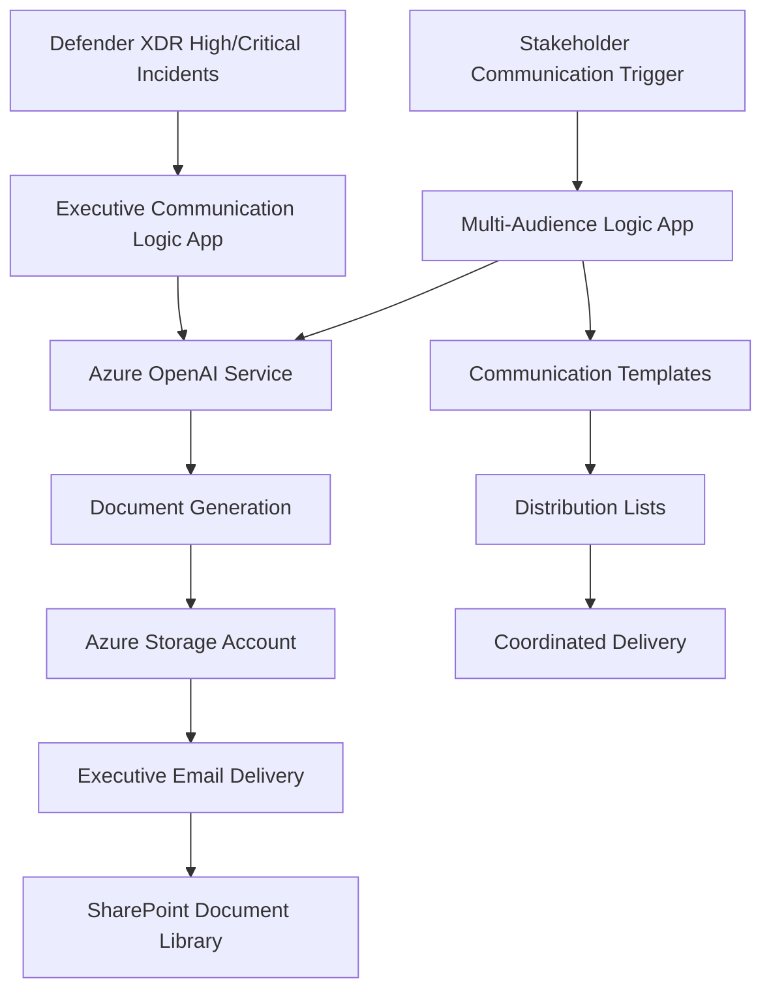

# Module 03.03 Deployment Guide: Executive AI Communication & Reporting

This guide provides step-by-step instructions for deploying AI-assisted executive communication and long-form reporting capabilities separate from SOC alert comment integration.

## 📋 Deployment Overview

### Architecture Components

This module deploys a separate Logic App optimized for document generation and executive delivery rather than alert comment integration.



### Integration Points

- **Input**: Microsoft Defender XDR incidents (same source as Module 03.02)
- **Processing**: Azure OpenAI with extended token limits for comprehensive analysis
- **Output**: PDF reports, email delivery, SharePoint storage (not alert comments)
- **Audience**: Executive leadership, board members, stakeholders (not SOC analysts)

## 🚀 Deployment Steps

### Step 1: Create Executive Communication Logic App

Create a new Logic App separate from your SOC-focused Logic App:

1. **Navigate to Azure Portal**: [https://portal.azure.com](https://portal.azure.com)
2. **Create Logic App**:
   - Resource Group: Use same resource group as Module 03.02
   - Logic App Name: `logic-executive-communication-{unique-suffix}`
   - Region: Same region as existing Azure OpenAI deployment
   - Plan Type: Consumption (for cost optimization)

### Step 2: Configure Triggers for Executive Reporting

#### High/Critical Incident Trigger

Set up incident severity filtering for executive attention:

```json
{
  "type": "ApiConnection",
  "inputs": {
    "host": {
      "connection": {
        "name": "@parameters('$connections')['microsoftdefenderxdr']['connectionId']"
      }
    },
    "method": "get",
    "path": "/incidents",
    "queries": {
      "severityFilter": "High,Critical",
      "statusFilter": "Active"
    }
  }
}
```

#### Stakeholder Impact Assessment

Add business impact filtering:

```json
{
  "condition": {
    "and": [
      {
        "greater": [
          "@length(triggerBody()?['alerts'])",
          5
        ]
      },
      {
        "contains": [
          "@triggerBody()?['classification']",
          "TruePositive"
        ]
      }
    ]
  }
}
```

### Step 3: Configure Azure OpenAI for Long-Form Generation

#### Executive Summary Configuration

```json
{
  "messages": [
    {
      "role": "system",
      "content": "You are an executive cybersecurity advisor providing comprehensive C-level briefings. Generate complete reports of 1500+ tokens covering all 8 required sections thoroughly."
    },
    {
      "role": "user", 
      "content": "Create comprehensive executive briefing covering: 1. Incident Overview 2. Business Impact 3. Strategic Risk 4. Resource Requirements 5. Stakeholder Communication 6. Regulatory Considerations 7. Recovery Timeline 8. Strategic Recommendations. Incident: @{triggerBody()?['displayName']}"
    }
  ],
  "max_tokens": 2000,
  "temperature": 0.3
}
```

#### Stakeholder Communication Configuration

```json
{
  "messages": [
    {
      "role": "system",
      "content": "You are a cybersecurity communications specialist. Create comprehensive multi-audience communication strategies with specific templates for each stakeholder group."
    },
    {
      "role": "user",
      "content": "Develop complete stakeholder communication strategy covering: Technical Teams, Business Leadership, Executive Management, Customer Communication, Regulatory Communication, Media Relations, Partner Notification, Employee Communication. Incident: @{triggerBody()?['displayName']}"
    }
  ],
  "max_tokens": 1500,
  "temperature": 0.2
}
```

### Step 4: Set Up Document Generation

#### PDF Report Creation

Add action to generate executive reports:

```json
{
  "type": "Compose",
  "inputs": {
    "reportTitle": "Executive Security Briefing - @{triggerBody()?['displayName']}",
    "generatedDate": "@{utcnow()}",
    "severity": "@{triggerBody()?['severity']}",
    "executiveContent": "@{body('Generate_Executive_Analysis')['choices'][0]['message']['content']}",
    "classification": "CONFIDENTIAL - EXECUTIVE USE ONLY"
  }
}
```

#### Azure Storage Integration

Configure blob storage for report archival:

```json
{
  "type": "ApiConnection",
  "inputs": {
    "host": {
      "connection": {
        "name": "@parameters('$connections')['azureblob']['connectionId']"
      }
    },
    "method": "post",
    "path": "/v2/datasets/@{encodeURIComponent(encodeURIComponent('executive-reports'))}/files",
    "body": "@{outputs('Create_Executive_Report')}",
    "headers": {
      "Content-Type": "application/pdf"
    },
    "queries": {
      "folderPath": "/executive-briefings/@{formatDateTime(utcnow(), 'yyyy/MM')}/",
      "name": "executive-briefing-@{triggerBody()?['incidentId']}-@{formatDateTime(utcnow(), 'yyyyMMdd-HHmm')}.pdf"
    }
  }
}
```

### Step 5: Configure Executive Email Delivery

#### Microsoft Graph Email Integration

```json
{
  "type": "ApiConnection",
  "inputs": {
    "host": {
      "connection": {
        "name": "@parameters('$connections')['office365']['connectionId']"
      }
    },
    "method": "post",
    "path": "/v2/Mail",
    "body": {
      "To": "executives@company.com;board@company.com",
      "Subject": "SECURITY ALERT - Executive Briefing Required: @{triggerBody()?['displayName']}",
      "Body": "@{outputs('Format_Executive_Email')['emailBody']}",
      "Importance": "High",
      "Attachments": [
        {
          "Name": "Executive-Security-Briefing.pdf",
          "ContentBytes": "@{outputs('Create_Executive_Report')}"
        }
      ]
    }
  }
}
```

#### Distribution List Management

Configure audience-specific distribution:

```json
{
  "switch": [
    {
      "case": "Critical",
      "actions": {
        "Send_Board_Notification": {
          "type": "ApiConnection",
          "inputs": {
            "body": {
              "To": "board@company.com;ceo@company.com;ciso@company.com"
            }
          }
        }
      }
    },
    {
      "case": "High", 
      "actions": {
        "Send_Executive_Notification": {
          "type": "ApiConnection",
          "inputs": {
            "body": {
              "To": "executives@company.com;ciso@company.com"
            }
          }
        }
      }
    }
  ]
}
```

### Step 6: Optional SharePoint Integration

#### Document Library Storage

```json
{
  "type": "ApiConnection",
  "inputs": {
    "host": {
      "connection": {
        "name": "@parameters('$connections')['sharepointonline']['connectionId']"
      }
    },
    "method": "post",
    "path": "/datasets/@{encodeURIComponent('https://company.sharepoint.com/sites/security')}/files",
    "body": "@{outputs('Create_Executive_Report')}",
    "queries": {
      "folderPath": "/Shared Documents/Executive Security Briefings",
      "name": "Executive-Briefing-@{triggerBody()?['incidentId']}.pdf"
    }
  }
}
```

## 🧪 Testing & Validation

### Executive Report Testing

1. **Generate Test Incident**: Create high-severity test alert in Defender for Cloud
2. **Verify Executive Report**: Confirm comprehensive 8-section briefing generation
3. **Validate Email Delivery**: Test distribution to executive email addresses
4. **Check Document Storage**: Verify PDF storage in Azure Blob and SharePoint

### Stakeholder Communication Testing

1. **Multi-Audience Generation**: Test communication strategy for all 8 stakeholder groups
2. **Template Creation**: Verify audience-specific messaging and delivery methods
3. **Distribution Coordination**: Test coordinated delivery across communication channels

## 📊 Monitoring & Success Metrics

### Performance Monitoring

- **Report Generation Time**: Target <5 minutes for complete executive briefing
- **Email Delivery Success**: >99% delivery rate to executive distribution lists
- **Document Storage Reliability**: 100% successful archival to Azure Storage
- **Content Quality**: Regular executive feedback on briefing usefulness

### Business Value Metrics

- **Executive Engagement**: Increased security decision participation by leadership
- **Response Time**: Faster executive decision-making on security incidents
- **Communication Consistency**: Unified messaging across all stakeholder groups
- **Cost Efficiency**: Reduced manual briefing preparation time by 80%+

## 🔒 Security & Compliance

### Data Protection

- **Encryption**: All reports encrypted at rest in Azure Storage
- **Access Control**: RBAC-based access to executive communication Logic App
- **Audit Logging**: Complete audit trail for all executive communications
- **Retention Policy**: Automatic document lifecycle management

### Compliance Alignment

- **Regulatory Reporting**: Automated compliance with breach notification requirements
- **Executive Oversight**: Board-level security oversight through automated briefings
- **Risk Management**: Enhanced executive risk awareness through comprehensive reporting

---

## 🤖 AI-Assisted Content Generation

This deployment guide was created with the assistance of **GitHub Copilot** powered by advanced AI language models. The architecture design, Logic App configurations, and integration patterns were generated, structured, and refined through iterative collaboration between human expertise and AI assistance within **Visual Studio Code**.

*AI tools were used to enhance productivity and ensure comprehensive coverage of deployment requirements while maintaining enterprise-grade security practices and executive communication standards.*
