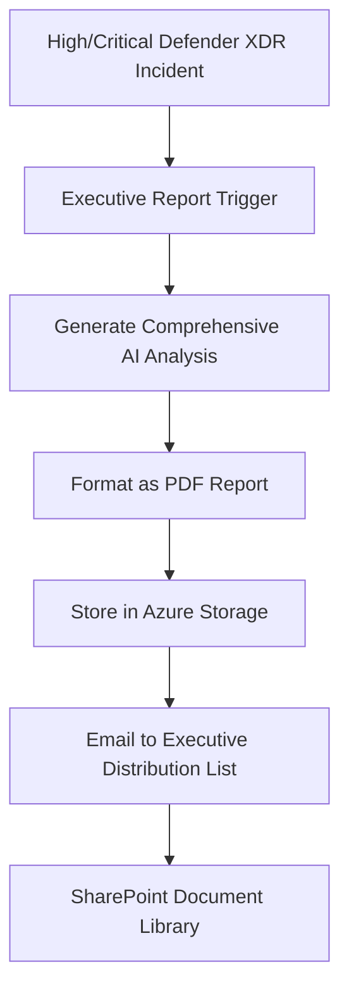

# Template 4: Executive Summary - Document Generation Integration

This template provides comprehensive C-level security briefings optimized for document generation and executive delivery, not alert comments.

## 🎯 Purpose

Generate complete executive reports for security incidents that require board-level decision making and strategic business context.

## 📊 Key Differences from Module 03.02

| Aspect | Module 03.02 (Alert Comments) | Module 03.03 (Executive Reports) |
|--------|-------------------------------|-----------------------------------|
| **Output Length** | 900-1000 characters (API limit) | Unlimited document length |
| **Token Allocation** | 350-500 tokens | 1500-2000+ tokens |
| **Content Structure** | 4-section structured comments | 8-section comprehensive briefing |
| **Delivery Method** | Defender XDR alert comments | PDF reports, email delivery |
| **Audience** | SOC analysts, security teams | C-suite, board members, executives |

## 📄 Document Generation Template

### System Message

```json
{
  "role": "system",
  "content": "You are an executive cybersecurity advisor providing comprehensive C-level briefings. Create detailed executive communications that cover all aspects of security incidents with business context, strategic implications, and actionable recommendations. Your briefings must be thorough, complete, and suitable for board-level decision making. Generate comprehensive reports of 1500+ tokens covering all required sections completely."
}
```

### User Message Template

```json
{
  "role": "user",
  "content": "Create a comprehensive executive cybersecurity briefing for senior leadership about this security incident. Your briefing must address ALL of the following sections with substantial detail:\n\n1. INCIDENT OVERVIEW & CLASSIFICATION\n2. IMMEDIATE BUSINESS IMPACT ASSESSMENT\n3. STRATEGIC RISK & COMPLIANCE IMPLICATIONS\n4. RESOURCE REQUIREMENTS & BUDGET CONSIDERATIONS\n5. STAKEHOLDER COMMUNICATION STRATEGY\n6. REGULATORY & LEGAL CONSIDERATIONS\n7. RECOVERY TIMELINE & SUCCESS METRICS\n8. LONG-TERM STRATEGIC RECOMMENDATIONS\n\nFor each section, provide comprehensive analysis with specific details, quantified impacts where possible, and actionable recommendations. Ensure your briefing is complete and addresses executive decision-making needs. Generate a complete report of at least 1500 tokens.\n\nIncident Details:\nTitle: {{incident_title}}\nDescription: {{incident_description}}\nSeverity: {{incident_severity}}\nAffected Systems: {{affected_systems}}\nBusiness Impact: {{business_impact}}\n\nBegin your comprehensive executive briefing:"
}
```

### Token Configuration

- **Max Tokens**: 2000
- **Target Length**: 1500+ tokens
- **Expected Output**: 8-12 page executive report

## 🏗️ Architecture Implementation

### Logic App Workflow for Document Generation



### Integration Components

1. **Azure Logic Apps**: Incident processing and document generation orchestration
2. **Azure OpenAI**: Comprehensive executive briefing generation
3. **Azure Storage**: PDF report storage and versioning
4. **Microsoft Graph**: Executive email delivery
5. **Power Automate**: SharePoint integration (optional)

## 📋 Expected Output Sections

### 1. Incident Overview & Classification
- Threat classification and severity assessment
- Timeline of events and discovery methods
- Initial containment actions taken
- Executive summary of threat landscape context

### 2. Immediate Business Impact Assessment
- Operational disruption quantification
- Financial impact estimates (direct and indirect)
- Customer and partner implications
- Service availability and performance impacts

### 3. Strategic Risk & Compliance Implications
- Regulatory compliance exposure assessment
- Reputational risk evaluation
- Competitive advantage implications
- Long-term business continuity considerations

### 4. Resource Requirements & Budget Considerations
- Immediate response resource allocation
- External consultant and vendor requirements
- Technology and tool investment needs
- Staff overtime and additional personnel costs

### 5. Stakeholder Communication Strategy
- Internal communication coordination
- Customer and partner notification plans
- Media and public relations considerations
- Regulatory body notification requirements

### 6. Regulatory & Legal Considerations
- Breach notification obligations
- Legal counsel engagement requirements
- Audit and forensic investigation scope
- Compliance framework alignment needs

### 7. Recovery Timeline & Success Metrics
- Immediate containment objectives (0-24 hours)
- Short-term recovery milestones (1-7 days)
- Long-term restoration targets (1-4 weeks)
- Key performance indicators for recovery success

### 8. Long-Term Strategic Recommendations
- Security architecture improvements
- Process and procedure enhancements
- Investment priorities for risk reduction
- Organizational capability development needs

## 🚀 Implementation Steps

1. **Create Logic App Workflow**: Import template configuration for document generation
2. **Configure Azure Storage**: Set up executive report storage container
3. **Set Up Email Distribution**: Configure Microsoft Graph for executive delivery
4. **Test Report Generation**: Validate comprehensive output with sample incidents
5. **Executive Onboarding**: Train leadership team on AI-generated security briefings

---

## 🤖 AI-Assisted Content Generation

This executive communication template was created with the assistance of **GitHub Copilot** powered by advanced AI language models. The template structure, business communication strategies, and integration architecture were generated, structured, and refined through iterative collaboration between human expertise and AI assistance within **Visual Studio Code**.

*AI tools were used to enhance productivity and ensure comprehensive coverage of executive communication requirements while maintaining C-level appropriate messaging and reflecting enterprise-grade stakeholder engagement best practices.*
