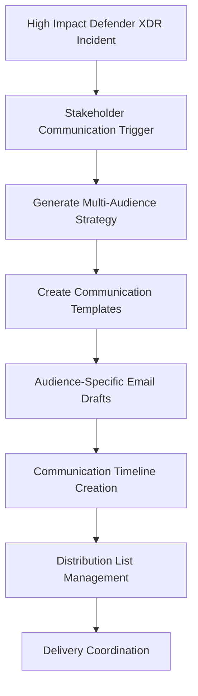

# Template 6: Stakeholder Communication - Document Generation Integration

This template provides comprehensive multi-audience communication strategies optimized for document generation and stakeholder coordination, not alert comments.

## 🎯 Purpose

Generate complete stakeholder communication plans for security incidents that require coordinated messaging across multiple organizational levels and external parties.

## 📊 Key Differences from Module 03.02

| Aspect | Module 03.02 (Alert Comments) | Module 03.03 (Communication Plans) |
|--------|-------------------------------|-------------------------------------|
| **Output Length** | 900-1000 characters per comment | Unlimited document length |
| **Token Allocation** | 400-500 tokens | 1200-1500 tokens |
| **Content Structure** | 5-section comment breakdown | Comprehensive communication strategy |
| **Delivery Method** | Defender XDR alert comments | Communication templates, email drafts |
| **Audience** | SOC analysts for coordination | All stakeholder groups directly |

## 📄 Document Generation Template

### System Message

```json
{
  "role": "system",  
  "content": "You are a cybersecurity communications specialist with expertise in multi-stakeholder incident communication. Create comprehensive communication strategies that address different audience needs while maintaining security and operational integrity. Generate detailed communication plans with audience-specific messaging, delivery methods, and escalation procedures."
}
```

### User Message Template

```json
{
  "role": "user",
  "content": "COMPREHENSIVE STAKEHOLDER COMMUNICATION STRATEGY:\n\nDevelop detailed multi-audience communication approach for this security incident. Create complete communication strategy with these requirements:\n\n1. TECHNICAL TEAMS COMMUNICATION\n2. BUSINESS LEADERSHIP MESSAGING\n3. EXECUTIVE MANAGEMENT BRIEFING\n4. CUSTOMER COMMUNICATION STRATEGY\n5. REGULATORY COMMUNICATION PLAN\n6. MEDIA & PUBLIC RELATIONS APPROACH\n7. PARTNER & VENDOR NOTIFICATION\n8. INTERNAL EMPLOYEE COMMUNICATION\n\nFor each audience, provide:\n- Key messages and talking points\n- Communication methods and timing\n- Escalation triggers and procedures\n- Template messaging with placeholders\n- Success metrics and feedback mechanisms\n\nIncident Details:\nTitle: {{incident_title}}\nDescription: {{incident_description}}\nSeverity: {{incident_severity}}\nBusiness Impact: {{business_impact}}\nStakeholder Impact: {{stakeholder_impact}}\n\nGenerate comprehensive stakeholder communication strategy:"
}
```

### Token Configuration

- **Max Tokens**: 1500
- **Target Length**: 1200+ tokens
- **Expected Output**: Complete communication plan with templates

## 🏗️ Architecture Implementation

### Communication Delivery Workflow



### Integration Components

1. **Azure Logic Apps**: Communication strategy generation and delivery orchestration
2. **Azure OpenAI**: Multi-audience message creation
3. **Microsoft Graph**: Email template generation and distribution
4. **SharePoint**: Communication template storage and versioning
5. **Power Automate**: Multi-channel communication delivery

## 📋 Expected Output Sections

### 1. Technical Teams Communication

- **Audience**: SOC analysts, IT teams, security engineers
- **Key Messages**: Technical details, remediation steps, system impact
- **Delivery Method**: Slack channels, email, internal portals
- **Timing**: Immediate (within 30 minutes)
- **Template**: Technical incident briefing with IOCs and response actions

### 2. Business Leadership Messaging

- **Audience**: Department heads, business unit managers
- **Key Messages**: Operational impact, resource needs, timeline
- **Delivery Method**: Management briefings, email updates
- **Timing**: Within 2 hours of incident confirmation
- **Template**: Business impact summary with action requirements

### 3. Executive Management Briefing

- **Audience**: C-level executives, board members
- **Key Messages**: Strategic implications, decision requirements, risk exposure
- **Delivery Method**: Executive briefing documents, scheduled calls
- **Timing**: Within 4 hours for high/critical incidents
- **Template**: Executive summary with decision framework

### 4. Customer Communication Strategy

- **Audience**: External customers, clients, service users
- **Key Messages**: Service impact, resolution timeline, protective measures
- **Delivery Method**: Customer portals, email, website updates
- **Timing**: Coordinate with legal/compliance requirements
- **Template**: Customer notification with reassurance messaging

### 5. Regulatory Communication Plan

- **Audience**: Regulatory bodies, compliance authorities
- **Key Messages**: Breach notification, compliance status, remediation plans
- **Delivery Method**: Formal notifications, regulatory portals
- **Timing**: Within regulatory requirements (typically 72 hours)
- **Template**: Compliance notification with regulatory alignment

### 6. Media & Public Relations Approach

- **Audience**: Media outlets, industry analysts, public
- **Key Messages**: Transparent response, security commitment, customer protection
- **Delivery Method**: Press releases, media statements
- **Timing**: Coordinated with legal and executive approval
- **Template**: Media response with key talking points

### 7. Partner & Vendor Notification

- **Audience**: Business partners, vendors, suppliers
- **Key Messages**: Partnership impact, collaboration needs, security status
- **Delivery Method**: Partner portals, direct communication
- **Timing**: Within 24 hours if partnership affected
- **Template**: Partner notification with collaboration requests

### 8. Internal Employee Communication

- **Audience**: All employees, specific departments
- **Key Messages**: Security awareness, procedural updates, reassurance
- **Delivery Method**: Internal email, intranet, team meetings
- **Timing**: Coordinated with external communications
- **Template**: Employee update with security awareness messaging

## 🚀 Implementation Steps

1. **Create Communication Workflow**: Import stakeholder communication Logic App template
2. **Configure Distribution Lists**: Set up audience-specific contact management
3. **Set Up Template Storage**: Configure SharePoint for communication templates
4. **Test Multi-Audience Delivery**: Validate messaging across all stakeholder groups
5. **Stakeholder Onboarding**: Train teams on AI-generated communication strategies

## 📊 Success Metrics

### Communication Effectiveness

- **Response Timeliness**: All stakeholders notified within target timeframes
- **Message Consistency**: Unified messaging across all communication channels
- **Stakeholder Satisfaction**: Feedback scores >4.0/5 for clarity and usefulness
- **Decision Velocity**: Faster stakeholder decision-making based on clear communication

### Operational Benefits

- **Reduced Manual Effort**: 90% reduction in communication template preparation time
- **Improved Coordination**: Better alignment across all stakeholder groups
- **Enhanced Compliance**: Consistent regulatory and legal communication standards
- **Stronger Relationships**: Maintained stakeholder confidence through transparent communication

---

## 🤖 AI-Assisted Content Generation

This stakeholder communication template was created with the assistance of **GitHub Copilot** powered by advanced AI language models. The multi-audience communication strategies, template structures, and delivery coordination approaches were generated, structured, and refined through iterative collaboration between human expertise and AI assistance within **Visual Studio Code**.

*AI tools were used to enhance productivity and ensure comprehensive coverage of stakeholder communication requirements while maintaining audience-appropriate messaging standards and reflecting enterprise-grade crisis communication best practices.*
