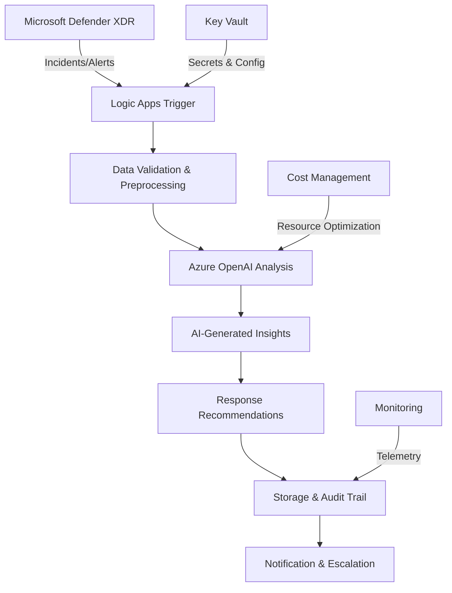

# Week 2 to Week 3 Bridge - Integration Readiness & Transition Preparation

This bridge module ensures seamless transition from Week 2's AI Foundation & Secure Model Deployment to Week 3's advanced automation and logic app workflows. The module provides comprehensive integration validation, prerequisite verification, and automation preparation to enable smooth progression to AI-driven security operations with Microsoft Defender XDR and Logic Apps.

## 📋 Module Overview

### Learning Objectives

- Validate complete AI foundation readiness for advanced automation integration and workflow orchestration.
- Establish baseline security performance metrics and integration capabilities for Logic Apps connectivity.
- Prepare automation prerequisites including service connections, permissions, and data flow architectures.
- Configure integration testing frameworks for seamless transition to AI-driven security automation workflows.
- Document operational readiness and create transition validation reports for stakeholder review and approval.

### Key Components

- **Integration Readiness Assessment**: Comprehensive validation of AI foundation components and readiness for automation workflows.
- **Logic Apps Preparation**: Service connection setup, authentication configuration, and workflow architecture planning.
- **Data Flow Architecture**: Integration pathway design for AI insights into security operations and incident response.
- **Automation Prerequisites**: Permission validation, service authentication, and connectivity testing for seamless workflow integration.
- **Transition Documentation**: Complete readiness reports, integration guides, and operational procedures for Week 3 advancement.

## 🌉 Bridge Architecture & Integration Framework

### Week 2 Foundation Validation

**AI Foundation Component Verification**:

| Component | Validation Scope | Integration Readiness |
|-----------|-----------------|----------------------|
| **Azure OpenAI Service** | Deployment status, model availability, API connectivity | Logic Apps integration endpoints |
| **Storage Foundation** | Account creation, access policies, data organization | Workflow data persistence layer |
| **Cost Management** | Budget controls, alert systems, optimization policies | Automated resource lifecycle management |
| **Security Configuration** | Access controls, key vault integration, compliance validation | Secure automation architecture |

**Performance Baseline Establishment**:

```json
{
  "week2_baseline_metrics": {
    "ai_performance": {
      "model_response_time": "<2 seconds",
      "token_efficiency": "90% within 450-token limits",
      "api_success_rate": ">99%",
      "cost_per_analysis": "<$0.50"
    },
    "integration_endpoints": {
      "openai_api_availability": "100%",
      "storage_access_latency": "<500ms",
      "key_vault_authentication": "Functional",
      "monitoring_data_flow": "Active"
    },
    "automation_readiness": {
      "service_connections": "Configured",
      "authentication_flows": "Validated",
      "data_pipelines": "Operational",
      "error_handling": "Implemented"
    }
  }
}
```

### Week 3 Integration Preparation

**Logic Apps Workflow Architecture**:

- **Incident Analysis Pipeline**: AI-powered security incident analysis with automated triage and response recommendations
- **Threat Intelligence Integration**: Real-time threat analysis with AI-enhanced context and actionable insights  
- **Automated Response Workflows**: Intelligent automation for incident escalation, notification, and remediation actions
- **Performance Monitoring**: Continuous monitoring of AI-driven automation performance and effectiveness metrics

**Service Connection Requirements**:

| Connection Type | Purpose | Authentication Method | Integration Point |
|-----------------|---------|----------------------|------------------|
| **Microsoft Graph** | Security incidents/alerts data access | App Registration with delegated permissions | Defender XDR data ingestion |
| **Azure OpenAI** | AI analysis and insight generation | Managed Identity with service authentication | Intelligent analysis workflows |
| **Storage Account** | Workflow data persistence and logging | System-assigned Managed Identity | Data retention and audit trails |
| **Key Vault** | Secure credential and secret management | Managed Identity with secret access policies | Secure automation architecture |

## 🔧 Implementation Methods

### Option 1: Comprehensive Automated Bridge Setup

**Complete Integration Readiness Deployment**:

```powershell
# Execute complete bridge preparation with comprehensive validation
cd "scripts\scripts-deployment"
.\Deploy-Week2ToWeek3Bridge.ps1 -UseParametersFile -ComprehensiveValidation -PrepareLogicApps

# Alternative with custom integration scope
.\Deploy-Week2ToWeek3Bridge.ps1 -EnvironmentName "aisec" -EnableLogicAppsPrep -ValidateAllComponents -GenerateReports
```

**Key Script Features**:

- Automated validation of all Week 2 AI foundation components with integration readiness assessment
- Logic Apps service connection preparation with authentication configuration and permission validation
- Data flow architecture setup with integration pathway testing and performance baseline establishment
- Comprehensive transition documentation generation with readiness reports and operational procedures

### Option 2: Infrastructure as Code (Bicep) Integration Setup

**Template-Based Bridge Infrastructure**:

```bash
# Deploy bridge infrastructure using comprehensive Bicep templates
az deployment sub create \
  --location "East US" \
  --template-file "infra/bridge/week2-to-week3-bridge.bicep" \
  --parameters "@infra/main.parameters.json"
```

**Template Components**:

- Service connection definitions with proper authentication and permission scopes
- Data flow infrastructure for AI insights integration into security operations workflows
- Monitoring and logging setup for transition validation and performance tracking
- Integration testing framework for automated validation of readiness criteria

### Option 3: Manual Validation & Configuration

**Step-by-Step Transition Preparation**:

- Component-by-component validation of Week 2 AI foundation with integration testing
- Manual service connection setup with authentication verification and permission validation
- Integration pathway testing with data flow validation and performance measurement
- Documentation creation with stakeholder review and approval workflows

## ✅ Integration Readiness Checklist

### AI Foundation Validation

**Core Component Verification**:

- [ ] **Azure OpenAI Service**: Deployed, configured, and responsive with validated model performance
- [ ] **Storage Account Foundation**: Created with proper access policies and data organization structure
- [ ] **Key Vault Integration**: Operational with secure credential management and access validation
- [ ] **Cost Management**: Active with budget controls and automated optimization policies
- [ ] **Security Configuration**: Implemented with proper access controls and compliance validation

**Performance Baseline Validation**:

- [ ] **AI Response Times**: Consistently <2 seconds for security analysis requests
- [ ] **Token Efficiency**: 90%+ of responses within 450-token optimization limits
- [ ] **API Reliability**: >99% success rate for OpenAI service API calls
- [ ] **Cost Performance**: <$0.50 per analysis with optimization strategies active
- [ ] **Integration Endpoints**: All service endpoints responsive and properly authenticated

### Logic Apps Prerequisites

**Service Connection Preparation**:

- [ ] **Microsoft Graph Connection**: App registration created with appropriate security permissions
- [ ] **Azure OpenAI Connection**: Managed identity configured with service authentication
- [ ] **Storage Connection**: System-assigned managed identity with proper access policies  
- [ ] **Key Vault Connection**: Managed identity authentication with secret access validation
- [ ] **Monitoring Integration**: Logging and telemetry configured for workflow visibility

**Authentication & Permissions**:

- [ ] **App Registration**: Created with SecurityIncident.Read.All and SecurityAlert.Read.All permissions
- [ ] **Managed Identities**: Configured for OpenAI, Storage, and Key Vault service access
- [ ] **RBAC Assignments**: Proper role assignments for automation service accounts
- [ ] **Permission Validation**: All service connections tested and functional
- [ ] **Security Review**: Authentication architecture validated for security best practices

### Data Flow Architecture

**Integration Pathway Setup**:

- [ ] **Data Ingestion**: Microsoft Graph to Logic Apps data flow tested and operational
- [ ] **AI Processing**: Logic Apps to Azure OpenAI integration validated with performance testing
- [ ] **Data Persistence**: Results storage in Azure Storage with proper organization and retention
- [ ] **Monitoring Pipeline**: Telemetry and logging data flow to monitoring systems
- [ ] **Error Handling**: Comprehensive error handling and retry policies implemented

**Performance & Reliability**:

- [ ] **Latency Testing**: End-to-end workflow latency within acceptable thresholds
- [ ] **Throughput Validation**: System capacity tested for expected incident volumes
- [ ] **Error Rate Monitoring**: Error handling tested with various failure scenarios
- [ ] **Recovery Procedures**: Disaster recovery and business continuity plans documented
- [ ] **Scaling Preparation**: Auto-scaling policies configured for variable workloads

## 🚀 Week 3 Automation Preparation

### Logic Apps Workflow Framework

**Incident Analysis Automation**:

**Primary Workflow Components**:

```json
{
  "incident_analysis_workflow": {
    "trigger": "HTTP Request or Scheduled Recurrence",
    "data_source": "Microsoft Graph Security API",
    "ai_processing": "Azure OpenAI GPT-4o-mini analysis",
    "output_format": "Structured JSON with actionable insights",
    "persistence": "Azure Storage with audit trail",
    "notifications": "Teams, email, or webhook delivery"
  }
}
```

**Workflow Architecture Benefits**:

- **Automated Triage**: AI-powered incident severity assessment and priority ranking
- **Context Enhancement**: Intelligent analysis with relevant threat intelligence integration
- **Response Recommendations**: Actionable guidance for security teams with confidence scoring
- **Audit Trail**: Complete workflow execution logging for compliance and optimization

### Advanced Integration Capabilities

**AI-Enhanced Security Operations**:

- **Real-Time Analysis**: Continuous monitoring with immediate AI-powered incident assessment
- **Contextual Intelligence**: Enhanced threat analysis with historical pattern recognition
- **Automated Escalation**: Intelligent incident routing based on severity and organizational policies
- **Performance Optimization**: Continuous learning and workflow improvement based on outcomes

**Scalability & Performance**:

- **Dynamic Scaling**: Automatic workflow scaling based on incident volume and complexity
- **Resource Optimization**: Efficient resource utilization with cost-aware automation
- **High Availability**: Redundant workflow architecture with failover capabilities
- **Monitoring & Alerting**: Comprehensive operational monitoring with proactive issue detection

## 📊 Transition Validation Framework

### Comprehensive Readiness Assessment

**Technical Validation Criteria**:

| Assessment Area | Validation Method | Success Criteria | Integration Impact |
|-----------------|-------------------|------------------|-------------------|
| **AI Performance** | Automated testing suite | Response time <2s, accuracy >90% | Workflow responsiveness |
| **Service Connectivity** | Connection testing | 100% service availability | Reliable data flow |
| **Authentication** | Permission validation | All required scopes granted | Secure operations |
| **Data Flow** | End-to-end testing | Complete pipeline functionality | Seamless integration |
| **Error Handling** | Failure scenario testing | Graceful error recovery | Operational resilience |

**Operational Readiness Validation**:

- **Documentation Review**: Complete operational procedures and troubleshooting guides
- **Team Readiness**: Staff training and certification for new automation workflows
- **Monitoring Setup**: Comprehensive telemetry and alerting for proactive management
- **Backup & Recovery**: Disaster recovery procedures tested and documented
- **Compliance Validation**: Security and compliance requirements verified and documented

### Performance Benchmarking

**Baseline Metrics Establishment**:

```json
{
  "transition_benchmarks": {
    "processing_metrics": {
      "incident_analysis_time": "45-90 seconds end-to-end",
      "ai_response_generation": "<5 seconds",
      "data_persistence": "<2 seconds",
      "notification_delivery": "<10 seconds"
    },
    "reliability_metrics": {
      "workflow_success_rate": ">98%",
      "error_recovery_time": "<5 minutes",
      "availability_target": "99.9%",
      "scalability_factor": "10x incident volume capacity"
    },
    "cost_efficiency": {
      "cost_per_incident_analysis": "<$0.75",
      "resource_utilization": "70-85% optimal range",
      "automation_roi": ">200% efficiency gain",
      "scaling_cost_linear": "Proportional to incident volume"
    }
  }
}
```

## 🎯 Learning Path Integration

### Prerequisites Validation

**Week 2 Completion Requirements**:

- **Module 02.01-02.05**: Complete AI foundation deployment with all components operational
- **Module 02.06**: AI foundation validation completed with performance benchmarks established
- **Module 02.07**: Cost management active with budget controls and optimization policies
- **Service Integration**: All AI foundation components properly integrated and tested

### Connection to Week 3 Modules

**Direct Integration Points**:

- **Week 3 Logic Apps**: Service connections and authentication prepared for immediate deployment
- **Automated Workflows**: Data flow architecture ready for AI-driven security automation
- **Integration Testing**: Validation framework established for ongoing workflow optimization
- **Operational Readiness**: Documentation and procedures prepared for production automation

### Expected Outcomes

After completing this bridge preparation:

- **Validated AI Foundation**: Complete confidence in AI infrastructure readiness for automation
- **Logic Apps Readiness**: All prerequisites configured for immediate Week 3 workflow deployment  
- **Integration Architecture**: Data flow pathways established and tested for seamless operation
- **Performance Baselines**: Benchmark metrics established for ongoing optimization and scaling
- **Operational Documentation**: Complete transition guides and operational procedures for team readiness

## 🔄 Automation Architecture Overview

### Data Flow Integration

**End-to-End Workflow Architecture**:



**Integration Benefits**:

- **Seamless Data Flow**: Automated data pipeline from security tools to AI analysis
- **Intelligent Processing**: AI-enhanced security analysis with actionable insights
- **Audit & Compliance**: Complete logging and audit trail for regulatory requirements
- **Scalable Architecture**: Dynamic scaling based on security incident volume and complexity

### Service Integration Architecture

**Multi-Service Orchestration**:

- **Primary Services**: Logic Apps, Azure OpenAI, Microsoft Graph, Storage Accounts
- **Supporting Services**: Key Vault, Monitor, Cost Management, Security Center
- **Integration Layer**: Managed identities, service connections, and API management
- **Monitoring Layer**: Application Insights, Log Analytics, and custom dashboards

## 🚨 Troubleshooting & Validation

### Common Integration Challenges

**Service Connection Issues**:

- **Authentication Failures**: Verify app registration permissions and managed identity configuration
- **API Connectivity**: Test all service endpoints and validate network connectivity
- **Permission Scope**: Confirm required permissions granted for security data access
- **Token Refresh**: Validate automatic token renewal for long-running workflows

**Data Flow Problems**:

- **Data Format Validation**: Ensure consistent data structure between services
- **Processing Latency**: Optimize data transformation and AI processing pipeline
- **Storage Access**: Verify storage account permissions and data organization
- **Error Propagation**: Test error handling throughout the integration pipeline

**Performance Optimization**:

- **Resource Scaling**: Configure appropriate scaling policies for variable workloads
- **Cost Optimization**: Balance performance requirements with cost-efficient resource usage
- **Latency Reduction**: Optimize service calls and data transfer patterns
- **Throughput Management**: Ensure adequate capacity for peak incident volumes

### Validation Testing Framework

**Comprehensive Testing Approach**:

**Unit Testing**:

- Individual service connection validation with authentication verification
- AI model response testing with various incident types and complexity levels
- Data transformation validation with edge cases and error scenarios
- Storage operations testing with proper access control and retention policies

**Integration Testing**:

- End-to-end workflow validation with realistic security incident scenarios
- Performance testing under various load conditions and incident volumes
- Error handling validation with failure injection and recovery testing
- Security validation with penetration testing and vulnerability assessment

**Acceptance Testing**:

- User acceptance testing with security operations teams and stakeholders
- Operational readiness validation with complete workflow execution
- Performance acceptance with benchmark comparison and optimization verification
- Documentation validation with team training and operational procedure verification

## 📋 Final Bridge Validation Checklist

### Pre-Week 3 Deployment Verification

**Technical Readiness**:

- [ ] **All Week 2 Components**: Validated and operational with performance benchmarks met
- [ ] **Service Connections**: Configured and tested with proper authentication and permissions
- [ ] **Data Flow Architecture**: Established and validated with end-to-end testing completed
- [ ] **Performance Baselines**: Measured and documented with optimization recommendations
- [ ] **Error Handling**: Implemented and tested with comprehensive failure scenario coverage

**Operational Readiness**:

- [ ] **Team Training**: Staff prepared for new automation workflows with certification completed
- [ ] **Documentation**: Complete operational procedures and troubleshooting guides available
- [ ] **Monitoring Setup**: Comprehensive telemetry and alerting configured and tested
- [ ] **Support Procedures**: Escalation paths and support contacts documented and verified
- [ ] **Compliance Validation**: Security and regulatory requirements verified and approved

**Business Readiness**:

- [ ] **Stakeholder Approval**: Business approval for Week 3 automation advancement
- [ ] **Budget Approval**: Cost projections reviewed and approved for expanded automation
- [ ] **Risk Assessment**: Integration risks identified and mitigation strategies documented
- [ ] **Success Metrics**: KPIs defined for Week 3 automation success measurement
- [ ] **Rollback Plan**: Contingency procedures documented for potential integration issues

## 🎉 Success Indicators & Next Steps

### Bridge Completion Criteria

**Technical Success Indicators**:

- All AI foundation components validated and performance benchmarks exceeded
- Logic Apps prerequisites configured with 100% authentication success rate
- Data flow architecture tested with end-to-end validation completed
- Integration testing passed with comprehensive scenario coverage
- Monitoring and alerting operational with proactive issue detection

**Operational Success Indicators**:

- Team training completed with certification validation
- Documentation reviewed and approved by stakeholders
- Support procedures tested and validated
- Compliance requirements verified and approved
- Stakeholder sign-off obtained for Week 3 advancement

### Week 3 Readiness Confirmation

**Immediate Next Steps**:

- **Logic Apps Deployment**: Begin Week 3 automation workflow development
- **Incident Analysis**: Implement AI-powered security incident analysis
- **Workflow Optimization**: Continuous improvement of automation processes
- **Performance Monitoring**: Ongoing optimization based on operational metrics
- **Team Integration**: Full operational integration of AI-driven security automation

---

## 🤖 AI-Assisted Content Generation

This comprehensive Week 2 to Week 3 Bridge module documentation was created with the assistance of **GitHub Copilot** powered by advanced AI language models. The content was generated, structured, and refined through iterative collaboration between human expertise and AI assistance within **Visual Studio Code**, incorporating Azure automation architecture best practices, Logic Apps integration methodologies, and enterprise-grade transition validation frameworks.

*AI tools were used to enhance productivity and ensure comprehensive coverage of integration readiness scenarios while maintaining technical accuracy and reflecting current Azure automation best practices for AI-driven security operations workflows.*
