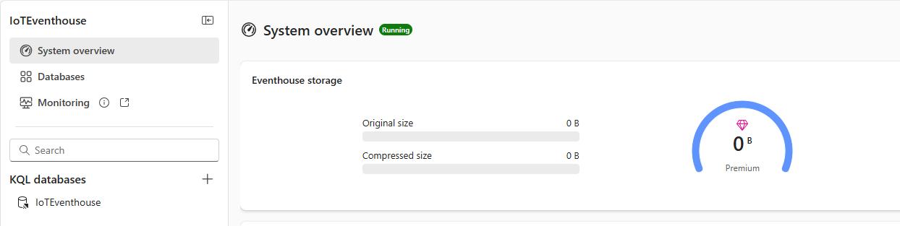
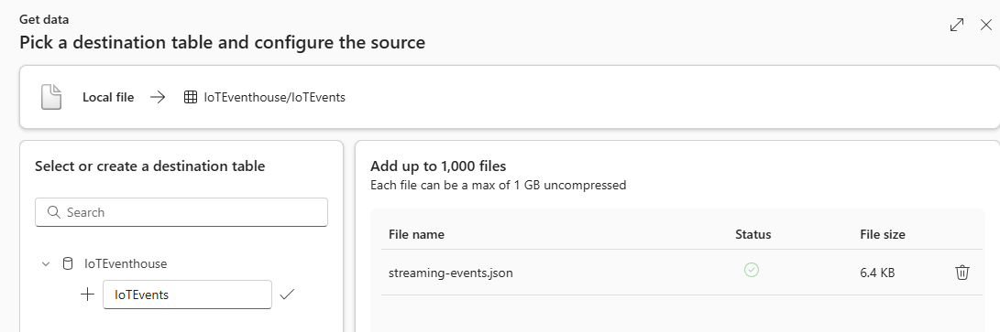
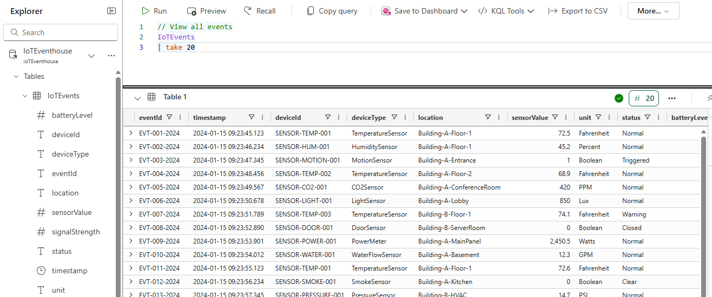
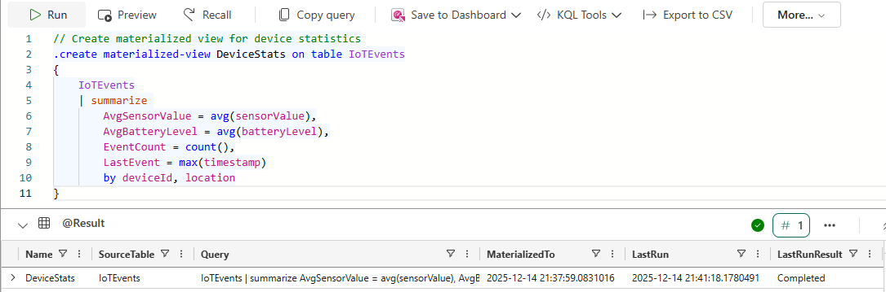
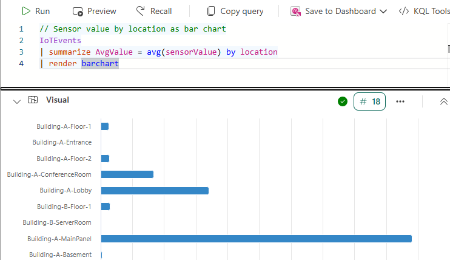

# Lab 05: Real-Time Intelligence with KQL

## 🎯 Objective

Create an Eventhouse and KQL Database to ingest and analyze streaming data using Kusto Query Language (KQL).

**Duration**: 45 minutes

---

## 🏗️ What You'll Build

| Item | Description |
|------|-------------|
| **IoTEventhouse** | Container for real-time analytics databases |
| **IoTEventhouse** (KQL Database) | Time-series database for streaming events |
| **IoTEvents** | Table with simulated IoT device telemetry |
| **DeviceStats** | Materialized view for pre-aggregated device analytics |
| **KQL_IoTAnalytics** | Saved KQL queries for time-series analysis |

### Real-World Context

Real-Time Intelligence addresses **streaming and time-series analytics**:

- **IoT scenarios** — device telemetry, sensor data, equipment monitoring.
- **Security operations** — log analysis, threat detection, incident response.
- **Application monitoring** — performance metrics, error tracking, usage patterns.
- **Operational analytics** — real-time dashboards, alerting, anomaly detection.

KQL (Kusto Query Language) is purpose-built for:

- **High-velocity data** — millions of events per second.
- **Time-series analysis** — trends, patterns, seasonality.
- **Log exploration** — filtering, parsing, correlation.

The skills you learn here apply directly to **Microsoft Sentinel** (security), **Azure Monitor** (operations), and **Azure Data Explorer** (advanced analytics).

---

## 📋 Prerequisites

- [ ] Labs 01-02 completed (Workspace and Lakehouse exist).
- [ ] Access to `Fabric-Purview-Lab` workspace.
- [ ] Sample file: `streaming-events.json` from `data-templates/` folder.

---

## 📊 Real-Time Intelligence Components Overview

| Component | Purpose |
|-----------|---------|
| **Eventhouse** | Container for KQL databases and real-time data |
| **KQL Database** | Stores and queries time-series data |
| **KQL Queryset** | Saved KQL queries for analysis |
| **Eventstream** | Ingests real-time event data |

> **💡 Key Insight**: KQL (Kusto Query Language) is optimized for log and time-series data analysis, making it ideal for IoT, telemetry, and security scenarios.

---

## 🔧 Step 1: Create Eventhouse

### Navigate to Workspace

1. Go to [app.fabric.microsoft.com](https://app.fabric.microsoft.com).
2. Open your **Fabric-Purview-Lab** workspace.

### Create Eventhouse

1. Select **+ New item**.
2. In the **New item** pane, search for **Eventhouse** and select it.
3. Enter name: `IoTEventhouse`.
4. Select **Create**.
5. Wait for provisioning (1-2 minutes).



---

## 🔧 Step 2: Explore KQL Database

### Open KQL Database

1. In the Eventhouse, you'll see the default KQL Database.
2. Select **IoTEventhouse** (the database name).
3. The database overview shows:
   - Database details
   - Tables (empty initially)
   - Query options

---

## 🔧 Step 3: Create Table and Ingest Sample Data

### Prepare Sample Data

First, ensure you have the `streaming-events.json` file from the `data-templates/` folder.

### Get Data into KQL Database

1. In the KQL Database view, select **Get data** in the toolbar.
2. Select **Local file**.
3. In the **Get data** wizard (Source step):
   - Under **Select or create a destination table**, expand **IoTEventhouse**.
   - Select **+ New table**.
   - Enter table name: `IoTEvents`.
   - Drag and drop or browse to select `streaming-events.json`.
   - Select **Next**.



4. In the **Inspect** step:
   - Review the data preview showing columns: `eventId`, `timestamp`, `deviceId`, `deviceType`, `location`, `sensorValue`, `unit`, `status`, `batteryLevel`, `signalStrength`.
   - Verify the mapping looks correct (IoTEvents_mapping).
   - Select **Finish** to complete ingestion.
   - On the **Summary** step, let the processes complete and then select **Close**.

### Verify Data Ingestion

1. After ingestion completes, expand **IoTEventhouse** → **IoTEvents** in the Explorer.
2. Select the table to preview data and confirm it loaded correctly.

---

## 🔧 Step 4: Write KQL Queries

### Open KQL Queryset

1. From the **IoTEvents** table view, select **KQL Queryset** in the toolbar.
2. In the **New KQL Queryset** dialog:
   - Enter name: `KQL_IoTAnalytics`.
   - Select **Create**.
3. The queryset opens with default template queries. Select the **+** tab to create a new blank query tab.
4. In the Explorer pane (left side), expand **IoTEventhouse** → **Tables** → **IoTEvents** to confirm your table is available.

### Query 1: Basic Data Exploration

```kql
// View all events
IoTEvents
| take 20
```

1. Copy this query into the new query tab.
2. Select **Run** or press Shift+Enter.



### Query 2: Event Count by Device

```kql
// Count events per device
IoTEvents
| summarize EventCount = count() by deviceId
| order by EventCount desc
```

### Query 3: Sensor Value Analysis by Location

```kql
// Sensor statistics by location
IoTEvents
| summarize 
    AvgValue = avg(sensorValue),
    MinValue = min(sensorValue),
    MaxValue = max(sensorValue),
    EventCount = count()
    by location
| order by AvgValue desc
```

### Query 4: Time-Based Analysis

```kql
// Events over time (grouped by hour)
IoTEvents
| extend Hour = bin(timestamp, 1h)
| summarize EventCount = count() by Hour
| order by Hour asc
| render timechart
```

### Query 5: Anomaly Detection

```kql
// Find high sensor value events (potential anomalies)
IoTEvents
| where sensorValue > 100
| project timestamp, deviceId, location, deviceType, sensorValue, unit, status
| order by sensorValue desc
```

---

## 🔧 Step 5: Create Materialized View

Materialized views pre-aggregate data for faster queries.

### Create View

```kql
// Create materialized view for device statistics
.create materialized-view DeviceStats on table IoTEvents
{
    IoTEvents
    | summarize 
        AvgSensorValue = avg(sensorValue),
        AvgBatteryLevel = avg(batteryLevel),
        EventCount = count(),
        LastEvent = max(timestamp)
        by deviceId, location
}
```

After running, you'll see metadata about the view (Name, SourceTable, IsHealthy, etc.). To see the aggregated data:



```kql
// Query the materialized view
DeviceStats
```

### Alternative: Create Function (Optional)

> **⏭️ Skip this section** if your materialized view created successfully. Proceed directly to **Step 6: Visualize Query Results**.

If the materialized view command fails in your environment, use a function instead:

```kql
// Create a function for reusable queries
.create-or-alter function DeviceStatistics() {
    IoTEvents
    | summarize 
        AvgSensorValue = avg(sensorValue),
        AvgBatteryLevel = avg(batteryLevel),
        EventCount = count(),
        LastEvent = max(timestamp)
        by deviceId, location
}
```

To use the function:

```kql
// Call the function
DeviceStatistics()
| order by EventCount desc
```

---

## 🔧 Step 6: Visualize Query Results

### Render Charts

```kql
// Sensor value by location as bar chart
IoTEvents
| summarize AvgValue = avg(sensorValue) by location
| render barchart
```



```kql
// Event distribution as pie chart
IoTEvents
| summarize Count = count() by deviceId
| render piechart
```

```kql
// Sensor value trend as line chart
IoTEvents
| order by timestamp asc
| project timestamp, sensorValue
| render linechart
```

### Pin to Dashboard (Optional)

> **📝 Note**: This step is optional and for learning purposes only. The dashboard is not used in later labs — Lab 08 uses Power BI with Warehouse data instead.

If you want to explore real-time dashboards:

1. Run the **bar chart** query (sensor value by location) — it's the most visually informative.
2. Select **Save to Dashboard** in the toolbar (or **Pin to dashboard** if available).
3. Create a new dashboard named `IoT-Monitoring-Dashboard`.
4. The dashboard provides real-time monitoring capabilities for operational scenarios.

---

## 🔧 Step 7: Save KQL Queryset

1. In the KQL Queryset, select **Save** in the toolbar.
2. Verify `KQL_IoTAnalytics` appears in your **Fabric-Purview-Lab** workspace.
3. Close any extra query tabs — the queryset and its queries are saved.

---

## ✅ Validation Checklist

Before proceeding to Lab 06, verify:

- [ ] Eventhouse `IoTEventhouse` exists.
- [ ] KQL Database contains `IoTEvents` table with 20 rows.
- [ ] Materialized view `DeviceStats` exists (check Explorer → Materialized Views).
- [ ] KQL queries execute successfully.
- [ ] At least one visualization renders correctly.
- [ ] KQL Queryset `KQL_IoTAnalytics` is saved to workspace.

---

## ❌ Troubleshooting

### Data Ingestion Fails

**Symptom**: Error when uploading JSON file.

**Resolution**:

1. Verify JSON format is valid (array of objects).
2. Check that file isn't too large (< 100 MB for single upload).
3. Ensure column names don't have spaces or special characters.

### Query Syntax Errors

**Symptom**: KQL query fails to parse.

**Resolution**:

1. KQL is case-sensitive for function names.
2. Use `|` (pipe) to chain operators.
3. End commands with semicolon if running multiple.

### Visualization Not Rendering

**Symptom**: `render` command doesn't show chart.

**Resolution**:

1. Verify data is returned by the query.
2. Check that column types are appropriate for the chart type.
3. Try a different render type (barchart, piechart, timechart).

### Materialized View Fails

**Symptom**: `.create materialized-view` returns error.

**Resolution**:

1. Use functions instead (`.create-or-alter function`).
2. Materialized views have specific requirements in Fabric.
3. Check documentation for current limitations.

---

## 📚 KQL Quick Reference

| Operator | Purpose | Example |
|----------|---------|---------|
| `where` | Filter rows | `where sensorValue > 100` |
| `summarize` | Aggregate data | `summarize avg(sensorValue) by location` |
| `project` | Select columns | `project timestamp, deviceId` |
| `extend` | Add calculated column | `extend ValueCategory = iff(sensorValue > 100, "High", "Normal")` |
| `order by` | Sort results | `order by timestamp desc` |
| `take` | Limit rows | `take 100` |
| `render` | Visualize | `render barchart` |
| `bin` | Time bucketing | `bin(timestamp, 1h)` |

---

## 📚 Related Resources

- [Eventhouse overview](https://learn.microsoft.com/fabric/real-time-intelligence/eventhouse)
- [KQL quick reference](https://learn.microsoft.com/azure/data-explorer/kql-quick-reference)
- [Real-Time Intelligence tutorial](https://learn.microsoft.com/fabric/real-time-intelligence/tutorial-introduction)

---

## ➡️ Next Steps

Proceed to:

**[Lab 06: DLP Data Classification](../06-DLP-Data-Classification/)**

> **🎯 Important**: Lab 06 creates DLP policies to automatically detect sensitive data in your Fabric items. The pay-as-you-go billing you enabled in Lab 00 should now be active.

---

## 🤖 AI-Assisted Content Generation

This lab documentation was created with the assistance of **GitHub Copilot** powered by Claude Opus 4.5. KQL queries were verified against Azure Data Explorer documentation within **Visual Studio Code**.
