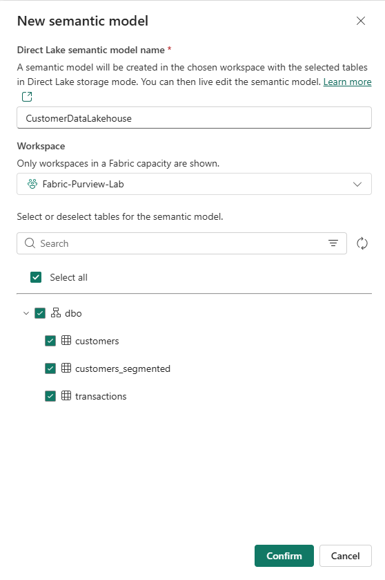
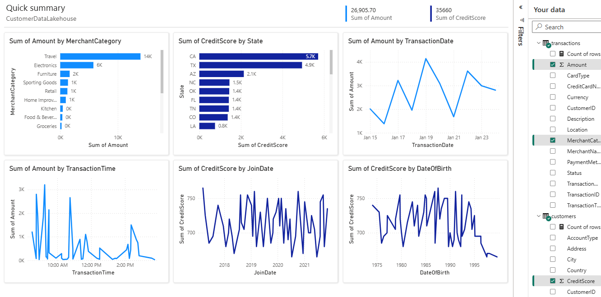
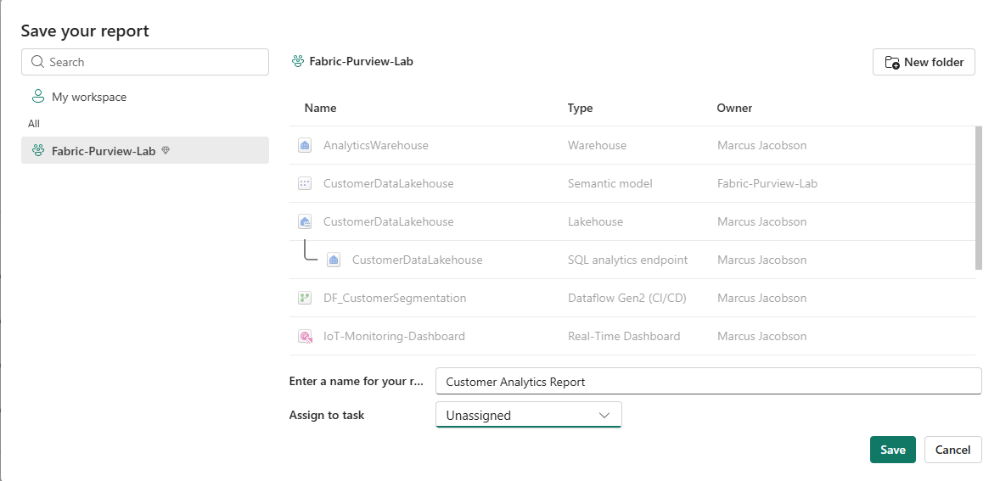

# Lab 08: Power BI Report for Governance Validation

## 🎯 Objective

Create a Power BI report that connects to your governed Lakehouse data, establishing the final link in the data lineage chain for Lab 09 validation.

**Duration**: 20 minutes

---

## 🏗️ What You'll Build

| Item | Purpose for Governance |
|------|------------------------|
| **Semantic Model** | Creates the data layer that inherits sensitivity labels |
| **Customer Analytics Report** | Final artifact in lineage chain (Report → Model → Lakehouse) |
| **Cross-Table Visualization** | Uses both `customers` (SSN) and `transactions` (Credit Card) tables |

### Why This Matters for Information Protection

This lab completes the **governed analytics chain**:

```text
Lakehouse Tables (DLP-protected: SSN, Credit Card)
    → Semantic Model (inherits protection)
        → Power BI Report (inherits protection)
```

In Lab 09, you'll validate:

- ✅ Sensitivity labels flow from source to report.
- ✅ Lineage shows complete data path in Purview.
- ✅ DLP policies protect data throughout the stack.

---

## 📋 Prerequisites

- [ ] Labs 01-05 completed (Lakehouse with `customers` and `transactions` tables).
- [ ] Access to `Fabric-Purview-Lab` workspace.

> **💡 Note**: Labs 06-07 enhance this lab by adding DLP policies and Data Map lineage, but are not required to create the report.

---

## 🔧 Step 1: Create Semantic Model

### Navigate to Lakehouse

1. Go to [app.fabric.microsoft.com](https://app.fabric.microsoft.com).
2. Open your `Fabric-Purview-Lab` workspace.
3. Select `CustomerDataLakehouse` to open the Lakehouse.

### Create the Model

1. In the Lakehouse toolbar, click **New semantic model**.
2. Configure the dialog:
   - **Direct Lake semantic model name**: `CustomerDataLakehouse`
   - **Workspace**: `Fabric-Purview-Lab` (auto-selected)
3. Select tables (check **Select all**):
   - ✅ `dbo` → `customers` (contains SSN — DLP protected)
   - ✅ `dbo` → `transactions` (contains Credit Card — DLP protected)
   - ✅ `dbo` → `customers_segmented`
4. Click **Confirm**.



The semantic model opens in **Model view**.

---

## 🔧 Step 2: Create Power BI Report

### Start New Report

1. Return to your `Fabric-Purview-Lab` workspace (click workspace name in breadcrumb).
2. Click **+ New item**.
3. Scroll to **Visualize data** section and select **Report**.
4. Select your `CustomerDataLakehouse` semantic model.
5. Click **Select**.

### Select Data for Governance Validation

The **Quick summary** view opens. Select fields from **both** DLP-protected tables to create the governance chain:

**From `customers` table** (contains SSN):

1. Expand `customers` in the **Your data** pane.
2. Check these fields:
   - ☑️ `State`
   - ☑️ `CreditScore`

**From `transactions` table** (contains Credit Card Number):

1. Expand `transactions`.
2. Check these fields:
   - ☑️ `Amount`
   - ☑️ `MerchantCategory`

> 🎯 **Why these selections**: Using fields from both tables ensures the report lineage connects to all your DLP-protected data sources.



Power BI auto-generates visuals based on your selections. You'll see charts like:

- **Sum of CreditScore by State** — customer geographic distribution
- **Count of MerchantCategory by CardType** — transaction patterns by card type
- Additional auto-generated visuals based on field relationships

> **🎯 Governance checkpoint**: The auto-generated report is sufficient for Lab 09 validation. You have data from both DLP-protected source tables, which establishes the lineage chain.

### Customize Visuals (Optional)

To clean up the auto-generated report:

1. Click **Edit** in the toolbar.
2. Select visuals you don't need and press **Delete**.
3. Keep the meaningful charts (State distribution, CardType breakdown).
4. Resize remaining visuals to fill the canvas.

---

## 🔧 Step 3: Save Report

### Save to Workspace

1. Click **Save** in the toolbar (or **File** → **Save**).
2. In the **Save your report** dialog:
   - Select `Fabric-Purview-Lab` in the left panel.
   - **Enter a name for your report**: `Customer Analytics Report`
   - **Assign to task**: Leave as **Unassigned**.
3. Click **Save**.



---

## ✅ Validation Checklist

Before proceeding to Lab 09, return to workspace view and verify:

| Item | Type | Purpose |
|------|------|---------|
| `CustomerDataLakehouse` | Lakehouse | Source data with DLP-protected columns |
| `CustomerDataLakehouse` | Semantic model | Data layer (inherits labels) |
| `Customer Analytics Report` | Report | Visualization layer (inherits labels) |

**Checklist:**

- [ ] All three items visible in workspace.
- [ ] Report uses data from both `customers` and `transactions` tables.

---

## ❌ Troubleshooting

### Semantic Model Not Appearing

**Resolution**: Wait 1-2 minutes after creation, then refresh the workspace view.

### No Data in Quick Summary

**Resolution**: Verify your Lakehouse has data in the tables. Return to Lab 02-03 if tables are empty.

### Cannot Save Report

**Resolution**: Ensure you have Contributor or higher permissions on the workspace.

---

## ➡️ Next Steps

Proceed to:

**[Lab 09: Final Validation](../09-Final-Validation/)**

> **🎯 Lab 09 validates everything**: DLP policy results, data lineage from Report → Lakehouse, sensitivity label inheritance, and governance compliance. Your DLP policy (Lab 06) has had time to deploy while you completed Labs 07-08.

---

## 🤖 AI-Assisted Content Generation

This lab documentation was created with the assistance of **GitHub Copilot** powered by Claude Opus 4.5. Power BI and DirectLake procedures were verified against Microsoft Fabric documentation within **Visual Studio Code**.
