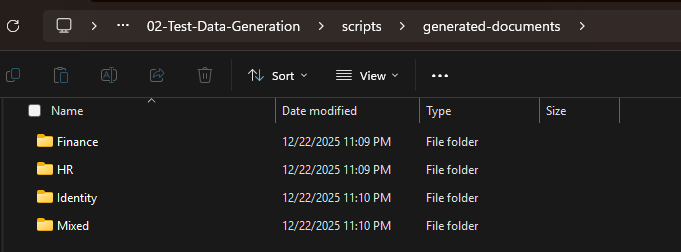

# Lab 02: Test Data Generation

## Overview

This lab focuses on generating realistic test documents containing Personally Identifiable Information (PII) and sensitive data patterns that match Microsoft Purview's built-in Sensitive Information Types (SITs). The generated documents will be used in subsequent labs for classification validation, DLP policy testing, and monitoring capabilities.

## Objectives

By completing this lab, you will:

- Generate realistic HR documents containing U.S. Social Security Numbers (SSN)
- Create financial records with credit card numbers, bank accounts, and routing numbers
- Produce documents with passport numbers, driver's license numbers, and ITIN
- Generate mixed-format documents (.docx, .xlsx, .pdf, .txt) with varying PII density
- Understand built-in SIT detection patterns and confidence levels
- Configure document generation parameters based on simulation scale

## Prerequisites

- Lab 00: Prerequisites Setup completed (environment validated)
- Lab 01: SharePoint Site Creation completed (sites ready for document upload)
- PowerShell 5.1+ or PowerShell 7+
- Global configuration file properly configured with DocumentGeneration settings
- Sufficient disk space for generated documents (see scale estimates below)

> **📝 Note**: This lab generates documents locally and does not require SharePoint authentication. Document upload to SharePoint sites occurs in Lab 03.

## Built-In SIT Patterns

This lab generates content targeting these Microsoft Purview built-in Sensitive Information Types:

| SIT Name | Pattern Type | Confidence Level | Example Format |
|----------|--------------|------------------|----------------|
| **U.S. Social Security Number** | SSN | High | 123-45-6789 |
| **Credit Card Number** | Financial | High | 4111-1111-1111-1111 |
| **U.S. Bank Account Number** | Financial | Medium | 123456789012 |
| **ABA Routing Number** | Financial | High | 021000021 |
| **U.S. Passport Number** | Identity | High | 123456789 |
| **U.S. Driver's License Number** | Identity | Medium | D1234567 (varies by state) |
| **U.S. Individual Taxpayer Identification Number** | Tax | High | 9XX-XX-XXXX |

## Lab Structure

```text
02-Test-Data-Generation/
├── README.md (this file)
└── scripts/
    ├── New-SimulatedHRDocuments.ps1          # HR documents with SSN patterns
    ├── New-SimulatedFinancialRecords.ps1     # Financial docs with credit card/bank
    ├── New-SimulatedPIIContent.ps1           # Identity docs (passport, license, ITIN)
    ├── New-MixedContentDocuments.ps1         # Various file formats with multiple SIT types
    ├── Invoke-BulkDocumentGeneration.ps1     # Orchestrator for all four generators
    └── Remove-GeneratedDocuments.ps1         # Cleanup script (used for regeneration)
```

## Step-by-Step Instructions

### Step 1: Review Document Generation Configuration

Review the document generation settings in your global configuration:

```powershell
# Navigate to Lab 02 directory
cd "c:\REPO\GitHub\Projects\Microsoft\Purview\Purview-Discovery-Methods-Simulation\02-Test-Data-Generation"

# Load configuration using the shared utility
$config = & "..\Shared-Utilities\Import-GlobalConfig.ps1"

# View document generation configuration (if configured in your global-config.json)
$config.DocumentGeneration | Format-List

# View simulation scale settings
$config.Simulation | Format-List ScaleLevel

```

**Document Generation Scale:**

| Scale Level | Total Documents | Storage Impact | Generation Time |
|-------------|-----------------|----------------|-----------------|  
| **Small** | 500-1,000 | ~25-50 MB | 30-60 seconds |
| **Medium** | 5,000 | ~125-150 MB | 1-2 minutes |
| **Large** | 20,000 | ~500-600 MB | 5-10 minutes |

> **📝 Note**: Document counts in the examples below reflect **Medium scale** configuration. Your actual counts will vary based on the `ScaleLevel` configured in Lab 01 (Small/Medium/Large). The scripts automatically calculate distribution percentages: 31% HR, 28% Financial, 19% Identity, 22% Mixed-format.

### Step 2: Generate HR Documents

Create HR-related documents containing Social Security Numbers:

```powershell
# Navigate to Lab 02 scripts directory
cd "scripts"

# Generate HR documents (skips existing files)
.\New-SimulatedHRDocuments.ps1 -SkipExisting

# Optional: Force regeneration of all documents
.\New-SimulatedHRDocuments.ps1 -Force

# Optional: Generate specific document count
.\New-SimulatedHRDocuments.ps1 -DocumentCount 100 -SkipExisting
```

**Expected Output (Medium scale example):**

```text
🔍 Step 1: Load Configuration
==============================
   ✅ Configuration loaded successfully
   ✅ HR document generation configured: 1550 documents (31% of 5000)

🔍 Step 2: Generate HR Documents
=================================
   📋 Generating employee handbook sections...
   📋 Generating new hire paperwork...
   📋 Generating tax forms (W-4, I-9)...
   📋 Generating benefits enrollment forms...
   ✅ 250 HR documents generated

🔍 Step 3: Generation Summary
==============================
   📊 Total HR Documents: 1550
   📊 File Types: 698 docx, 465 xlsx, 232 pdf, 155 txt
   📊 Total PII Patterns: 6200
   ⏱️  Generation Time: 00:00:26
   ✅ HR document generation completed
```

### Step 3: Generate Financial Records

Create financial documents with credit card numbers, bank accounts, and routing numbers:

```powershell
# Generate financial documents (skips existing files)
.\New-SimulatedFinancialRecords.ps1 -SkipExisting

# Optional: Force regeneration with specific PII density
.\New-SimulatedFinancialRecords.ps1 -PIIDensity High -Force

# Optional: Preview what will be generated
.\New-SimulatedFinancialRecords.ps1 -WhatIf
```

**Expected Output (Medium scale example):**

```text
🔍 Step 1: Load Configuration
==============================
   ✅ Configuration loaded successfully
   ✅ Financial document generation configured: 1400 documents (28% of 5000)

🔍 Step 2: Generate Financial Documents
========================================
   📋 Generating expense reports...
   📋 Generating payment vouchers...
   📋 Generating bank statements...
   📋 Generating credit card transactions...
   ✅ 1400 financial documents generated

🔍 Step 3: Generation Summary
==============================
   📊 Total Financial Documents: 1400
   📊 File Types: 630 docx, 420 xlsx, 210 pdf, 140 txt
   📊 Total PII Patterns: 5948
   ⏱️  Generation Time: 00:00:32
   ✅ Financial document generation completed
```

### Step 4: Generate Identity Documents

Create documents with passport numbers, driver's licenses, and ITIN:

```powershell
# Generate mixed PII documents (skips existing files)
.\New-SimulatedPIIContent.ps1 -SkipExisting

# Optional: Focus on specific SIT types
.\New-SimulatedPIIContent.ps1 -SITTypes "Passport","DriverLicense" -SkipExisting

# Optional: Force complete regeneration
.\New-SimulatedPIIContent.ps1 -Force
```

**Expected Output (Medium scale example):**

```text
🔍 Step 1: Load Configuration
==============================
   ✅ Configuration loaded successfully
   ✅ Identity document generation configured: 950 documents (19% of 5000)

🔍 Step 2: Generate Identity Documents
=======================================
   📋 Generating passport application forms...
   📋 Generating driver's license records...
   📋 Generating ITIN tax documentation...
   ✅ 950 identity documents generated

🔍 Step 3: Generation Summary
==============================
   📊 Total Identity Documents: 950
   📊 File Types: 428 docx, 285 xlsx, 142 pdf, 95 txt
   📊 Total PII Patterns: 3795
   ⏱️  Generation Time: 00:00:19
   ✅ Identity document generation completed
```

### Step 5: Generate Mixed-Format Documents

Create various document formats with distributed PII patterns:

```powershell
# Generate mixed format documents (skips existing files)
.\New-MixedContentDocuments.ps1 -SkipExisting

# Optional: Specify file type distribution
.\New-MixedContentDocuments.ps1 -DocxPercent 50 -XlsxPercent 30 -PdfPercent 15 -TxtPercent 5 -SkipExisting

# Optional: Force complete regeneration
.\New-MixedContentDocuments.ps1 -Force
```

**Expected Output (Medium scale example):**

```text
🔍 Step 1: Load Configuration
==============================
   ✅ Configuration loaded successfully
   ✅ Mixed format generation configured: 1100 documents (22% of 5000)

🔍 Step 2: Generate Mixed-Format Documents
===========================================
   📋 Generating .docx documents...
   📋 Generating .xlsx documents...
   📋 Generating .pdf documents...
   📋 Generating .txt documents...
   ✅ 1100 mixed-format documents generated

🔍 Step 3: Generation Summary
==============================
   📊 Total Mixed Documents: 1100
   📊 File Types: 495 docx, 330 xlsx, 165 pdf, 110 txt
   📊 Total PII Patterns: 4833
   📊 Low Density: 330 documents
   📊 Medium Density: 461 documents
   📊 High Density: 309 documents
   ⏱️  Generation Time: 00:00:23
   ✅ Mixed-format document generation completed
```

### Step 6: Run Bulk Document Generation (Optional - Orchestrator Alternative)

**Note:** If you already completed Steps 2-5 individually, you can skip this step. This orchestrator is an alternative approach that runs all four generators in sequence automatically.

Execute all document generators at once:

```powershell
# Run complete bulk generation (automatically skips existing files)
.\Invoke-BulkDocumentGeneration.ps1

# Optional: Skip specific generators
.\Invoke-BulkDocumentGeneration.ps1 -SkipHR -SkipFinancial

# Optional: Force complete regeneration (overwrites existing documents)
.\Invoke-BulkDocumentGeneration.ps1 -Force
```

**When to Use Step 6:**

- **First-time generation**: Run this instead of Steps 2-5 to generate all documents at once
- **Automated workflows**: Integrate into CI/CD pipelines for repeatable document generation
- **Testing scenarios**: Quickly regenerate all documents with `-Force` parameter

**When to Skip Step 6:**

- **Already completed Steps 2-5**: Individual scripts already generated all documents
- **Selective generation**: You only need specific document categories (HR, Finance, etc.)
- **Step-by-step learning**: Understanding each generator's output before proceeding

**Expected Output (Medium scale example):**

```text
📋 Phase 1: HR Document Generation
====================================
   🚀 Calling script 'New-SimulatedHRDocuments.ps1'...
   ✅ Script 'New-SimulatedHRDocuments.ps1' completed successfully
   ✅ Phase 1 completed successfully

📋 Phase 2: Financial Document Generation
==========================================
   🚀 Calling script 'New-SimulatedFinancialRecords.ps1'...
   ✅ Script 'New-SimulatedFinancialRecords.ps1' completed successfully
   ✅ Phase 2 completed successfully

📋 Phase 3: Mixed PII Document Generation
==========================================
   🚀 Calling script 'New-SimulatedPIIContent.ps1'...
   ✅ Script 'New-SimulatedPIIContent.ps1' completed successfully
   ✅ Phase 3 completed successfully

📋 Phase 4: Mixed-Format Document Generation
=============================================
   🚀 Calling script 'New-MixedContentDocuments.ps1'...
   ✅ Script 'New-MixedContentDocuments.ps1' completed successfully
   ✅ Phase 4 completed successfully

🎯 Bulk Document Generation Summary
====================================
   📊 Phases Executed: 4
   📊 Successful Phases: 4
   📊 Failed Phases: 0
   ⏱️  Total Duration: 00:01:42

   📋 Phase Results:
      ✅ HR Documents - Completed in 00:00:26
      ✅ Financial Documents - Completed in 00:00:32
      ✅ Identity Documents - Completed in 00:00:19
      ✅ Mixed-Format Documents - Completed in 00:00:23

   📊 Document Generation Statistics:
      • HR Documents: 1550
      • Financial Documents: 1400
      • Identity Documents: 950
      • Mixed-Format Documents: 1100
      • Total Documents: 5000

   ✅ All document generation phases completed successfully
```

**Verify Generated Documents:**

After generation completes, verify the folder structure in File Explorer. Documents are created in `scripts/generated-documents/`:



*File Explorer showing the scripts/generated-documents folder with HR, Finance, Identity, and Mixed subfolders containing test files with realistic naming conventions.*

## Validation Checklist

After completing Lab 02, verify:

- [ ] **HR Documents Generated**: Files created in scripts/generated-documents/HR directory
- [ ] **Financial Documents Generated**: Files created in scripts/generated-documents/Finance directory
- [ ] **Identity Documents Generated**: Files created in scripts/generated-documents/Identity directory
- [ ] **Mixed-Format Documents Generated**: Files created in scripts/generated-documents/Mixed directory
- [ ] **File Type Distribution**: ~45% docx, ~30% xlsx, ~15% pdf, ~10% txt (approximate)
- [ ] **Document Count Matches Scale**: Total matches your Lab 01 ScaleLevel (Small: 500-1K, Medium: 5K, Large: 20K)
- [ ] **Category Distribution**: HR 31%, Financial 28%, Identity 19%, Mixed 22% of total
- [ ] **PII Patterns Embedded**: Documents contain realistic SIT patterns
- [ ] **Generation Reports Created**: JSON reports saved to scripts/reports/ directory
- [ ] **No Generation Errors**: All scripts completed successfully
- [ ] **Storage Space Sufficient**: Disk space matches expected storage impact

## Troubleshooting

### Issue: Document Generation Slow

**Symptoms:**

- Generation takes significantly longer than expected time
- Script appears to hang during file creation

**Resolution:**

```powershell
# Check disk I/O performance
Get-PSDrive C | Select-Object Used,Free

# Generate in smaller test batch first
.\New-SimulatedHRDocuments.ps1 -DocumentCount 100

# If successful, proceed with full generation
.\Invoke-BulkDocumentGeneration.ps1

# Or reduce scale in global-config.json
# Edit ScaleLevel: "Small" (500-1K docs) instead of "Medium" (5K docs)
```

### Issue: Out of Disk Space

**Symptoms:**

- Error: "There is not enough space on the disk"
- Generation fails partway through

**Resolution:**

```powershell
# Check available disk space
Get-PSDrive C | Select-Object @{N="FreeGB";E={[math]::Round($_.Free/1GB,2)}}

# Clean up existing generated documents if needed
.\Remove-GeneratedDocuments.ps1 -Force

# Reduce ScaleLevel in global-config.json before regenerating
# Small: 500-1K docs (~1 GB)
# Medium: 5K docs (~4 GB)
# Large: 20K docs (~15 GB)
```

### Issue: Invalid PII Patterns

**Symptoms:**

- Generated documents contain unrealistic data patterns
- SIT detection may not work correctly

**Resolution:**

```powershell
# Verify configuration loaded correctly
$config = & "..\Shared-Utilities\Import-GlobalConfig.ps1"
$config.Simulation | Format-List

# Regenerate HR documents with verbose output
.\New-SimulatedHRDocuments.ps1 -Force

# Check sample generated content for SSN patterns
Get-ChildItem ".\generated-documents\HR" -File | Select-Object -First 3 | 
    ForEach-Object { Get-Content $_.FullName -Raw | Select-String "\d{3}-\d{2}-\d{4}" }
```

### Issue: Configuration File Not Found

**Symptoms:**

- Error: "Cannot find path" or "Configuration file not found"
- Scripts fail during configuration loading step

**Resolution:**

```powershell
# Verify global configuration file exists
Test-Path "..\..\global-config.json"

# If missing, verify you're in the correct directory
Get-Location  # Should be in 02-Test-Data-Generation\scripts

# Verify shared utilities are accessible
Test-Path "..\Shared-Utilities\Import-GlobalConfig.ps1"

# Load configuration to test
$config = & "..\Shared-Utilities\Import-GlobalConfig.ps1"
$config.Simulation | Format-List
```

### Issue: Memory Consumption High

**Symptoms:**

- PowerShell process using excessive memory
- System becomes slow during generation

**Resolution:**

```powershell
# Generate in smaller batches
.\New-SimulatedHRDocuments.ps1 -DocumentCount 100
# Wait for completion, then run again

# Close other applications during generation

# Use 64-bit PowerShell for large scale generation
# Check: [Environment]::Is64BitProcess
```

## Document Generation Patterns

### SSN Patterns (U.S. Social Security Number)

**Format:** XXX-XX-XXXX

**Validation:**

- First three digits: 001-899, 900-999 (excluding 000, 666)
- Middle two digits: 01-99 (excluding 00)
- Last four digits: 0001-9999 (excluding 0000)

**Example Content:**

```text
Employee SSN: 123-45-6789
Tax Identification: 987-65-4321
Social Security Number: 456-78-9012
```

### Credit Card Number Patterns

**Formats:**

- Visa: 4XXX-XXXX-XXXX-XXXX (16 digits)
- Mastercard: 5XXX-XXXX-XXXX-XXXX (16 digits)
- American Express: 3XXX-XXXXXX-XXXXX (15 digits)
- Discover: 6XXX-XXXX-XXXX-XXXX (16 digits)

**Validation:** Luhn algorithm checksum validation

**Example Content:**

```text
Credit Card: 4111-1111-1111-1111
Payment Method: 5500-0000-0000-0004
Card Number: 3400-000000-00009
```

### Bank Account Patterns

**U.S. Bank Account Format:** 8-17 digits

**ABA Routing Number Format:** 9 digits

**Example Content:**

```text
Account Number: 123456789012
Routing Number: 021000021
Bank Account: 987654321098
```

### Passport Number Patterns

**U.S. Passport Format:** 9 digits (older format: 1 letter + 7 digits)

**Example Content:**

```text
Passport Number: 123456789
U.S. Passport: C12345678
Travel Document: 987654321
```

### Driver's License Patterns

**State-Specific Formats:**text

- California: 1 letter + 7 digits
- Texas: 8 digits
- New York: 1 letter + 7 digits or 9 digits
- Florida: 1 letter + 12 digits

**Example Content:**

```text
Driver's License: D1234567 (CA)
DL Number: 12345678 (TX)
License: A1234567 (NY)
```

### ITIN Patterns (Individual Taxpayer Identification Number)

**Format:** 9XX-XX-XXXX

**Validation:**

- First digit: Always 9
- Fourth and fifth digits: Range from 70-88, 90-92, 94-99

**Example Content:**

```text
ITIN: 912-34-5678
Tax ID: 987-88-1234
Individual TIN: 900-70-0000
```

## Next Steps

After completing Lab 02:

1. **Verify Document Generation**:
   - Check `scripts/generated-documents/` directory for all four document categories (HR, Finance, Identity, Mixed)
   - Review generation reports in `scripts/reports/` directory
   - Validate total document count matches your Lab 01 ScaleLevel configuration:
     - Small: 500-1,000 documents
     - Medium: 5,000 documents
     - Large: 20,000 documents

2. **Review Sample Document Content**:
   - Open sample documents from each category to verify SIT patterns
   - Confirm SSN format: XXX-XX-XXXX
   - Confirm credit card format: XXXX-XXXX-XXXX-XXXX
   - Validate passport, driver's license, and ITIN patterns

3. **Prepare for Lab 03**:
   - Documents remain in local `scripts/generated-documents/` directory
   - Ensure SharePoint sites from Lab 01 are accessible
   - Verify sufficient network bandwidth for document upload
   - Plan to run Lab 03 upload scripts from this environment

4. **Proceed to Lab 03: Document Upload & Distribution**:
   - Upload generated documents to SharePoint sites
   - Distribute documents across department libraries
   - Apply metadata for classification preparation
   - Clean up local documents after successful upload (see Lab 03 Step 5)

> **💡 Tip**: Generated documents remain on your local system through Lab 03. After successful SharePoint upload and validation, use the cleanup script in Lab 03 Step 5 to free disk space.

> **🔄 Regenerating Documents**: If you need to regenerate documents, first run `.\Remove-GeneratedDocuments.ps1` from the scripts directory to clear existing files, then re-run the generation steps above.

## Additional Resources

- **Microsoft Purview SIT Reference**: [Learn about sensitive information types](https://learn.microsoft.com/en-us/purview/sensitive-information-type-learn-about)
- **Built-In SIT Definitions**: [Sensitive information type entity definitions](https://learn.microsoft.com/en-us/purview/sit-entity-definitions)
- **Custom SIT Creation** (Future): [Create custom sensitive information types](https://learn.microsoft.com/en-us/purview/create-a-custom-sensitive-information-type)
- **Document Generation Best Practices**: Project PORTABILITY-GUIDE.md

---

**Lab 02 Completion Criteria:**

✅ All four document generation scripts executed successfully (HR, Financial, Identity, Mixed)  
✅ Total documents match Lab 01 ScaleLevel configuration (Small: 500-1K, Medium: 5K, Large: 20K)  
✅ Category distribution: 31% HR, 28% Financial, 19% Identity, 22% Mixed (automatic)  
✅ File type distribution: ~45% docx, ~30% xlsx, ~15% pdf, ~10% txt (approximate)  
✅ SIT patterns embedded: SSN, credit cards, bank accounts, passports, driver's licenses, ITIN  
✅ Generation reports saved in `scripts/reports/` directory with JSON metadata  
✅ Documents stored locally in `scripts/generated-documents/` directory  
✅ No disk space or PowerShell errors encountered  
✅ Ready to proceed to Lab 03 for SharePoint upload and distribution

---

*This lab establishes the local test data foundation required for Lab 03 document upload, Lab 04 classification validation, and subsequent DLP policy testing and monitoring activities in the Purview Discovery Methods Simulation.*
