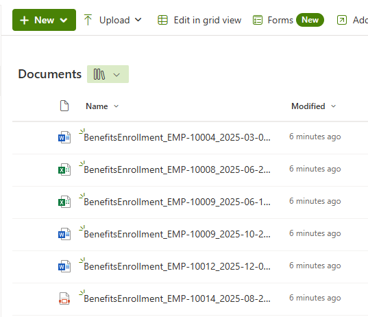

# Lab 03: Document Upload & Distribution

## Overview

This lab focuses on uploading the generated test documents to SharePoint Online sites and distributing them across appropriate department libraries. The uploaded documents will be prepared for Microsoft Purview classification and DLP policy application.

## Objectives

By completing this lab, you will:

- Upload generated documents to SharePoint document libraries
- Distribute documents across appropriate department sites (HR, Finance, Legal, Marketing, IT)
- Implement throttling and error handling for large-scale uploads
- Validate successful document uploads and accessibility
- Clean up local documents after successful upload (optional)

## Prerequisites

- Lab 00: Prerequisites Setup completed
- Lab 01: SharePoint Site Creation completed
- Lab 02: Test Data Generation completed
- PowerShell 5.1+ or PowerShell 7+
- SharePoint Online permissions (Site Collection Administrator or higher)
- Network bandwidth sufficient for document upload operations

## Document Distribution Strategy

### Department-to-Site Mapping

Documents generated in Lab 02 will be distributed to SharePoint sites based on content type:

| Document Category | Target SharePoint Site | Document Library | Percentage |
|-------------------|------------------------|------------------|------------|
| **HR Documents** | HR-Simulation | Documents | 31% |
| **Financial Documents** | Finance-Simulation | Documents | 28% |
| **Identity Documents** | Legal-Simulation | Documents | 19% |
| **Mixed-Format Documents** | Distributed across all sites | Documents | 22% |

### Upload Throttling Strategy

To avoid SharePoint API throttling limits:

- **Batch Size**: 50 documents per batch
- **Delay Between Batches**: 5 seconds
- **Concurrent Uploads**: Sequential (one at a time)
- **Retry Logic**: 3 retries with exponential backoff
- **Progress Tracking**: Real-time progress indicators with ETA

## Lab Structure

```text
03-Document-Upload-Distribution/
├── README.md (this file)
└── scripts/
    ├── Upload-AllDocuments.ps1              # Multi-phase orchestrator (optional)
    ├── Upload-ToSingleSite.ps1              # Single-site upload script (primary)
    ├── Test-UploadValidation.ps1            # Upload verification
    └── Grant-AppSitePermissions.ps1         # Permission helper (troubleshooting)
```

## Step-by-Step Instructions

### Step 1: Review Upload Configuration

Review document distribution settings:

```powershell
# Navigate to Lab 03 scripts directory from repository root
cd "C:\REPO\GitHub\Projects\Microsoft\Purview\Purview-Discovery-Methods-Simulation\03-Document-Upload-Distribution\scripts"

# Review generated documents ready for upload
Get-ChildItem -Path "C:\REPO\GitHub\Projects\Microsoft\Purview\Purview-Discovery-Methods-Simulation\02-Test-Data-Generation\scripts\generated-documents" -Recurse -File | Measure-Object

# Review SharePoint sites configuration
$config = Get-Content "C:\REPO\GitHub\Projects\Microsoft\Purview\Purview-Discovery-Methods-Simulation\global-config.json" | ConvertFrom-Json
$config.SharePointSites | Format-Table Name, Department, Description
```

**Expected Document Counts by Scale:**

| Scale Level | Total Documents | Upload Time (Estimate) |
|-------------|-----------------|------------------------|
| **Small** | 500-1,000 | 15-30 minutes |
| **Medium** | 5,000 | 1-2 hours |
| **Large** | 20,000 | 4-6 hours |

### Step 2: Upload Documents to SharePoint

Execute document upload to SharePoint sites:

```powershell
# Option 1: Use orchestrator to upload HR, Finance, and Identity documents
.\Upload-AllDocuments.ps1

# Option 2: Upload to specific sites individually
.\Upload-ToSingleSite.ps1 -SiteUrl "https://yourtenant.sharepoint.com/sites/HR-Simulation" -SourceFolder "..\..\02-Test-Data-Generation\scripts\generated-documents\HR"

.\Upload-ToSingleSite.ps1 -SiteUrl "https://yourtenant.sharepoint.com/sites/Finance-Simulation" -SourceFolder "..\..\02-Test-Data-Generation\scripts\generated-documents\Finance"

# Optional: Upload Mixed documents to remaining sites
.\Upload-ToSingleSite.ps1 -SiteUrl "https://yourtenant.sharepoint.com/sites/Marketing-Simulation" -SourceFolder "..\..\02-Test-Data-Generation\scripts\generated-documents\Mixed"
```

**Expected Output (Upload-ToSingleSite.ps1):**

```text
📋 Step 1: Validate Source Folder
================================
   ✅ Source folder validated
   📊 Found 1550 files to upload

📋 Step 2: Connect to SharePoint Site
====================================
🔗 Connecting to: https://marcusjcloud.sharepoint.com/sites/HR-Simulation
   ✅ Connected successfully

📋 Step 3: Verify Target Library
===============================
   ✅ Target library 'Shared Documents' exists

📋 Step 4: Upload Documents to SharePoint
==========================================
📄 [1/1550] (0.1%) Uploading: HR_Contract_00001_2025-01-15.docx
   ✅ Success
📄 [50/1550] (3.2%) Uploading: HR_Contract_00050_2025-03-15.docx
   ✅ Success
   ⏳ Pausing 5 seconds (throttle protection)...
📄 [100/1550] (6.5%) Uploading: HR_Contract_00100_2025-05-20.docx
   ✅ Success
   ⏳ Pausing 5 seconds (throttle protection)...
...
📄 [1550/1550] (100%) Uploading: HR_Report_01550_2025-11-10.txt
   ✅ Success

📋 Step 5: Upload Summary
========================
📊 Results:
   • Total Documents: 1550
   • Successful: 1550
   • Skipped: 0
   • Failed: 0
   • Success Rate: 100%
   • Duration: 00:22:15

✅ All documents uploaded successfully!
```

**Note**: If documents already exist on a site, the script will skip them and include them in the success rate. For example:

```text
📄 [1/1550] (0.1%) Uploading: HR_Contract_00001_2025-01-15.docx
   ⏭️  Already exists (skipped)
...
📊 Results:
   • Total Documents: 1550
   • Successful: 0
   • Skipped: 1550
   • Failed: 0
   • Success Rate: 100%
   • Duration: 00:02:30
```

### Step 3: Validate Document Upload

After uploads complete, navigate to your SharePoint sites in the browser to visually confirm documents are present. The HR-Simulation site should show uploaded HR documents in the Shared Documents library:



Once you've confirmed documents are visible in SharePoint, run the validation script to verify counts and accessibility:

```powershell
# Run comprehensive upload validation
.\Test-UploadValidation.ps1

# Optional: Validate specific site
.\Test-UploadValidation.ps1 -SiteName "HR-Simulation"

# Optional: Detailed validation with file access tests
.\Test-UploadValidation.ps1 -DetailedValidation
```

**Expected Output:**

```text
🔍 Action 1: Load Configuration
================================
   ✅ Configuration loaded successfully
   ✅ 5 SharePoint sites to validate

🔍 Action 2: Validate Document Counts
======================================
   📋 HR-Simulation: 1550/1550 documents present (100%)
   📋 Finance-Simulation: 1400/1400 documents present (100%)
   📋 Legal-Simulation: 950/950 documents present (100%)
   📋 Marketing-Simulation: 1100/1100 documents present (100%)
   ✅ All document counts validated

🔍 Action 3: Test Document Accessibility
=========================================
   📋 Testing random sample: 50 documents
   ✅ 50/50 documents accessible (100%)

🔍 Action 4: Validation Summary
================================
   📊 Total Documents Validated: 5000
   📊 Documents Present: 5000 (100%)
   📊 Documents Accessible: 5000 (100%)
   ✅ All validation checks passed
```

### Step 4: Clean Up Local Documents

After confirming successful upload to SharePoint, remove local generated documents to free disk space:

```powershell
# Navigate to Lab 02 scripts directory
cd "..\..\02-Test-Data-Generation\scripts"

# Run cleanup script with confirmation
.\Remove-GeneratedDocuments.ps1

# Optional: Skip confirmation prompt
.\Remove-GeneratedDocuments.ps1 -Force

# Optional: Preview what would be deleted
.\Remove-GeneratedDocuments.ps1 -WhatIf
```

**Expected Output:**

```text
🔍 Step 1: Environment Validation
=================================
📋 Validating paths...
   • Script Path: C:\...\02-Test-Data-Generation\scripts
   • Generated Docs: C:\...\02-Test-Data-Generation\scripts\generated-documents
   • Reports Path: C:\...\Purview-Discovery-Methods-Simulation\Reports
   ✅ Environment validation successful
   📊 Files to delete: 5000 documents

🔍 Step 2: Verify Upload Success
================================
📋 Checking upload reports...
   ⚠️  No upload reports found in C:\...\Reports
   💡 Tip: Run Test-UploadValidation.ps1 to verify upload success first
   ℹ️  Upload reports are created by Upload-AllDocuments.ps1 (not Upload-ToSingleSite.ps1)
   ✅ Upload verification completed (proceeding with caution)
   💡 Best Practice: Verify uploads before deletion using Test-UploadValidation.ps1

⚠️  Step 3: Confirm Deletion
==========================
📋 You are about to delete:
   • Total files: 5000 documents
   • Location: C:\...\generated-documents

⚠️  This action is IRREVERSIBLE
⚠️  Ensure Lab 03 upload validation showed 100% success

❓ Delete all local generated documents? (yes/no): yes

🗑️  Step 4: Delete Generated Documents
=====================================
📋 Deleting generated documents...
   ✅ All generated documents deleted

🔍 Step 5: Verify Deletion
==========================
📋 Verifying deletion completed...
   ✅ Verification successful: 0 files remaining
   ✅ Local cleanup completed

🎯 Cleanup Summary
==================
   📊 Original file count: 5000 documents
   📊 Files remaining: 0
   📊 Disk space freed: ~125 MB (estimated)
   ✅ Local cleanup completed successfully

💡 Next Steps:
   1. Upload reports preserved in: C:\...\Reports
   2. Documents remain accessible in SharePoint Online
   3. To regenerate documents, return to Lab 02
   4. Proceed to Lab 04 for Purview classification validation
```

> **💡 Best Practice**: Always verify successful upload to SharePoint before deleting local files using Test-UploadValidation.ps1.
>
> **⚠️ Important**: Local document deletion is irreversible. Ensure upload validation (Step 3) shows 100% success before proceeding with cleanup. If you need to regenerate documents, return to Lab 02.

## Validation Checklist

After completing Lab 03, verify:

> **📝 Note**: Document counts below reflect **Medium scale** configuration. Your actual counts will vary based on `ScaleLevel` in global-config.json (Small: ~1K total, Medium: ~5K total, Large: ~20K total).

- [ ] **All Documents Uploaded**: Total documents match your scale (Medium example: 5000 total - HR: 1550, Financial: 1400, Identity: 950, Mixed: 1100)
- [ ] **Documents Accessible**: Random sample documents can be opened from SharePoint
- [ ] **Distribution Correct**: Documents distributed to appropriate department sites:
  - HR → HR-Simulation
  - Financial → Finance-Simulation
  - Identity → Legal-Simulation
  - Mixed → Marketing-Simulation (or IT-Simulation)
- [ ] **No Upload Errors**: Upload summaries show 100% success rate
- [ ] **Site Quotas Not Exceeded**: SharePoint site storage within limits
- [ ] **SharePoint Search Indexing**: Documents appear in SharePoint search (may take 15-30 minutes)
- [ ] **Local Documents Cleaned Up**: Generated documents deleted from local storage after upload validation (optional)

## Troubleshooting

### Issue: Upload Throttling Errors

**Symptoms:**

- Error: "Request rate is too high"
- Error: "429 Too Many Requests"
- Uploads failing intermittently

**Resolution:**

```powershell
# The Upload-ToSingleSite.ps1 script includes automatic throttle protection
# It pauses for 5 seconds every 50 files

# If throttling still occurs, increase the delay:
# Edit Upload-ToSingleSite.ps1, locate this section:
# Start-Sleep -Seconds 5  # Change to 10 seconds if needed

# Resume interrupted upload by re-running the same command
# The script automatically skips already uploaded files
.\Upload-ToSingleSite.ps1 -SiteUrl "https://yourtenant.sharepoint.com/sites/HR-Simulation" -SourceFolder "..\..\02-Test-Data-Generation\scripts\generated-documents\HR"
```

### Issue: Authentication Token Expiration

**Symptoms:**

- Upload succeeds initially, then fails after 60-90 minutes
- Error: "Access token has expired"

**Resolution:**

```powershell
# Long-running uploads may experience token expiration
# Upload-ToSingleSite.ps1 uses single-session authentication

# If token expires, manually reconnect:
Connect-PnPOnline -Url "https://yourtenant.sharepoint.com/sites/HR-Simulation" -Interactive

# Then resume upload (script will skip already uploaded files)
.\Upload-ToSingleSite.ps1 -SiteUrl "https://yourtenant.sharepoint.com/sites/HR-Simulation" -SourceFolder "..\..\02-Test-Data-Generation\scripts\generated-documents\HR"
```

### Issue: Insufficient Permissions / Access Denied

**Symptoms:**

- Error: "Access denied" when uploading files
- Error: "You do not have permission to perform this action"
- Upload scripts connect successfully but fail on file operations
- User is confirmed as Site Collection Administrator but still gets access denied

**Root Cause:**

This is typically caused by **PnP PowerShell v3.x authentication issues** with the default PnP Management Shell app (`14c0019b-f7a4-412e-9adf-f5a2487f2a7e`). The connection shows empty Scopes even with proper permissions configured.

#### Resolution Option 1: Use Azure CLI Authentication (Recommended)

```powershell
# Disconnect from current session
Disconnect-PnPOnline

# Connect using Azure CLI (requires az login first)
az login
Connect-PnPOnline -Url "https://yourtenant.sharepoint.com/sites/HR-Simulation" -Interactive

# Test upload
Add-PnPFile -Path "test-document.xlsx" -Folder "Documents"
```

#### Resolution Option 2: Create Custom App Registration

If PnP Management Shell continues to have permission issues, create a custom App Registration:

1. **Navigate to Azure Portal** → **Entra ID** → **App registrations** → **New registration**

2. **Configure App Registration**:
   - Name: `Purview-Simulation-Upload`
   - Supported account types: **Accounts in this organizational directory only**
   - Redirect URI: **Public client/native** → `http://localhost`

3. **Configure API Permissions**:
   - **Microsoft Graph** → **Delegated**:
     - `Sites.ReadWrite.All` (Read and write items in all site collections)
     - `User.Read` (Sign in and read user profile)
   - Click **Grant admin consent**

4. **Get Application (client) ID** from Overview page

5. **Update global-config.json**:

   ```json
   {
     "Environment": {
       "PnPClientId": "your-new-app-id-here"
     }
   }
   ```

6. **Reconnect and test**:

   ```powershell
   # Load updated config
   $config = Get-Content "global-config.json" | ConvertFrom-Json
   
   # Connect with your custom app
   Connect-PnPOnline -Url "https://yourtenant.sharepoint.com/sites/HR-Simulation" -Interactive -ClientId $config.Environment.PnPClientId
   
   # Test upload
   Add-PnPFile -Path "test-document.xlsx" -Folder "Documents"
   ```

#### Resolution Option 3: Verify Site Admin Status

```powershell
# Connect to SharePoint Admin Center
Connect-PnPOnline -Url "https://yourtenant-admin.sharepoint.com" -Interactive

# Check site collection admins
Get-PnPTenantSite -Url "https://yourtenant.sharepoint.com/sites/HR-Simulation" | Select-Object Url, Owner

# Add yourself as site admin if missing
Set-PnPTenantSite -Url "https://yourtenant.sharepoint.com/sites/HR-Simulation" -Owners "your-email@domain.com"
```

**Verification Steps:**

After implementing any resolution, verify permissions:

```powershell
# Connect to site
Connect-PnPOnline -Url "https://yourtenant.sharepoint.com/sites/HR-Simulation" -Interactive

# Check connection
Get-PnPConnection | Format-List Url, ClientId, Scopes

# Verify site admin status
Get-PnPSiteCollectionAdmin

# Test file upload capability
$testPath = "C:\temp\test.txt"
"Test content" | Out-File $testPath
Add-PnPFile -Path $testPath -Folder "Documents"
```

### Issue: Network Interruption

**Symptoms:**

- Upload script terminates unexpectedly
- Partial upload completion

**Resolution:**

```powershell
# The Upload-ToSingleSite.ps1 script automatically skips already uploaded files
# Simply re-run the same upload command to resume:

.\Upload-ToSingleSite.ps1 -SiteUrl "https://yourtenant.sharepoint.com/sites/HR-Simulation" -SourceFolder "..\..\02-Test-Data-Generation\scripts\generated-documents\HR"

# The script will:
# - Skip files that already exist in SharePoint
# - Only upload new/missing files
# - Show progress for remaining files

# To check upload status in SharePoint:
Connect-PnPOnline -Url "https://yourtenant.sharepoint.com/sites/HR-Simulation" -Interactive
$files = Get-PnPListItem -List "Shared Documents"
Write-Host "Documents in library: $($files.Count)"
```

### Issue: Metadata Application Failures

**Status:** Metadata functionality has been removed from this lab. Microsoft Purview classifiers work directly on document content without requiring pre-applied metadata tags.

## Upload Performance Optimization

### Network Optimization

```powershell
# Test network bandwidth to SharePoint
Test-NetConnection -ComputerName "yourtenant.sharepoint.com" -Port 443

# Optimize upload performance:
# 1. Use wired connection instead of Wi-Fi
# 2. Close bandwidth-intensive applications
# 3. Upload during off-peak hours
# 4. Consider using Azure VM in same region as tenant
```

### Batch Size Tuning

**Recommendations by Document Count:**

| Total Documents | Recommended Batch Size | Delay Between Batches |
|-----------------|------------------------|----------------------|
| < 1,000 | 50 documents | 5 seconds |
| 1,000 - 5,000 | 50 documents | 5 seconds |
| 5,000 - 10,000 | 25 documents | 10 seconds |
| > 10,000 | 25 documents | 10 seconds |

### Parallel Upload Considerations

**Not Recommended for This Simulation:**

While PowerShell supports parallel processing, SharePoint Online has strict throttling limits:

- **Concurrent requests per user**: Limited by tenant
- **Risk of throttling**: High with parallel uploads
- **Complexity**: Increased error handling requirements
- **Benefit**: Minimal for document counts < 20K

**Current Approach (Sequential):**

- Predictable performance
- Easier error recovery
- Complies with throttling limits
- Sufficient for simulation scale

## Next Steps

After completing Lab 03:

1. **Verify Upload Success**:
   - Run `Test-UploadValidation.ps1` to confirm all documents uploaded
   - Check SharePoint sites in browser to verify document counts
   - Open sample documents to verify accessibility

2. **Optional: Clean Up Local Documents**:
   - Run `Remove-GeneratedDocuments.ps1` to free disk space
   - Ensure upload validation passed before deletion
   - Local files can be regenerated from Lab 02 if needed

3. **Wait for SharePoint Indexing**:
   - Allow 15-30 minutes for SharePoint search indexing
   - New documents may not appear in search immediately
   - Classification requires indexed content

4. **Prepare for Classification**:
   - Ensure Microsoft Purview is configured
   - Verify SharePoint sites are included in Purview scope
   - Plan classification validation approach

5. **Proceed to Lab 04: Classification Validation**:
   - Invoke on-demand classification for uploaded content
   - Validate built-in SIT detection accuracy
   - Measure classification coverage and confidence levels
   - Export Content Explorer data for analysis

## Additional Resources

- **SharePoint Throttling Limits**: [Avoid getting throttled in SharePoint Online](https://learn.microsoft.com/en-us/sharepoint/dev/general-development/how-to-avoid-getting-throttled-or-blocked-in-sharepoint-online)
- **PnP PowerShell Upload**: [Add-PnPFile cmdlet documentation](https://pnp.github.io/powershell/cmdlets/Add-PnPFile.html)
- **SharePoint File Limits**: [SharePoint limits](https://learn.microsoft.com/en-us/office365/servicedescriptions/sharepoint-online-service-description/sharepoint-online-limits)
- **Purview Content Indexing**: [Learn about Microsoft Purview data classification](https://learn.microsoft.com/en-us/purview/data-classification-overview)

---

**Lab 03 Completion Criteria:**

✅ All generated documents uploaded to SharePoint sites  
✅ Documents distributed to appropriate department sites  
✅ Upload validation confirms 100% success rate  
✅ No throttling or permission errors encountered  
✅ SharePoint sites ready for Purview classification  
✅ Local documents cleaned up (optional but recommended)  
✅ Ready to proceed to Lab 04 for classification validation

---

*This lab establishes the SharePoint content foundation required for Microsoft Purview classification, DLP policy enforcement, and monitoring activities.*
