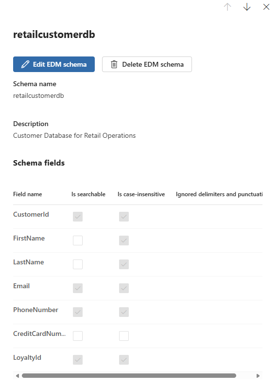
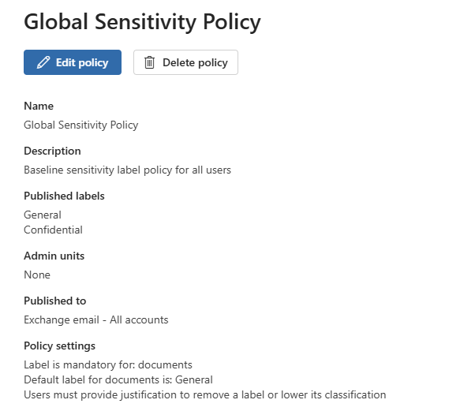
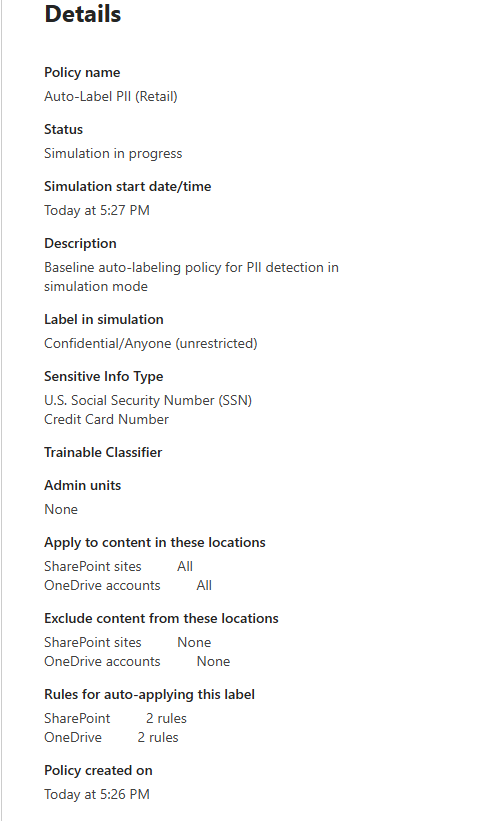
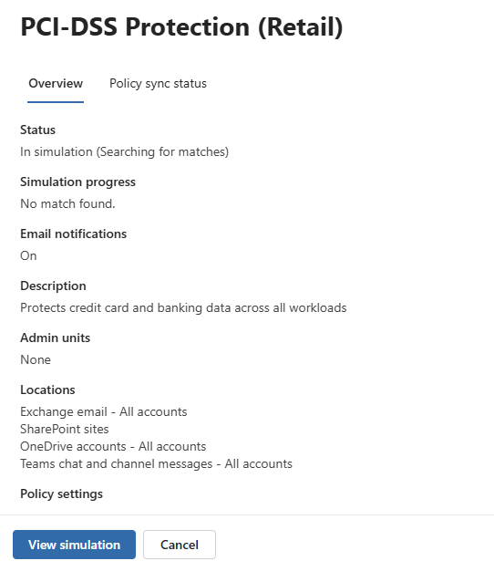

# Day Zero Setup: Long-Lead Items

**⚠️ CRITICAL STEP**: Execute the tasks in this section **IMMEDIATELY**.

Microsoft Purview has several features that require significant backend processing time before they become active. To ensure you can complete the labs without waiting, you must initiate these processes on "Day Zero".

## ⏳ Wait Times Overview

| Feature | Action | Estimated Wait Time |
|---------|--------|---------------------|
| **Pay-As-You-Go (PAYG)** | Billing Propagation | 4 - 24 Hours |
| **Exact Data Match (EDM)** | Schema Indexing | 12 - 24 Hours |
| **Sensitivity Labels** | Policy Publication | 24 Hours (for full client availability) |
| **Auto-Labeling Policies** | Simulation Results | 24 - 48 Hours |
| **DLP Policies** | Policy Propagation | 1 - 2 Hours (M365 workloads) |
| **Audit Log** | Initial Enablement | 24 Hours |

## 📋 Day Zero Checklist

### 1. Enable Purview Pay-As-You-Go (PAYG)

**Why?** EDM and other advanced features require an Azure Subscription link.

- **Pre-Check (Optional)**:
  - Go to [purview.microsoft.com](https://purview.microsoft.com) > **Settings** (gear icon) > **Account**.
  - If you see an Azure Subscription listed under "Billing & Usage", PAYG is **already enabled**. You can skip this step.
- **Action**: Run the script from the `scripts` directory:

    ```powershell
    cd scripts
    .\Enable-PurviewPAYG.ps1
    ```
  
  - This script checks for existing Purview accounts.
  - **If enabled**: It will report "✅ Purview Pay-As-You-Go is ALREADY enabled" and exit safely.
  - **If not enabled**: It creates an Azure Resource Group and a Purview Account to enable billing.
  - **Note**: This script requires the `Az` PowerShell module and Owner/Contributor rights on your Azure Subscription.

- **Validation**:
  - The script output will confirm either "✅ Pay-As-You-Go billing is now enabled" or "ALREADY enabled".
  - In the Azure Portal, verify the `pview-payg-*` (or your existing) resource exists.

### 2. Create and Index EDM Schema

**Why?** The EDM hash must be uploaded and indexed by Microsoft before you can use it in policies. This process can take up to 24 hours.

**Clarification**: The goal here is to upload the **Data** so it can be indexed. The **Classifier** (Rule Package) will be created in Lab 03, but it requires this data to be fully indexed first.

**⚠️ IMPORTANT REQUIREMENTS**:

- You must run these scripts as **Administrator**.
- You must sign in with your **User Account** (Service Principal auth is not supported by the EDM Agent).
- Your user must be in the `EDM_DataUploaders` security group (Script 01 handles this).

- **Action**: Run the following scripts in order:

    1. **Setup Prerequisites**:
       Checks Admin rights, installs/verifies EDM Agent, and adds your user to the `EDM_DataUploaders` security group.

        ```powershell
        cd scripts
        .\Initialize-EdmPrerequisites.ps1
        ```

        > **Note**: This script now includes a **Verification Step**. It will attempt to authorize with the EDM Agent. If it fails (due to propagation delay), it will provide a command for you to retry until successful.

    2. **Sync or Create Schema**:
    Ensures your local XML schema matches the cloud definition to prevent validation errors.

    ```powershell
    .\Sync-EdmSchema.ps1
    ```

    > **Note**: If the schema does not exist in the cloud, this script will generate a new one locally and **automatically upload** it to Purview.
    > **💡 Critical**: This script performs a "Round-Trip" sync. It creates the schema in the cloud and then **immediately downloads** the authoritative version (with system attributes) back to your local machine. This is required for the next step to succeed.

    3. **Upload Data**:

    Generates sample data, hashes it, and uploads it to Purview.

    ```powershell
    .\Upload-EdmData.ps1
    ```

    > **Troubleshooting**: If this fails with "Schema provided is not a valid XML", run Step 2 again to refresh your local schema file.

#### 🟢 Expected Execution Output

You should see the following success indicators in your terminal:

```text
# Step 1: Prerequisites
✅ User added to EDM_DataUploaders group
✅ EDM Upload Agent is installed

# Step 2: Schema Sync
✅ Schema 'RetailCustomerDB' found in cloud!
⬇️ Downloading schema to ensure local sync...
✅ Local file updated: ...\RetailCustomerDB.xml

# Step 3: Data Upload
✅ Data file created: ...\CustomerDB.csv
🔐 Authenticating & Uploading...
✅ Data Uploaded Successfully!
```

- **What to Expect**:
  - `Initialize-EdmPrerequisites.ps1`: Fixes the "UserNotInSecurityGroup" error.
  - `Sync-EdmSchema.ps1`: Resolves "Schema does not match definition" errors by syncing with the cloud.
  - `Upload-EdmData.ps1`: Hashes the data locally and uploads the **hashes** to the **Purview EDM Datastore**.
    - **Note**: This does **NOT** upload the file to SharePoint or OneDrive. It sends the "fingerprints" to Microsoft so Purview can recognize this data later.
  - **Data Fields**: The schema includes `CustomerId`, `FirstName`, `LastName`, `Email`, `PhoneNumber`, `CreditCardNumber`, and `LoyaltyId`.

#### 🔎 Validation

**1. Verify Schema Existence**:

- **PowerShell**: Run `Get-DlpEdmSchema` in the terminal. You should see `RetailCustomerDB` listed.
- **Portal**:
  1. Go to **Purview Portal** > **Information Protection** > **Classifiers**.
  2. Toggle **New EDM experience** to **Off** (switch to Classic view).
  3. Click the **EDM schemas** tab.
  4. Verify `RetailCustomerDB` is listed.

**2. Verify Data Upload Status**:

- **PowerShell (Primary Method)**:
  1. **Authenticate** (Required if session expired):

     ```powershell
     & "C:\Program Files\Microsoft\EdmUploadAgent\EdmUploadAgent.exe" /Authorize
     ```

  2. **Check Status**:
     Run this command to extract the specific upload status:

     ```powershell
     $out = & "C:\Program Files\Microsoft\EdmUploadAgent\EdmUploadAgent.exe" /GetSession /DataStoreName RetailCustomerDB
     if ($LASTEXITCODE -eq 0) {
         $out | Select-String "Completed|Indexing" | ForEach-Object { 
             $row = $_.ToString().Split(',')
             if ($row.Count -gt 2) { "✅ Upload Status: " + $row[2].Trim() }
         }
     } else {
         Write-Host "❌ Error retrieving session. Please run '/Authorize' again." -ForegroundColor Red
     }
     ```

    > You should see output like: **✅ Upload Status: Completed** or **Indexing**.

- **Portal**:
  - **Note**: The "Data source" status often does not appear in the Schema flyout immediately. Rely on the PowerShell command above for confirmation.
  - You can confirm the **Schema** itself exists by finding `RetailCustomerDB` in the list.

    

> **Note**: Indexing can take **12-24 hours**. You can proceed with the labs while this processes in the background.

- **Future Context**: You will use this schema in **Lab 03: Classification Design** to detect custom customer data.

### 3. Publish "Baseline" Sensitivity Labels

**Why?** While labels often appear in Web Apps within an hour, full propagation to Desktop Apps (Word, Excel) and the AIP Client can take up to **24 hours**. Deploying them now ensures they are fully available when you reach **Lab 04**.

**Authentication Note**: Unlike the EDM step above, this script uses **Service Principal** authentication (configured in Prerequisites) to interact with the Microsoft Graph API.

- **Action**: Run the deployment script:

    ```powershell
    .\Deploy-BaselineLabels.ps1
    ```

- **What to Expect**:
  - The script connects to Security & Compliance PowerShell using the Service Principal.
  - It checks for existing labels by **Display Name** to prevent duplicates.
  - It creates two labels: **"General"** and **"Confidential"** (if they don't already exist).
  - **Note**: This script only creates the **Label Definitions**. You must create a **Label Policy** (in Lab 04 or via portal) to publish them to users. Auto-labeling policies are also a separate future step.

  **Example Output (Idempotent Run):**

  ```text
  🔌 Connecting to Microsoft Graph...
     📂 Loading configuration from global-config.json...
     ✅ Found certificate 'PurviewAutomationCert' in user store.
     ✅ Found App ID in ServicePrincipal-Details.txt
  🔍 Step 1: Environment Validation
  =================================
     ✅ Microsoft.Graph module is already installed.
  🔐 Step 2: Authentication
  ========================
     🚀 Connecting to Microsoft Graph...
     ✅ Successfully connected to tenant...
  📋 Step 1: Defining Label Taxonomy
  ==================================
  🔐 Step 2: Connecting to Security & Compliance PowerShell
  ========================================================
     🔍 Retrieving default domain from Microsoft Graph...
     ✅ Organization Domain: marcusj-dev.cloud
     🚀 Connecting to IPPSSession (App-Only)...
     ✅ Connected to Security & Compliance PowerShell
  🚀 Step 3: Deploying Labels
  ===========================
     ⏳ Processing label: General
     ✅ Label 'General' already exists (ID: ...). Skipping creation.
     ⏳ Processing label: Confidential
     ✅ Label 'Confidential' already exists (ID: ...). Skipping creation.
     ℹ️ Note: Policy publication is required to make these labels visible to users.
     ℹ️ Please create a Label Policy in the Purview Portal or via script to publish these.
  ```

- **Validation**:
  - The script creates label definitions successfully.
  - **Note**: Labels require up to 24 hours for full propagation to desktop apps.
  - After propagation, open **Word** or **Excel** and verify the **Sensitivity** button appears.
  - You'll create a Label Policy in **Lab 04** to publish these labels to users.

### 4. Deploy Label Policy

**Why?** Label definitions alone don't make labels visible to users. A Label Policy is required to publish labels, and policy propagation takes up to 24 hours. Creating the policy now ensures labels are fully available when you reach **Lab 04**.

- **Action**: Run the deployment script:

    ```powershell
    .\Deploy-LabelPolicy.ps1
    ```

- **What to Expect**:
  - The script creates a "Global Sensitivity Policy" that publishes the baseline labels.
  - It assigns the policy to **All Users** in your tenant.
  - Sets **"General"** as the default label for new documents.
  - Enables **mandatory labeling** (users must apply a label).
  - Requires **justification** to remove or downgrade a label.
  - Policy propagates to M365 apps within 24 hours.

- **Validation**:
  - After 24 hours, open **Word** or **Excel** (desktop or web).
  - Verify the **Sensitivity** button appears on the ribbon.
  - Click it and confirm you see **"General"** and **"Confidential"** labels.
  - Create a new document and verify you're prompted to select a label.



### 5. Deploy Auto-Labeling Policy

**Why?** Auto-labeling policies scan SharePoint/OneDrive for sensitive content and automatically apply labels. Simulation mode takes 24-48 hours to analyze files and provide results. Starting this now means you'll have simulation data ready when you reach **Lab 03**.

- **Action**: Run the deployment script:

    ```powershell
    .\Deploy-AutoLabelingPolicy.ps1
    ```

- **What to Expect**:
  - The script creates an auto-labeling policy named **"Auto-Label PII (Retail)"**.
  - Creates **4 detection rules** (2 for SharePoint, 2 for OneDrive) to scan for **Credit Card Numbers** and **U.S. Social Security Numbers**.
  - Runs in **Simulation Mode** (safe - no files are modified).
  - Automatically applies the **"Confidential"** label when PII/PCI data is detected.
  - Simulation takes **24-48 hours** to complete analysis.
  - Aligns with baseline DLP policy scope (PCI-DSS + PII protection).

- **Validation**:
  - Go to [purview.microsoft.com](https://purview.microsoft.com) > **Information Protection** > **Auto-labeling**.
  - Verify **"Auto-Label PII (Retail)"** policy appears with status **"Simulation"**.
  - Click the policy to confirm **4 rules** are configured (2 for SharePoint, 2 for OneDrive).
  - After 24-48 hours, click the policy to **View simulation results**.
  - You'll see a list of files that matched either **Credit Card** or **SSN** patterns.
  - Results show where sensitive payment and identity data exists across your tenant.
  - In **Lab 03**, you can review results and turn on enforcement if desired.



> **💡 Key Point**: This policy runs in simulation mode only. It identifies matching files without modifying them. You'll have visibility into what would be auto-labeled before enforcing the policy. The dual SIT detection (Credit Cards + SSN) aligns with your DLP policy scope and provides comprehensive coverage of retail PII/PCI data.

### 6. Deploy Baseline DLP Policies

**Why?** DLP policies require time to propagate across Exchange, SharePoint, OneDrive, and Teams workloads. Creating baseline policies now ensures they are active when you reach the configuration and testing labs.

- **Action**: Run the deployment script:

    ```powershell
    .\Deploy-BaselineDlpPolicies.ps1
    ```

- **What to Expect**:
  - The script creates **four** baseline policies in **"Test with Notifications"** mode:
    1. **"PCI-DSS Protection (Retail)"**: Detects Credit Cards and ABA Routing Numbers.
    2. **"PII Data Protection (Retail)"**: Detects U.S. SSNs.
    3. **"Loyalty Card Protection (Retail)"**: Uses a placeholder rule (Credit Card) until the custom SIT is created.
    4. **"External Sharing Control (Retail)"**: Restricts external sharing of sensitive files.
  - All policies target **Exchange, SharePoint, OneDrive, and Teams** and propagate within 1-2 hours.

- **Validation**:
  - Go to [purview.microsoft.com](https://purview.microsoft.com) > **Data Loss Prevention** > **Policies**.
  - Verify all 4 policies show status "On (Test)" with M365 locations enabled.



> **💡 Key Point**: These policies are created now to start the propagation timer. In **Lab 04**, you'll edit them to add advanced features (custom SITs, notifications, overrides) without triggering a new wait. Only creating NEW policies or adding NEW LOCATIONS requires propagation time.

### 7. Enable Audit Logging

**Why?** You cannot track data exfiltration or policy matches if auditing is off.

- **Action**: Run the enablement script:

    ```powershell
    .\Enable-AuditLogging.ps1
    ```

- **What to Expect**:
  - The script connects to Exchange Online PowerShell.
  - It checks the current status of `UnifiedAuditLogIngestionEnabled`.
  - If disabled, it enables it and warns about the 24-hour activation period.
- **Validation**:
  - Run the script again; it should report "✅ Unified Audit Log is ALREADY enabled."
- **Future Context**: You will use these logs in **Lab 07: Audit and Validation** to investigate simulated data leaks.

## 🚀 Automation Scripts

Use the scripts in this directory to perform these actions quickly.

> **Note**: All scripts should be run from the `scripts` directory.

- `Enable-PurviewPAYG.ps1`: Enables Pay-As-You-Go billing.
- `Initialize-EdmPrerequisites.ps1`: Sets up EDM security groups and verifies agent.
- `Sync-EdmSchema.ps1`: Syncs or creates the EDM schema.
- `Upload-EdmData.ps1`: Uploads EDM data hashes.
- `Deploy-BaselineLabels.ps1`: Creates baseline label definitions.
- `Deploy-LabelPolicy.ps1`: Creates and publishes the Global Sensitivity Policy.
- `Deploy-AutoLabelingPolicy.ps1`: Creates auto-labeling policy in simulation mode for PII detection.
- `Deploy-BaselineDlpPolicies.ps1`: Creates comprehensive baseline DLP policies (PCI-DSS, PII, Loyalty ID, External Sharing).
- `Enable-AuditLogging.ps1`: Turns on the Unified Audit Log.

> **Note**: Ensure you have run `Deploy-ServicePrincipal.ps1` in the prerequisites section before running these scripts.

---

## 🤖 AI-Assisted Content Generation

This documentation was created with the assistance of **GitHub Copilot** powered by advanced AI language models. The content was generated, structured, and refined through iterative collaboration between human expertise and AI assistance within **Visual Studio Code**, incorporating best practices for managing Purview propagation delays.

*AI tools were used to enhance productivity and ensure comprehensive coverage of Day Zero requirements while maintaining technical accuracy.*
