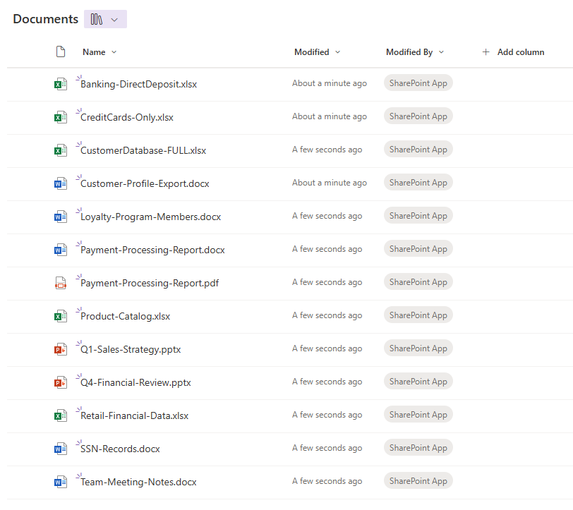

# Data Foundation: Creating SharePoint Site and Uploading Test Data

> **✅ Prerequisites**: Complete **00-Project-Setup-and-Admin** to configure service principal authentication and global configuration settings.

## 🎯 What You're Creating and Uploading

This lab generates **13 comprehensive test files** in native Microsoft Office formats containing various combinations of Sensitive Information Types (SITs) for realistic DLP testing:

### Test File Categories

**Single-SIT Files (4 files)** - Isolated testing:

- **CreditCards-Only.xlsx** - Credit card numbers only (Luhn-valid)
- **SSN-Records.docx** - Social Security Numbers only
- **Banking-DirectDeposit.xlsx** - ABA routing numbers only
- **Loyalty-Program-Members.docx** - Custom loyalty IDs (RET-XXXXXX-X pattern)

**Multi-SIT Files (6 files)** - Complex scenarios:

- **CustomerDatabase-FULL.xlsx** - ALL SITs (CC, SSN, Banking, Loyalty, PII)
- **Payment-Processing-Report.docx** - Credit cards + ABA routing numbers
- **Payment-Processing-Report.pdf** - Same content as DOCX, PDF format
- **Customer-Profile-Export.docx** - PII + SSN + Loyalty IDs
- **Q4-Financial-Review.pptx** - CC + SSN + Banking + Loyalty (presentation format)
- **Retail-Financial-Data.xlsx** - Multi-sheet workbook with various SIT combinations

**Clean Control Files (3 files)** - False positive testing:

- **Product-Catalog.xlsx** - Product inventory (no sensitive data)
- **Team-Meeting-Notes.docx** - Meeting notes (no sensitive data)
- **Q1-Sales-Strategy.pptx** - Sales presentation (no sensitive data)

### Sensitive Information Types Included

All files use **30 realistic customer records** with:    

- **Luhn-Valid Credit Cards** (Visa, Mastercard, Amex, Discover)
- **Realistic SSNs** (avoiding invalid patterns: 000-xx-xxxx, xxx-00-xxxx, 666-xx-xxxx)
- **ABA Routing Numbers** (with valid checksums)
- **Custom Loyalty IDs** (RET-XXXXXX-X pattern for custom SIT testing)
- **PII** (names, emails, phone numbers, addresses)

This comprehensive test data will trigger:

- **Auto-labeling policies** (various SIT detection combinations)
- **DLP policies** (single and multi-SIT scenarios)
- **Content Explorer classification**
- **Custom SIT validation** (Loyalty IDs)

## 📍 SharePoint Site Architecture

This lab creates a dedicated **Retail Operations** SharePoint Team Site for DLP testing:

| Component | Value | Purpose |
|-----------|-------|---------|
| **Site Name** | `Retail-Operations` | URL-safe site identifier |
| **Site Title** | `Retail Operations - DLP Testing` | Display name in SharePoint |
| **Site Type** | Team Site | Collaborative document library |
| **Owner** | Admin email from config | Site collection administrator |
| **Document Library** | `Shared Documents` | Default document storage location |

> **📝 Configuration**: All site details are defined in `templates/global-config.json` under the `sharePointSite` section.

## 🧪 Lab Instructions

### Step 1: Configure global-config.json

Before running scripts, ensure your configuration file is properly set up:

**Location**: `templates/global-config.json`

**Required Settings**:

```json
{
  "tenantId": "your-tenant-id-guid",
  "sharePointRootUrl": "https://yourtenant.sharepoint.com",
  "sharePointSite": {
    "name": "Retail-Operations",
    "title": "Retail Operations - DLP Testing",
    "owner": "admin@yourtenant.onmicrosoft.com"
  },
  "servicePrincipal": {
    "appId": "your-app-id-guid",
    "certificateName": "PurviewAutomationCert"
  }
}
```

> **💡 Service Principal Setup**: This lab uses certificate-based service principal authentication. If you haven't completed **00-Project-Setup-and-Admin**, do that first to configure the app registration and certificate.

### Step 2: Generate Test Files

Generate all 13 test files with realistic sensitive data:

```powershell
cd scripts

.\Generate-TestData.ps1
```

**What happens**:

- Initializes Microsoft Office COM objects (Excel, Word, PowerPoint)
- Generates 30 customer records with Luhn-valid credit cards, realistic SSNs, ABA routing numbers
- Creates 13 files in `data-templates/` directory:
  - 5 Excel workbooks (.xlsx)
  - 5 Word documents (.docx)
  - 1 PDF document (.pdf)
  - 2 PowerPoint presentations (.pptx)

**Expected output**:

```text
✅ Microsoft Excel COM object loaded
✅ Microsoft Word COM object loaded
✅ Microsoft PowerPoint COM object loaded
✅ Generated 30 customer records with realistic data
✅ Created: CreditCards-Only.xlsx (Credit Card SIT only)
✅ Created: SSN-Records.docx (SSN SIT only)
...
📈 Total Files Generated: 13
📂 Output Location: C:\...\data-templates
```

> **⚠️ Requirements**: Requires Microsoft Office installed (Excel, Word, PowerPoint). Script uses COM automation - no PowerShell modules needed.

### Step 3: Create the Retail Operations SharePoint Site

```powershell
.\New-RetailSite.ps1
```

**What happens**:

- Loads configuration from `global-config.json`
- Connects to SharePoint using service principal with certificate authentication
- Creates new Team Site: `https://yourtenant.sharepoint.com/sites/Retail-Operations`
- Provisions default `Shared Documents` library
- Validates site creation and accessibility

**Expected output**:

```text
✅ Configuration loaded
   📋 Tenant: https://yourtenant.sharepoint.com
✅ Found certificate (expires: MM/DD/YYYY)
✅ Connected to SharePoint with service principal
🚀 Creating site (may take 1-2 minutes)...
✅ Site created successfully!
```

> **⏱️ Timing**: Site creation takes 1-2 minutes. If site already exists, script detects it and continues.

### Step 4: Upload Test Files to SharePoint

```powershell
.\Upload-TestDocs.ps1
```

**What happens**:

- Validates all 13 test files in `data-templates/` directory
- Connects to Retail Operations SharePoint site using service principal
- Uploads all files to `Shared Documents` library
- Checks for duplicates and skips already-uploaded files

**Expected output**:

```text
✅ Found 13 test files to upload
   📄 Banking-DirectDeposit.xlsx (0.01 MB)
   📄 CreditCards-Only.xlsx (0.01 MB)
   ...
✅ Connected to SharePoint with service principal
✅ Site validated: Retail Operations - DLP Testing
📤 Uploading Banking-DirectDeposit.xlsx...
   ✅ Uploaded successfully
...
📊 Upload Summary
   Total Files:    13
   ✅ Uploaded:    13
   ⚠️  Skipped:    0
```

## ✅ Validation Steps

After uploading, verify the files are accessible and being scanned:

### Immediate Verification (Within 5 Minutes)

1. Open a browser and navigate to: `https://yourtenant.sharepoint.com/sites/Retail-Operations`
2. Click **Documents** in the left navigation
3. Confirm all **13 test files** are present in the library
4. Preview files to verify content:
   - **CustomerDatabase-FULL.xlsx** - Should show all customer data with SITs
   - **Payment-Processing-Report.pdf** - Should display credit card and banking info
   - **Q4-Financial-Review.pptx** - Should show presentation slides with financial data



### DLP Scanning Verification (Within 1 Hour)

1. Go to [Microsoft Purview Compliance Center](https://purview.microsoft.com)
2. Navigate to **Data loss prevention** → **Activity explorer**
3. Filter by:
   - **Location**: SharePoint
   - **Activity**: File accessed/File modified
4. Look for activity related to your uploaded files
5. Check for DLP policy matches:
   - Files with credit cards should show CC detection
   - Files with SSNs should show SSN detection
   - Multi-SIT files should show multiple SIT detections

### Content Classification Verification (Within 24 Hours)

1. Go to **Data classification** → **Content explorer**
2. Navigate to **Locations** → **SharePoint**
3. Search for "Retail Operations" site
4. Verify files are classified by detected SITs:
   - **Credit Card Number** - Should show 7 files
   - **U.S. Social Security Number (SSN)** - Should show 6 files
   - **U.S. Bank Account Number** - Should show 5 files
   - **Custom SIT (Loyalty ID)** - Should show 4 files

### Auto-Labeling Verification (Within 24-48 Hours)

1. Return to SharePoint site and check file properties
2. Right-click any multi-SIT file → **Details**
3. Check the **Sensitivity** field for applied labels
4. Expected labels (based on your auto-labeling policies):
   - Files with CC + SSN should receive higher sensitivity label
   - Files with single SITs may receive lower sensitivity label
   - Clean control files should have no labels

> **💡 Simulation Mode**: If your auto-labeling policy is in simulation mode:
>
> 1. Go to Purview → **Information protection** → **Auto-labeling**
> 2. Click your auto-labeling policy
> 3. Click **Simulation results** tab
> 4. Wait 24-48 hours, then check which files would be labeled

### Expected Classification Results

| File Name | Expected SITs Detected | Expected Count |
|-----------|----------------------|----------------|
| CreditCards-Only.xlsx | Credit Card Number | 12 instances |
| SSN-Records.docx | U.S. Social Security Number | 8 instances |
| Banking-DirectDeposit.xlsx | U.S. Bank Account Number | 12 instances |
| Loyalty-Program-Members.docx | Custom Loyalty ID | 12 instances |
| CustomerDatabase-FULL.xlsx | CC, SSN, Banking, Loyalty, PII | 30+ instances |
| Payment-Processing-Report.docx/pdf | Credit Card, Banking | 10+ instances |
| Customer-Profile-Export.docx | SSN, Loyalty, PII | 8+ instances |
| Q4-Financial-Review.pptx | CC, SSN, Banking, Loyalty | 5+ instances |
| Retail-Financial-Data.xlsx | CC, SSN, Banking, Loyalty | 20+ instances |
| Product-Catalog.xlsx | **NONE** (clean file) | 0 instances |
| Team-Meeting-Notes.docx | **NONE** (clean file) | 0 instances |
| Q1-Sales-Strategy.pptx | **NONE** (clean file) | 0 instances |

## 🔍 Troubleshooting

### "Microsoft Office not available" Warning

**Cause**: Excel, Word, or PowerPoint not installed on the system.

**Solution**:

- Install Microsoft Office (365, 2021, 2019, or 2016)
- Script will gracefully skip file types for unavailable applications
- Minimum files created: 0 (if no Office apps), Maximum: 13 (all Office apps available)

### "Failed to resolve site" Error

**Cause**: SharePoint site doesn't exist or service principal lacks permissions.

**Solution**:

- Run `New-RetailSite.ps1` first to create the site
- Verify site URL format: `https://yourtenant.sharepoint.com/sites/Retail-Operations`
- Confirm app registration has `Sites.ReadWrite.All` permission
- Check certificate is valid and uploaded to app registration

### "Certificate not found" Error

**Cause**: PurviewAutomationCert certificate not in local certificate store.

**Solution**:

- Complete **00-Project-Setup-and-Admin** to generate and install certificate
- Verify certificate exists: `Get-ChildItem Cert:\CurrentUser\My | Where-Object {$_.Subject -eq "CN=PurviewAutomationCert"}`
- Ensure certificate is uploaded to Azure AD app registration

### "Upload failed" Error

**Cause**: Network issues, file already exists, or permission problems.

**Solution**:

- Script automatically skips files that already exist (check "Skipped" count)
- Verify service principal has `Files.ReadWrite.All` permission
- Check firewall/proxy settings for SharePoint connectivity
- Delete existing files from SharePoint and re-run upload

### Re-running the Lab

To start fresh with a clean SharePoint site:

```powershell
# 1. Delete site from SharePoint admin center or via browser
# 2. Remove from recycle bin using this PowerShell command:
$cert = Get-ChildItem Cert:\CurrentUser\My | Where-Object {$_.Subject -eq "CN=PurviewAutomationCert"} | Select-Object -First 1
Connect-PnPOnline -Url "https://yourtenant-admin.sharepoint.com" -ClientId "your-app-id" -Thumbprint $cert.Thumbprint -Tenant "yourtenant.onmicrosoft.com"
Remove-PnPTenantDeletedSite -Identity "https://yourtenant.sharepoint.com/sites/Retail-Operations" -Force

# 3. Re-run scripts in order:
.\Generate-TestData.ps1
.\New-RetailSite.ps1
.\Upload-TestDocs.ps1
```

---

## 📚 What's Next?

After uploading test files and validating detection:

1. **Monitor DLP Activity** (Immediate - 24 Hours)
   - Check Activity Explorer for DLP policy matches
   - Verify different SIT types are being detected
   - Confirm clean control files don't trigger false positives

2. **Review Content Classification** (24-48 Hours)
   - Use Content Explorer to see files categorized by SIT
   - Verify single-SIT vs multi-SIT classification accuracy
   - Check confidence scores for SIT detections

3. **Validate Auto-Labeling** (24-48 Hours)
   - Review simulation results for auto-labeling policies
   - Identify which files would receive which sensitivity labels
   - Compare multi-SIT files vs single-SIT label assignments

4. **Test File Sharing** (Next Lab)
   - Share files externally to trigger DLP policies
   - Test policy tips and user notifications
   - Verify blocking vs audit-only behavior

5. **Advanced DLP Configuration** (Future Labs)
   - Create custom DLP policies for specific file combinations
   - Configure advanced rules for multi-SIT scenarios
   - Set up custom SIT for Loyalty ID pattern (RET-XXXXXX-X)

## 📁 Project Structure

```
02-Data-Foundation/
├── README.md                          # This file
├── scripts/
│   ├── Generate-TestData.ps1          # Creates 13 test files with Office COM automation
│   ├── New-RetailSite.ps1             # Creates SharePoint site via service principal
│   └── Upload-TestDocs.ps1            # Uploads all test files to SharePoint
├── data-templates/                    # Generated test files (created by Generate-TestData.ps1)
│   ├── Banking-DirectDeposit.xlsx
│   ├── CreditCards-Only.xlsx
│   ├── Customer-Profile-Export.docx
│   ├── CustomerDatabase-FULL.xlsx
│   ├── Loyalty-Program-Members.docx
│   ├── Payment-Processing-Report.docx
│   ├── Payment-Processing-Report.pdf
│   ├── Product-Catalog.xlsx
│   ├── Q1-Sales-Strategy.pptx
│   ├── Q4-Financial-Review.pptx
│   ├── Retail-Financial-Data.xlsx
│   ├── SSN-Records.docx
│   └── Team-Meeting-Notes.docx
└── templates/
    └── global-config.json              # Configuration (from 00-Project-Setup-and-Admin)
```

## ⚠️ Security Warning

While this data is **100% synthetic** (generated algorithmically with Luhn-valid algorithms), it appears **authentic to security scanning tools**. 

**Do not upload this data to production environments** unless you want to trigger:

- Real DLP policy violations
- Security incident alerts  
- Compliance audit findings
- Potential regulatory reporting

**Always use a dedicated test tenant, sandbox environment, or properly labeled development workspace.**

---

## 🤖 AI-Assisted Content Generation

This documentation was created with the assistance of **GitHub Copilot** powered by advanced AI language models. The content was generated, structured, and refined through iterative collaboration between human expertise and AI assistance within **Visual Studio Code**, incorporating best practices for synthetic data generation in security testing.

*AI tools were used to enhance productivity and ensure comprehensive coverage of data generation requirements while maintaining technical accuracy.*
