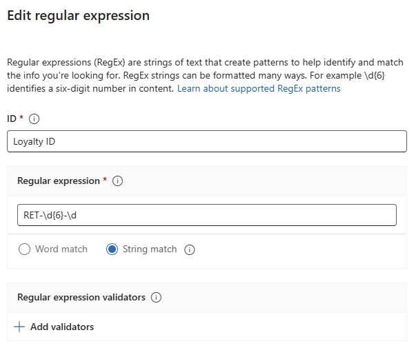
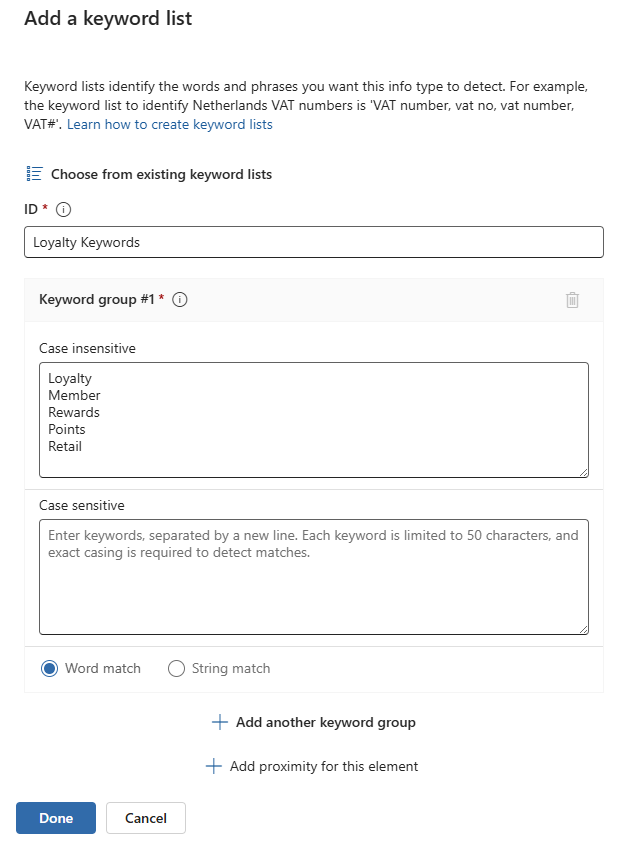
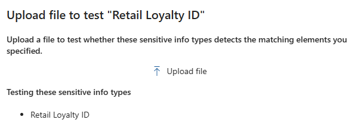
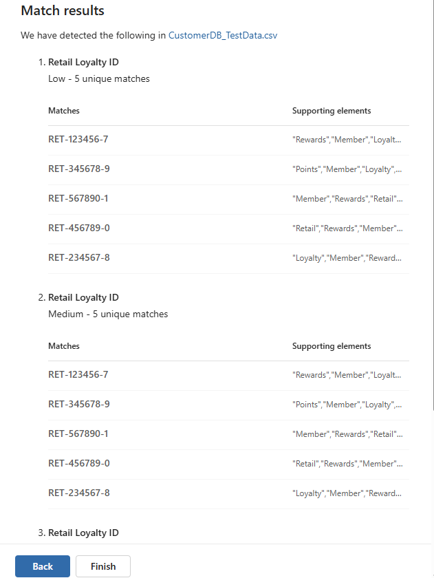

# Lab 01: Configure Custom Sensitive Information Types (SITs)

In this lab, you will create a Custom Sensitive Information Type (SIT) to detect our proprietary "Retail Loyalty ID" format. This demonstrates how to extend Purview beyond the built-in types.

## 🎯 Objectives

- Create a Regex-based SIT for `RET-123456-7` (6 digits, trailing digit).
- Add a keyword list to increase confidence.
- Test the SIT against sample data.

## 📋 Prerequisites

- **Global Administrator** or **Compliance Administrator** role.
- **Test Data** generated in `02-Data-Foundation`.

## 📝 Step-by-Step Instructions

### Part 1: Create the SIT

- Go to [purview.microsoft.com](https://purview.microsoft.com).
- Navigate to **Information Protection** > **Classifiers** > **Sensitive info types**.
- Click **+ Create sensitive info type**.

**Step 1: Name and Description**:

- **Name**: Retail Loyalty ID
- **Description**: Detects loyalty card numbers in the format RET-123456-7.
- Click **Next**.

**Step 2: Define Patterns**:

- Click **+ Create pattern**.
- **Confidence level**: High confidence.
- **Primary element**:
  - Select **Regular expression**.
  - **ID**: Loyalty ID
  - **Regex**: `RET-\d{6}-\d`

> **💡 Note**: Skip **Add validators** - validators are designed for established standards like credit card checksums or government IDs. This proprietary loyalty ID format has no validation algorithm, so the regex pattern itself provides sufficient structural validation.

- **Character proximity**:
  - Leave the default **300** characters.
  - Ensure **Anywhere in the document** is unchecked (we want proximity-based detection).
- **Supporting elements** (Recommended for higher accuracy):
  - Click **+ Add supporting elements or group of elements**.
  - Select **Keyword list**.
    - **ID**: Loyalty Keywords
    - **Keyword group #1** (Case insensitive): Add each keyword on a new line:
      - `Loyalty`
      - `Member`
      - `Rewards`
      - `Points`
      - `Retail`
    - Ensure **Word match** is selected (not String match - we want complete words only).
    - Skip **Add proximity for this element** - the pattern-level proximity (300 characters) already controls keyword distance.
    - Click **Done**.

    

- Skip **Additional checks** - no additional checks needed for this pattern.
- Click **Create**.
- Click **Next**.

**Step 3: Recommended Confidence Level**:

> **💡 Note**: This screen shows **High confidence level** selected with other options grayed out. This is because we configured only one pattern at the High confidence level in Step 2. The recommended confidence level is determined by the patterns you create - since all our patterns are High confidence, the overall SIT defaults to High confidence.

- Click **Next**.

**Step 4: Review settings and finish**:

- Review the configuration summary.
- Click **Create**.
- Click **Done**.

### Part 2: Test the SIT

- In the list of Sensitive info types, find **Retail Loyalty ID**.
- Click on it to open the details pane.
- Click **Test**.
- Click **Upload file**.

- Upload the `CustomerDB_TestData.csv` file from `02-Data-Foundation\Output`.
- Click **Test**.
- **Expected Results**: You should see matches for the Loyalty ID column with high confidence due to keyword proximity.

## ✅ Validation

- **High Confidence matches**: Loyalty IDs with keywords nearby (MembershipType column contains "Rewards", "Loyalty", "Points").
- **Pattern verification**: All 5 loyalty IDs should be detected: `RET-123456-7`, `RET-234567-8`, `RET-345678-9`, `RET-456789-0`, `RET-567890-1`.
- **Contextual detection**: Notice how supporting elements improve accuracy - the keywords in the MembershipType column validate these are legitimate loyalty program data, not random code samples.

> **💡 Production Insight**: In real-world scenarios, requiring keyword proximity significantly reduces false positives. Without keywords, the pattern might match test data, log files, or documentation that happens to use the same format.

---

## 🚀 Next Steps

You've successfully created and tested a Custom SIT that can detect proprietary Retail Loyalty IDs with contextual keyword validation. However, **detection alone doesn't enforce protection** - the SIT is now available as a building block for policy enforcement.

**To see this SIT in action with actual policy enforcement:**

- **Information Protection Labels** (upcoming labs): Apply sensitivity labels that automatically classify documents containing loyalty IDs
- **Data Loss Prevention (DLP) Policies** (upcoming labs): Block sharing of files with loyalty data, require justification, or encrypt sensitive content
- **Auto-Labeling** (upcoming labs): Automatically tag documents containing loyalty IDs for compliance reporting

> **🔒 Important**: Custom SITs are reusable classification components. The same "Retail Loyalty ID" SIT you created here will be available across Information Protection labels, DLP policies, retention policies, and compliance solutions throughout your Purview deployment.

**Coming Next**: Lab 02 will introduce **Exact Data Match (EDM)** classification for the complete customer database, demonstrating how to match entire records (not just individual field patterns) against your protected data inventory.

---

## 🤖 AI-Assisted Content Generation

This documentation was created with the assistance of **GitHub Copilot** powered by advanced AI language models. The content was generated, structured, and refined through iterative collaboration between human expertise and AI assistance within **Visual Studio Code**, incorporating best practices for custom classification.

*AI tools were used to enhance productivity and ensure comprehensive coverage of SIT configuration steps while maintaining technical accuracy.*
