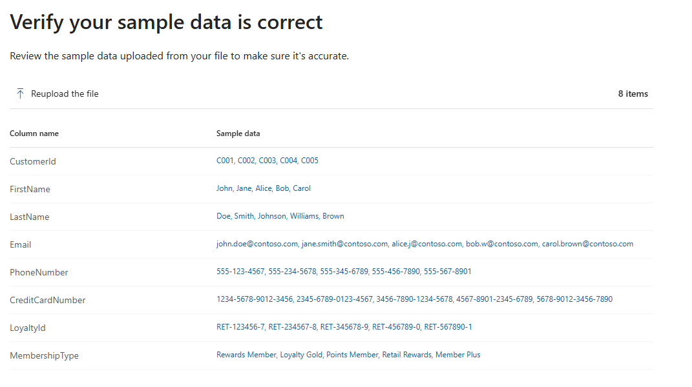
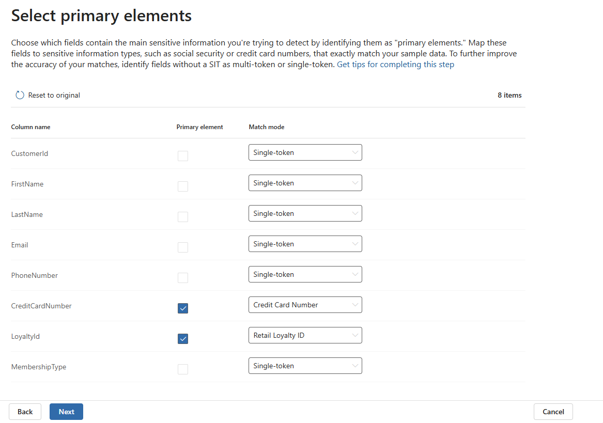
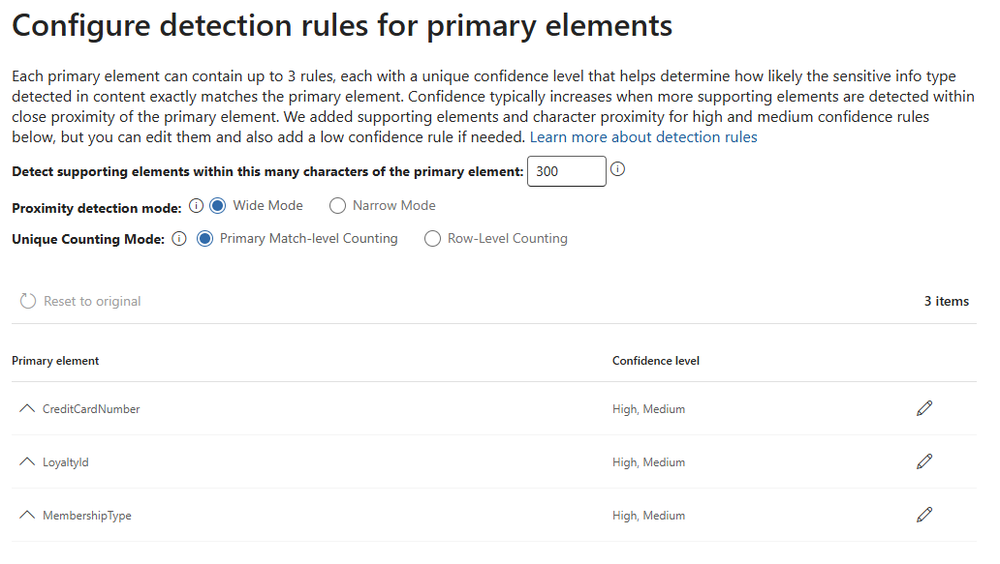
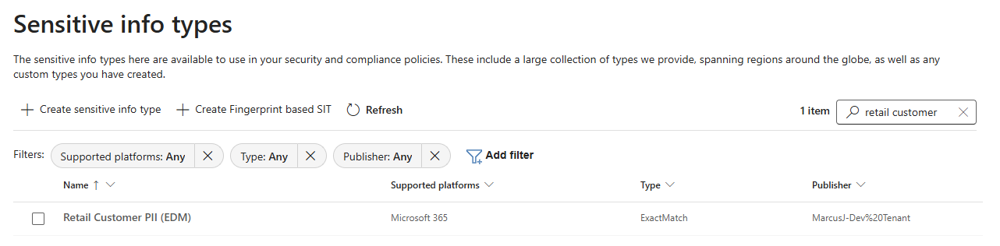
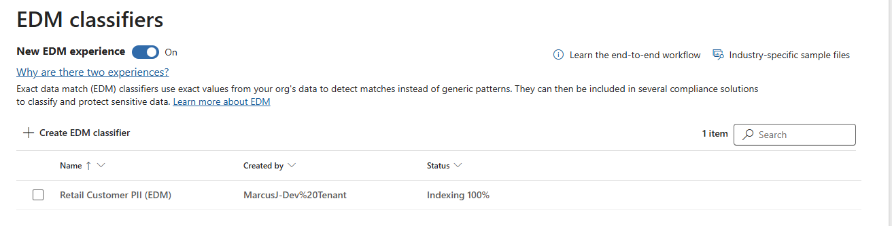

# Lab 02: Create EDM-based Classifiers (Sensitive Information Types)

In this lab, you will create an EDM-based Sensitive Information Type (SIT) using the Microsoft Purview portal. This demonstrates how to configure Exact Data Match (EDM) classifiers for high-confidence detection of specific customer PII while minimizing false positives.

## 🎯 Objectives

- Create an EDM-based SIT using the **New Experience** in Microsoft Purview
- Understand EDM's two-phase detection architecture (SIT pattern + database validation)
- Configure primary elements that trigger detection
- Learn how supporting elements boost confidence levels
- Understand when to use EDM vs regular pattern-based SITs

## 📋 Prerequisites

- **Global Administrator** or **Compliance Administrator** role
- **Custom SIT created**: Retail Loyalty ID (from Lab 01)
- **EDM sample file**: CustomerDB_EDM.csv (from 02-Data-Foundation/Output/)
- **Security & Compliance PowerShell** connected (for validation)
- **EDM Upload Agent installed** (download from [Microsoft](https://go.microsoft.com/fwlink/?linkid=2088639))
- **Administrator privileges** on Windows machine (required for EDM Upload Agent)

## 🧩 Understanding EDM Components

EDM classifiers consist of three components that work together:

| Component | Created Where | Purpose |
|-----------|---------------|---------|
| **EDM Schema** | Purview Portal (wizard Step 2) | Defines data structure (column names, data types) |
| **EDM Classifier (SIT)** | Purview Portal (this lab) | Detection rules that specify primary/supporting elements |
| **EDM Data Store** | EDM Upload Agent (separate process) | Contains hashed customer data for exact-value matching |

**Key Concept**: The classifier can be created immediately, but won't match content until data is uploaded and indexed (12-24 hours).

## ⏰ Lab Scope and Timing

This lab covers the **complete EDM deployment workflow** from classifier creation through data upload:

| Phase | Timeline | Covered In |
|-------|----------|------------|
| **Classifier Creation** | 10-15 minutes | ✅ Part 1-2 |
| **Data Upload** | 30-60 minutes | ✅ Part 4 |
| **Data Indexing** | ⏳ 12-24 hours | Automatic (wait time) |
| **EDM Detection Testing** | 5-10 minutes | Lab 05 (DLP) after indexing |

**Lab Outcome**: You'll create a fully configured EDM classifier and upload data. Detection testing happens in DLP labs after 12-24 hour indexing completes.

## 🎯 EDM Value Proposition

**The Problem Regular SITs Have**:

Pattern-based SITs (like Credit Card Number) detect any value matching the pattern - they can't distinguish between:

- Real customer credit cards in your database
- Fake test data (1111-2222-3333-4444)
- Credit cards from other companies' customers

**EDM's Solution**:

EDM validates that detected values exist in YOUR specific database, enabling:

| Business Scenario | Pattern SIT Result | EDM Result | Impact |
|-------------------|-------------------|------------|--------|
| Your customer card leaked | ✅ Match | ✅ Match | Correct detection |
| Fake test data in email | ✅ Match | ❌ No match | Reduces false positives |
| Competitor's customer data | ✅ Match | ❌ No match | Reduces false positives |
| Your customer + loyalty ID together | ✅ Match | ✅ HIGH confidence | Stronger detection |

**Business Value**: Reduce false positive alerts by 60-80% while maintaining 100% detection of actual customer data leaks.

## 📝 Step-by-Step Instructions

---

## 📝 Part 1: Create EDM Classifier Using Portal Wizard

Microsoft Purview offers two experiences for creating EDM classifiers. We'll use the **New Experience** (recommended as of 2025).

### Step 1: Access the EDM Classifier Wizard

1. **Navigate to Purview Portal**:
   - Go to [purview.microsoft.com](https://purview.microsoft.com)
   - Sign in with your compliance administrator account

2. **Access EDM Classifiers**:
   - Navigate to **Information Protection** > **Classifiers**
   - Ensure the **New EDM experience** toggle is set to **On** (modern UI)

   

3. **Create New EDM Classifier**:
   - Click **+ Create EDM classifier**
   - An informational popup appears: **"Familiarize yourself with the steps needed to put your classifier to work"**

   > **ℹ️ Informational Popup**: This popup outlines the 4-step EDM workflow (Prepare data → Create classifier → Upload data → Test). In this lab, we'll complete Step 2 (Create classifier). Data upload and testing will be covered in later labs. Click **Create EDM classifier** to continue.

   - The **EDM classifier creation wizard** opens with a 4-step process

### Step 1: Name Your Classifier

**Configuration**:

- **Name** (required): `Retail Customer PII (EDM)`
- **Description**: `Exact Data Match classifier for retail customer database - detects customer records using credit cards and loyalty IDs as primary identifiers`

Click **Next**.

### Step 2: Define the Schema

**Choose Schema Definition Method**:

- Select **Upload a file containing sample data** (RECOMMENDED - badge shown)
- Click **Next**

**Upload Sample File**:

- Click **Upload file** button
- Navigate to `02-Data-Foundation\Output\` and select `CustomerDB_EDM.csv` (7 fields)
- Wait for upload to complete (~10-30 seconds for small file)
- Verify the sample data shows 7 columns: CustomerId, FirstName, LastName, Email, PhoneNumber, CreditCardNumber, LoyaltyId
- Click **Next**

> **📋 File Selection Note**: Use `CustomerDB_EDM.csv` (7 fields) generated specifically for EDM schema creation, NOT `CustomerDB_TestData.csv` (8 fields with MembershipType). The 7-field structure contains only the fields we'll configure as primary and supporting elements.

> **📋 What Happens Behind the Scenes**: The wizard uses this sample file to create an EDM schema with the column names and data types it detects. This schema will store your data after you upload it using the EDM Upload Agent (separate process). The schema name will be auto-generated (e.g., `retailcustomerpiiedmschema`).



### Step 3: Specify Detection Rules

**3a. Select Primary Elements**:

On the **Select primary elements** page, you'll configure which fields are the main identifiers for detection.

> **ℹ️ Primary Elements**: Fields that must match for detection to occur. The wizard uses **OR** logic - finding any one primary element triggers a potential match. Choose 1-5 fields.
>
> **🎯 EDM Detection Architecture** (Per Microsoft Learn Documentation):
>
> **Two-Phase Detection Process**:
>
> 1. **SIT Triggers Search**: The SIT pattern detects potential matches in scanned content (e.g., finds credit card-like patterns)
> 2. **EDM Validates Exact Values**: EDM compares detected values against your indexed database using cryptographic hashes
>
> **Why SIT Mapping is Required**: The wizard requires SIT mapping to designate primary elements because "primary elements must be discoverable through an existing SIT" (Microsoft Learn). The SIT pattern finds candidates; EDM validates if those exact values exist in your database.
>
> **Why Validation Warnings Don't Matter**: The wizard validates your sample file against SIT patterns, but EDM matching happens against your indexed database (created in 01-Day-Zero-Setup). Validation failures like "No match" or "0 items" don't affect EDM functionality - they just indicate sample file values don't match SIT patterns, which is expected for exact-value EDM data.

**For each primary element, select the SIT from the Match mode dropdown and check the checkbox:**

**CreditCardNumber**:

- **Match mode**: Select **+** and then **Credit Card Number** from dropdown (built-in SIT)
- ✅ Check the **Primary element** checkbox
- Ignore validation warnings like "No match" - EDM will match exact values from your database

**LoyaltyId**:

- **Match mode**: Select **+** and then **Retail Loyalty ID** from dropdown (custom SIT created in Lab 01)
- ✅ Check the **Primary element** checkbox
- Ignore "No match" validation - EDM will match exact IDs like "RET-123456-7" from your database

> **⚠️ Do NOT Select MembershipType**: The CustomerDB_EDM.csv sample file only contains 7 fields and does NOT include MembershipType. Only select primary elements that exist in your EDM schema.



> **💡 Why These Primary Elements?**
>
> - **CreditCardNumber**: Payment data commonly appears in financial documents and support tickets  
> - **LoyaltyId**: Business-specific ID that appears in reports and customer records
> - **OR Logic**: Finding ANY ONE of these in a document triggers EDM detection (SIT finds pattern, EDM validates exact value)
> - **Schema Alignment**: Only select primary elements that exist in your EDM schema (CustomerDB_EDM.csv has 7 fields)
>
> **💡 SIT Validation vs. EDM Matching**:
>
> - **Wizard Validation**: Checks if sample file values match SIT patterns (often fails for exact-value data)
> - **Actual EDM Detection**: Matches exact values from your indexed database (happens during DLP scanning)
> - **Key Point**: Ignore validation warnings - EDM will work correctly when DLP scans content against your indexed database

**Supporting Elements (Auto-Assigned)**:

> **ℹ️ Auto-Assignment**: Fields left unchecked in the primary elements step are automatically included as supporting elements. These fields increase confidence when found within proximity of primary elements but don't trigger matches on their own.

**Supporting Elements (Automatically Assigned):**

- **CustomerId** - Database identifier
- **FirstName** - Customer first name
- **LastName** - Customer last name
- **Email** - Email address
- **PhoneNumber** - Phone number

> **💡 How Supporting Elements Boost Confidence**:
>
> - **More supporting elements near primary** = **higher confidence scores**
> - **FirstName + LastName**: Validates it's a customer record, not just isolated data
> - **PhoneNumber + Email**: Additional PII reinforces identity match
> - **CustomerId**: Database key adds technical validation
> - **Confidence Strategy**: EDM will calculate Low/Medium/High confidence based on how many supporting elements appear within proximity (300 characters) of the primary element

Click **Next**.

**3b. Configure Settings for Data in Selected Columns**:

On the **Configure settings for data in selected columns** page, configure how EDM matches data from your columns.

**Configuration Options**:

- **Use the same settings for all columns**: Toggle **On** (Yes)
  - Applies consistent matching behavior across all primary and supporting elements
  
- ✅ **Data in columns are case-insensitive**: Checked (default)
  - Matches "John" and "john" as equivalent
  - Recommended for names, emails, and most text fields
  
- **Ignore delimiters and punctuation**: Leave unchecked (default)
  - Keeps punctuation significant in matching (important for credit cards, phone numbers, IDs)
  - Example: "555-123-4567" won't match "5551234567" with this unchecked

> **💡 Recommended Configuration**: Keep the defaults - case-insensitive matching enabled, delimiters/punctuation matching disabled. This provides accurate matching for formatted data like credit cards and phone numbers while being flexible with name capitalization.

Click **Next**.

**3c. Configure Detection Rules for Primary Elements**:

On the **Configure detection rules for primary elements** page, the wizard shows auto-configured confidence rules based on your primary element selections.

**Configuration Settings (Keep Defaults)**:

- **Detect supporting elements within this many characters of the primary element**: `300` (default)
  - Supporting elements must be within 300 characters of the primary element to count toward confidence
  
- **Proximity detection mode**: **Wide Mode** (selected)
  - Recommended for most scenarios - provides broader matching context
  
- **Unique Counting Mode**: **Primary Match-level Counting** (selected)
  - Counts unique matches at the primary element level (recommended)

**Auto-Configured Confidence Rules**:

The wizard automatically creates **High** and **Medium** confidence rules for each primary element:

| Primary Element | Confidence Levels |
|----------------|------------------|
| **CreditCardNumber** | High, Medium |
| **LoyaltyId** | High, Medium |

> **ℹ️ Confidence Rules**: Each primary element gets two detection rules:
>
> - **High Confidence**: Primary element + more supporting elements within proximity
> - **Medium Confidence**: Primary element + fewer supporting elements within proximity
> - **Low Confidence**: Optional (not auto-created) - would be primary element only with no supporting elements required
>
> You can click the edit icon (✏️) next to each primary element to customize the specific number of supporting elements required for each confidence level, but the defaults are recommended for initial testing.
>
> **💡 Production Tip**: The wizard's auto-configured High/Medium confidence thresholds provide good balance between detection coverage and false positive prevention. Adjust later based on real-world detection results.



Click **Next**.

#### Step 4: Review Settings and Finish

On the **Review settings and finish** page, verify all configuration before creating the classifier.

**Review the Following Sections**:

### Step 5: Wizard Step 4 - Review and Finish

Review all settings before creating the classifier:

**EDM classifier name**:

- `Retail Customer PII (EDM)`

**EDM classifier description**:

- `Exact Data Match classifier for retail customer database - detects customer records using credit cards and loyalty IDs as primary identifiers`

**Sensitive info types for primary elements**:

- **CreditCardNumber** - Credit Card Number
- **LoyaltyId** - Retail Loyalty ID

**Schema file column settings**:

- Data in all columns is case insensitive

**Detection rules**:

- **CreditCardNumber** - 2 confidence levels (High, Medium)
- **LoyaltyId** - 2 confidence levels (High, Medium)

> **ℹ️ Edit Links Available**: Each section has an "Edit" link if you need to make changes before submitting. Review carefully as some settings cannot be changed after creation.

**Finalize Creation**:

- Review all settings carefully
- Click **Submit** to create the classifier

> **⏳ Creation Time**: The classifier is created immediately and appears in the classifiers list within 1-2 minutes.

**Wizard Completion Screen**:

After clicking Submit, you'll see a success message:

- **"You successfully created an EDM classifier"** 
- **Next step**: "Use the EDM Upload Agent tool to hash and upload your data"
- **Schema name shown**: (e.g., `retailcustomerpiiedmschema` or similar auto-generated name)

> **📋 Important - Copy Schema Name**: The wizard automatically creates a schema with a generated name based on your classifier name. **Copy this schema name** - you'll add it to `templates/global-config.json` in Part 4, Step 1 before uploading data.

---

## 📝 Part 2: Verify Classifier Creation

1. **Confirm in Portal**:

- Navigate to **Information Protection** > **Classifiers** > **Sensitive info types**
- In the search box, type `retail customer` to filter the list
- Locate **Retail Customer PII (EDM)** in the results
- Verify the following details:
  - **Name**: Retail Customer PII (EDM)
  - **Supported platforms**: Microsoft 365
  - **Type**: ExactMatch
  - **Publisher**: Your tenant name

   

> **ℹ️ Search Tip**: The search filters sensitive info types in real-time. You can also use filters like **Publisher: My organization** to show only your custom SITs

---

## 📤 Part 3: Upload EDM Data

**Why Upload is Required**:

The EDM classifier is created and ready for DLP policy assignment, but **actual detection requires data upload and indexing**:

| Missing Component | What's Needed | Timeline |
|------------------|---------------|----------|
| **EDM Data Upload** | Upload CustomerDB_EDM.csv via EDM Upload Agent | 30-60 min |
| **Data Indexing** | Purview indexes uploaded data | 12-24 hours |

> **⏱️ Wait 10-15 minutes** after Part 1 for schema propagation before proceeding with upload.

### Step 1: Configure EDM Schema Name

Edit `templates/global-config.json` and add the schema name from Part 1:

```json
  "edmSchema": {
    "schemaName": "retailcustomerpiiedmschema"
  },
```

Replace `retailcustomerpiiedmschema` with your actual schema name.

### Step 2: Upload EDM Data

**Open PowerShell as Administrator** and run:

```powershell
cd "C:\REPO\GitHub\Projects\Microsoft\Purview\Purview-Retail-Data-Protection-Masterclass\03-Classification-UI\scripts"
.\Upload-EdmData.ps1
```

The script handles authentication, hashes CustomerDB_EDM.csv locally, and uploads to Purview. Data indexing takes 12-24 hours.

### Step 3: Verify Upload in Portal

**Visual Confirmation**:

- Navigate to [purview.microsoft.com](https://purview.microsoft.com) > **Information Protection** > **Classifiers** > **EDM classifiers**
- Review **Retail Customer PII (EDM)**.
- In the classifier details pane, look for the **status** showing **Indexing 100%**.

> **💡 Verification Tip**: If you don't see upload details immediately, wait 2-3 minutes and refresh the page. The portal may take a moment to update after the EDM Upload Agent completes.



---

## 📊 Success Criteria

- ✅ EDM classifier created with primary/supporting elements
- ✅ Classifier verified in Purview portal (Type: ExactMatch)
- ✅ CustomerDB_EDM.csv uploaded successfully
- ⏳ Data indexing in progress (12-24 hours)

---

## 🎓 Key Concepts Learned

### EDM Classifier vs EDM Schema vs EDM Data

| Component | Purpose | Created When |
|-----------|---------|--------------|
| **EDM Schema** | Database table definition | Wizard Step 2 (auto-generated) |
| **EDM Classifier** | Detection rules (what triggers match) | This lab (Wizard Step 3-4) |
| **EDM Data Store** | Actual hashed customer data | Later (EDM Upload Agent) |

### Two-Phase EDM Detection

1. **Phase 1 - Pattern Matching** (SIT):
   - Base SIT finds pattern in content (e.g., Credit Card Number regex pattern)
   - This triggers potential match, moves to Phase 2

2. **Phase 2 - Database Validation** (EDM):
   - EDM checks: Does this exact value exist in our indexed database?
   - If YES → High confidence match (exact customer record)
   - If NO → Ignore (false positive filtered out)

### Primary vs Supporting Elements

| Element Type | Purpose | Match Logic |
|--------------|---------|-------------|
| **Primary** | Trigger detection | OR logic (any one field match) |
| **Supporting** | Boost confidence | Proximity-based (within 300 chars) |

**Example Detection Flow**:

- Content: "John Doe, Card: 1234-5678-9012-3456, Loyalty: RET-123456-7"
- SIT finds: Credit card pattern match
- EDM validates: Exact card number in database? → YES
- Supporting elements: LoyaltyId also found nearby (+1 proximity match)
- Result: **HIGH confidence** (primary match + 1 supporting element)

---

## 🚀 Next Steps

1. **Continue to Lab 03-04** - Complete sensitivity label and information protection labs while EDM data indexes
2. **05: Data Loss Prevention** - Create DLP policies using the EDM classifier (wait 12-24 hours after upload for EDM detection to work)
3. **Test EDM Detection** - After indexing completes, verify EDM matches exact customer records in Activity Explorer
4. **Monitor and Refine** - Review detection accuracy, adjust primary/supporting elements if needed

---

## 🤖 AI-Assisted Content Generation

This comprehensive EDM classifier lab guide was created with the assistance of **GitHub Copilot** powered by advanced AI language models. The content was generated, structured, and refined through iterative collaboration between human expertise and AI assistance within **Visual Studio Code**, incorporating Microsoft Purview EDM architecture, wizard workflows, and data protection best practices.

*AI tools were used to enhance productivity and ensure comprehensive coverage of EDM classifier configuration while maintaining technical accuracy and reflecting enterprise-grade data protection standards.*
