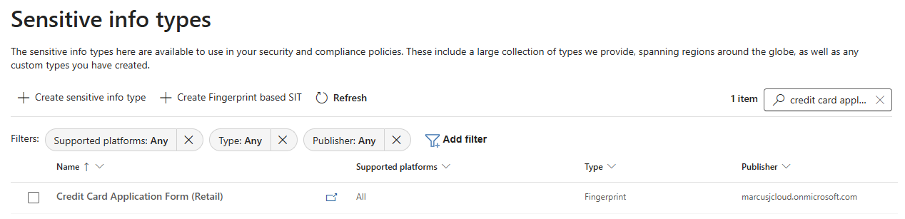

# Lab 03: Configure Document Fingerprinting

In this lab, you will create Document Fingerprinting classifiers to protect standardized retail forms and templates. This demonstrates how to detect sensitive documents based on their structure and layout, not just content - perfect for protecting forms like credit card applications and employee records.

## 🎯 Objectives

- Understand the difference between content-based detection (SITs/EDM) and structure-based detection (fingerprinting)
- Create fingerprints for standardized retail forms
- Test fingerprinting detection against modified versions
- Learn when to use document fingerprinting vs other classification methods

## 📋 Prerequisites

- **Global Administrator** or **Compliance Administrator** role
- **Template files** generated in `02-Data-Foundation` and uploaded to SharePoint

## 🧩 Understanding Document Fingerprinting

### What is Document Fingerprinting?

Document Fingerprinting creates a unique "fingerprint" from a document's structure and layout, allowing you to detect copies or variations of standard forms even when the actual data changes.

**How it works:**

1. **Upload a template** (e.g., blank credit card application form)
2. **Purview analyzes structure** (paragraph breaks, formatting, field positions)
3. **Creates a fingerprint** (mathematical representation of document structure)
4. **Detects similar documents** - even with different customer names, addresses, etc.

**Retail Use Cases:**

- **Credit Card Application Forms** - Standard application template regardless of applicant
- **Employee Onboarding Forms** - HR forms with consistent structure
- **Store Audit Reports** - Compliance audit templates

### Fingerprinting vs Other Classification Methods

| Method | What It Detects | Best For | Example |
|--------|----------------|----------|---------|
| **Built-in SITs** | Specific patterns (SSN, Credit Card) | Regulatory compliance (PCI-DSS, GDPR) | Any document with a credit card number |
| **Custom SITs** | Custom regex patterns | Business-specific identifiers | Loyalty ID format (RET-123456-7) |
| **EDM** | Exact database matches | Known customer records | Specific customer from your database |
| **Fingerprinting** | Document structure/layout | **Standard forms and templates** | **Any credit card application regardless of applicant** |
| **Named Entities** | People, organizations, locations | PII detection enhancement | Documents containing person names |

**Key Advantage**: Fingerprinting detects **unfilled or partially-filled forms** that might not trigger SIT detection yet.

## 📝 Step-by-Step Instructions

### Part 1: Verify Template Files Availability

Before creating fingerprints, confirm the template files exist in SharePoint.

1. **Open Browser** and navigate to your SharePoint site:
   - URL: `https://[your-tenant].sharepoint.com/sites/Retail-Operations`
   - Replace `[your-tenant]` with your organization's tenant name

2. **Navigate to Shared Documents** library

3. **Verify the following template files exist**:
   - ✅ `Credit-Card-Application-Form.docx`
   - ✅ `Employee-Onboarding-Form.docx`
   - ✅ `Store-Audit-Report-Template.xlsx`

> **💡 If files are missing**: Return to `02-Data-Foundation` and run:
>
> ```powershell
> .\Generate-TestData.ps1
> .\Upload-TestDocs.ps1
> ```

### Part 2: Create Document Fingerprints in Purview Portal

Microsoft Purview provides a dedicated wizard for creating fingerprint-based sensitive information types.

#### Fingerprint 1: Credit Card Application Form

1. **Navigate to Purview Portal**:
   - Go to [purview.microsoft.com](https://purview.microsoft.com)
   - Sign in with your compliance administrator account

2. **Access Document Fingerprinting Wizard**:
   - Navigate to **Information Protection** > **Classifiers** > **Sensitive info types**
   - Click **+ Create Fingerprint based SIT** (specialized button for fingerprint creation)

3. **Name Your Fingerprint**:
   - **Name**: `Credit Card Application Form (Retail)`
   - **Description**: `Detects credit card application forms based on document structure regardless of applicant information`
   - Click **Next**

4. **Upload Template Document**:
   - **Upload file**: Click **Browse**
     - **Option A - From Local Copy**:
       - Navigate to `C:\REPO\GitHub\Projects\Microsoft\Purview\Purview-Retail-Data-Protection-Masterclass\02-Data-Foundation\data-templates`
       - Select `Credit-Card-Application-Form.docx`
     - **Option B - Download from SharePoint First**:
       - Download the file from SharePoint to your local machine
       - Then upload it to Purview
   - **Confidence Level**: Configure detection sensitivity:
     - **Low**: 30 & Above (most sensitive, may have false positives)
     - **Medium**: 50 & Above (balanced detection, recommended)
     - **High**: 80 & Above (least sensitive, requires very close match)
   - **Recommendation**: Leave at default **Medium (50 & Above)** for balanced detection
   - Click **Next**


5. **Review and Finish**:
   - Verify the fingerprint settings:
     - **Name**: Credit Card Application Form (Retail)
     - **Description**: Document structure-based detection
     - **File names**: Credit-Card-Application-Form.docx
     - **Confidence level**: Matching default values
   - Click **Create** to create the fingerprint
   - Click **Done**.

> **⏳ Creation Time**: The fingerprint is created immediately and appears in the classifiers list within 1-2 minutes.

### Step 2: Verify Fingerprint Creation

1. **In Purview Portal**:
   - Navigate to **Information Protection** > **Classifiers** > **Sensitive info types**
   - Search for **credit card application**
   - Verify you see **Credit Card Application Form (Retail)**
   - Each fingerprint should show **Type**: Fingerprint



#### Verification

After creating all fingerprints, verify they appear in the classifiers list:

- Navigate to **Information Protection** > **Classifiers** > **Sensitive info types**
- Filter by **Publisher**: **My organization** or search for **retail**
- Verify all three fingerprints show **Type**: **Fingerprint**

#### Fingerprint 2 and 3: Additional Forms

#### Fingerprint 2: Employee Onboarding Form

Repeat the process for the employee onboarding form:

1. Click **+ Create Fingerprint based SIT**
2. **Name**: `Employee Onboarding Form (Retail)`
3. **Description**: `Detects employee onboarding forms based on document structure`
4. **Upload**: `Employee-Onboarding-Form.docx`
   - **Confidence Level**: Leave at default **Medium (50 & Above)**
5. **Review and Finish**, then click **Create** and **Done**

#### Fingerprint 3: Store Audit Report Template

Repeat for the Excel audit template:

1. Click **+ Create Fingerprint based SIT**
2. **Name**: `Store Audit Report (Retail)`
3. **Description**: `Detects store audit reports based on spreadsheet structure`
4. **Upload**: `Store-Audit-Report-Template.xlsx`
5. **Review and Finish**, then click **Create** and **Done**

### Part 3: Test Document Fingerprinting

Document fingerprinting testing requires creating **variations** of the template documents with different data but maintaining the same structure.

#### Test Scenario 1: Credit Card Application

1. Make a copy of the local file or download the template from SharePoint:
   - `Credit-Card-Application-Form.docx`

2. **Create a test variation**:
   - Open the document in Word
   - **Change applicant information**:
     - Name: "Test Applicant"
     - SSN: 123-45-6789
     - Income: $75,000
   - **Keep the form structure intact** (same sections, formatting)
   - Save as: `Test-Credit-Card-App-Variation.docx`

3. **Test in Purview**:
   - Navigate to **Information Protection** > **Classifiers** > **Sensitive info types**
   - Find **Credit Card Application Form (Retail)**
   - Click **Test**
   - Upload `Test-Credit-Card-App-Variation.docx`
   - Click **Test**

4. **Expected Result - Minimal Match Confirmation**:

   ```text
   Match results
   A fingerprint match has been detected in Test-Credit-Card-App-Variation.docx
   ```

> **ℹ️ Fingerprint Test Results**: Unlike pattern-based SITs that show detailed match information (confidence levels, matched patterns, character positions), fingerprint-based SITs provide minimal test results - just a simple confirmation that a match was detected. There's no option to click the file or view detailed match data. This is normal behavior for fingerprint testing.
>
> **💡 Understanding the Match**: The fingerprint matched because the **document structure** (sections, paragraphs, table layout) matched the template, even though the **content** (applicant name, SSN) was different. The detection is based purely on structural similarity, not content patterns.

#### Test Scenario 2: Negative Test (Should NOT Match)

1. **Create a completely different document**:
   - Open Word, create a new document
   - Type: "This is a completely different document with no relation to credit card applications"
   - Save as: `Test-Unrelated-Document.docx`

2. **Test in Purview**:
   - Test against **Credit Card Application Form (Retail)** fingerprint
   - Upload `Test-Unrelated-Document.docx`
   - Click **Test**

3. **Expected Result**:

   ```text
   Match results
   We didn't detect any sensitive information in Test-Unrelated-Document.docx
   ```

> **✅ Correct Behavior**: The fingerprint correctly rejected the document because its structure doesn't match the credit card application template, demonstrating that the classifier is working properly.

## ✅ Success Criteria

You've successfully completed this lab when:

- [x] Three document fingerprints created:
  - Credit Card Application Form (Retail)
  - Employee Onboarding Form (Retail)  
  - Store Audit Report (Retail)
- [x] All fingerprints appear in **Sensitive info types** list with **Type**: **Fingerprint**
- [x] Test successfully detects **variations** of template documents
- [x] Test correctly **rejects** unrelated documents
- [x] You understand the difference between structure-based and content-based detection

## 🔍 What You've Learned

### When to Use Document Fingerprinting

**✅ Best Use Cases:**

- **Standardized forms** (applications, onboarding, compliance reports)
- **Templates** used across the organization
- **Partially-filled forms** that might not trigger SIT detection
- **Protection of document structure** regardless of content

**❌ Not Ideal For:**

- **Free-form documents** with varying structure
- **Detection of specific data elements** (use SITs/EDM instead)
- **Content-based detection** (use regex patterns)
- **One-off documents** (not worth fingerprinting)

### Fingerprinting in DLP Policies

Document fingerprints can be used in DLP policies just like SITs:

**Example Policy Logic:**

```test
IF document matches "Credit Card Application Form (Retail)"
AND contains "Credit Card Number" (built-in SIT)
THEN block external sharing AND notify compliance team
```

This **double validation** provides:

- **High confidence** - both structure and content match
- **Reduced false positives** - not just any document with a credit card number
- **Business context** - you know it's specifically a credit card application

### Maintenance Considerations

**Template Updates:**

- If your organization updates the credit card application form template, you must **recreate the fingerprint** with the new template
- **Versioning strategy**: Consider naming conventions (e.g., "Credit Card Application Form v2")
- **Testing after updates**: Always test with sample data after recreating fingerprints

**Performance:**

- Fingerprinting scans are **fast** - similar to SIT detection
- No indexing delay (unlike EDM's 24-hour wait)
- Immediate availability in DLP policies

## 📚 Next Steps

Now that you have document fingerprinting configured, you can proceed to:

1. **Lab-04-Named-Entities.md**: Enhance PII detection with pre-built machine learning classifiers
2. **04-Information-Protection-UI**: Create sensitivity labels and auto-labeling policies that use fingerprints
3. **05-Data-Loss-Prevention-UI**: Build DLP policies that protect fingerprinted documents
4. **06-Exfiltration-Simulation**: Test fingerprinting by attempting to share modified versions of forms

## 🛠️ Troubleshooting

### Common Issues

**Issue**: Fingerprint not detecting template variations

- **Cause**: Document structure changed too much (different sections, formatting)
- **Solution**: Ensure test variations maintain the same structure (paragraph breaks, table layout)
- **Tip**: Minor content changes are OK, but structural changes break the fingerprint

**Issue**: Fingerprint created but not appearing in DLP policy options

- **Wait Time**: New fingerprints take 1-2 hours to propagate to DLP policy editor
- **Workaround**: Refresh browser, clear cache, or wait and try again

**Issue**: Error uploading template document

- **File Size**: Ensure template is under 10MB
- **File Format**: Use .docx, .xlsx, .pptx (not .doc, .xls, .ppt legacy formats)
- **File Corruption**: Re-download template from SharePoint

**Issue**: Too many false positives (unrelated documents matching)

- **Cause**: Template is too generic (common structure)
- **Solution**: Make template more distinctive with unique sections/formatting
- **Alternative**: Combine fingerprinting with other SITs in DLP policy (AND logic)

**Issue**: Test fails with error when document has sensitivity label applied

- **Cause**: Documents with **Confidential** or higher sensitivity labels cannot be tested in the fingerprint test interface
- **Error Behavior**: Test throws an error or fails to process the labeled document
- **Solution**: Before testing, **remove or downgrade the sensitivity label** to a lower classification (e.g., General, Public)
- **Workaround Steps**:
  1. Right-click the test document in File Explorer
  2. Select **Classify and protect** (if available) or open in Office app
  3. Change label from **Confidential** to **General** or remove label entirely
  4. Save the document
  5. Retry fingerprint test
- **Important**: This limitation only affects the **test interface** - fingerprint detection works normally with labeled documents in real DLP policies and Activity Explorer

### Best Practices

**Template Selection:**

- Choose templates with **distinctive structure** (unique sections, specific formatting)
- **Test with variations** before deploying to production DLP policies
- **Document the source template** for future reference

**Fingerprint Naming:**

- Use descriptive names: "Credit Card Application Form (Retail)" not "Form 1"
- Include context: Organization name, department, version
- Consider versioning: "v1", "v2" for template updates

**Testing Strategy:**

1. Test with **exact template** - should always match
2. Test with **content variations** - should match if structure preserved
3. Test with **structural changes** - should NOT match
4. Test with **unrelated documents** - should NOT match

### Getting Help

- **Microsoft Learn**: [Document Fingerprinting Documentation](https://learn.microsoft.com/en-us/purview/document-fingerprinting)
- **Recreate Fingerprint**: If issues persist, delete and recreate with fresh template
- **Support**: Use Activity Explorer to see if fingerprints are triggering in real-world scenarios

---

## 🤖 AI-Assisted Content Generation

This lab guide was created with the assistance of **GitHub Copilot** powered by advanced AI language models. The content was generated, structured, and refined through iterative collaboration between human expertise and AI assistance within **Visual Studio Code**, incorporating Microsoft Purview document fingerprinting best practices and retail governance scenarios.

*AI tools were used to enhance productivity and ensure comprehensive coverage of document fingerprinting configuration while maintaining technical accuracy and reflecting current best practices.*
