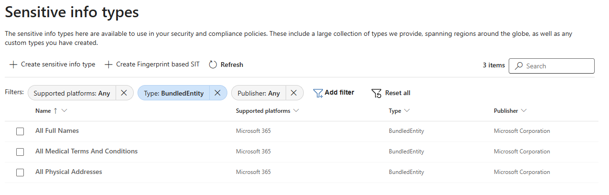
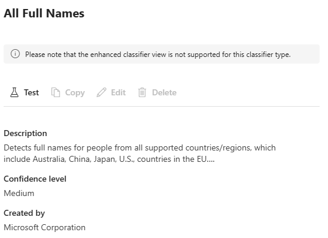
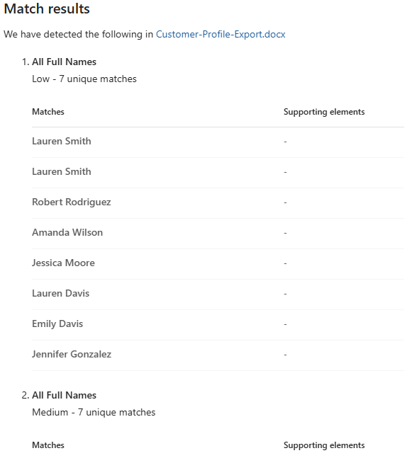
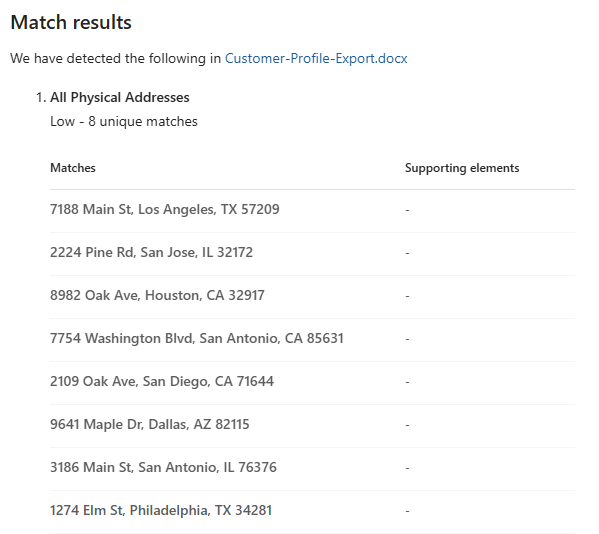

# Lab 04: Configure Named Entity Detection

In this lab, you will configure Named Entity detection (BundledEntity type) using pre-built machine learning classifiers to detect person names and physical addresses in retail documents.

## 🎯 Objectives

- Understand BundledEntity classifiers and how they differ from pattern-based SITs
- Test Name and Address detection against retail customer data
- Combine BundledEntity classifiers with existing SITs for high-confidence detection

## 📋 Prerequisites

- **Global Administrator** or **Compliance Administrator** role
- **Test Data** generated in `02-Data-Foundation` and uploaded to SharePoint

## 🧩 Understanding Named Entities

### What are Named Entities?

Named Entities are **pre-built machine learning classifiers** in Microsoft Purview. Unlike regex-based SITs that match exact patterns (555-55-5555 for SSN), BundledEntity classifiers use AI to understand **context** ("Sarah Johnson" is a person name).

### Named Entity Types Available

| Entity Type | What It Detects | Retail Example | Confidence Levels |
|-------------|----------------|----------------|-------------------|
| **All Full Names** | Human names (first, last, full) | "Sarah Johnson", "Dr. Michael Smith" | Low, Medium, High |
| **All Medical Terms And Conditions** | Medical terminology and health conditions | "Diabetes", "Hypertension", "Prescription" | Low, Medium, High |
| **All Physical Addresses** | Street addresses, locations | "123 Main St, Seattle, WA 98101" | Low, Medium, High |

> **📋 Retail Data Note**: While all three BundledEntity types are available in Purview, our retail test data contains **only Names and Addresses**. We will focus testing on **All Full Names** and **All Physical Addresses** since the retail scenario does not include medical information.

**Confidence Levels:**

- **High (85%)**: Clear, unambiguous detection with strong context
- **Medium (75%)**: Probable detection with reasonable context
- **Low (65%)**: Possible detection, may need additional validation

## 📝 Step-by-Step Instructions

### Part 1: Verify Named Entity SITs Availability

Named Entities are **already available** in Purview as pre-built classifiers - you don't need to create them. This section verifies they're accessible in your tenant.

1. **Navigate to Purview Portal**:
   - Go to [purview.microsoft.com](https://purview.microsoft.com)
   - Sign in with your compliance administrator account

2. **Browse BundledEntity SITs**:
   - Navigate to **Information Protection** > **Classifiers** > **Sensitive info types**
   - Click **Add filter** > **Type** > **BundledEntity**

3. **Review Available BundledEntity SITs**:
   You should see the following pre-built classifiers:

   - ✅ **All Full Names**
   - ✅ **All Medical Terms And Conditions**
   - ✅ **All Physical Addresses**



4. **Examine a BundledEntity SIT**:
   - Click on **All Full Names**
   - Note the message: "Please note that the enhanced classifier view is not supported for this classifier type"
   - Review the **Description**: "Detects full names for people from all supported countries/regions, which include Australia, China, Japan, U.S., countries in the EU..."
   - Note the **Confidence level**: Medium
   - Note the **Created by**: Microsoft Corporation
   - **Key Observation**: No regex patterns shown - BundledEntity types use ML-based detection, not pattern matching



### Part 2: Test Named Entity Detection

Let's test Named Entity detection using your existing test data.

#### Test 1: Person Name Detection

1. **In Purview Portal**:
   - Navigate to **Information Protection** > **Classifiers** > **Sensitive info types**
   - Find **All Full Names**
   - Click **Test**

2. **Upload Test File**:
   - Click **Browse** and select **Customer-Profile-Export.docx** from your SharePoint site (uploaded in Lab 00)
   - This document contains customer names, addresses, phone numbers, and other PII from your generated test data

3. **Run Test**:
   - Click **Test**
   - Wait for results (5-10 seconds)

4. **Interpret Results**:
   ```
   ✅ Match Results for Customer-Profile-Export.docx:
   
   1. All Full Names
      Low - 7 unique matches
      
   2. All Full Names
      Medium - 7 unique matches
      
   3. All Full Names
      High - 7 unique matches
      
   Matches include: Lauren Smith, Robert Rodriguez, Amanda Wilson, 
   Jessica Moore, Lauren Davis, Emily Davis, Jennifer Gonzalez
   ```

> **💡 Confidence Levels**: BundledEntity test results display the same entities across **Low, Medium, and High** confidence levels. This shows how the classifier evaluates each match at different thresholds - you can then choose which confidence level to use in your DLP policies based on your risk tolerance.



#### Test 2: Physical Address Detection

1. **In Purview Portal**:
   - Navigate to **Information Protection** > **Classifiers** > **Sensitive info types**
   - Find **All Physical Addresses**
   - Click **Test**

2. **Upload Test File**:
   - Click **Browse** and select **Customer-Profile-Export.docx** from your SharePoint site (same file as Test 1)
   - This document contains customer addresses from your generated test data

3. **Run Test**:
   - Click **Test**
   - Wait for results (5-10 seconds)

4. **Interpret Results**:

   ```text
   ✅ Match Results for Customer-Profile-Export.docx:
   
   1. All Physical Addresses
      Low - 8 unique matches
      
   2. All Physical Addresses
      Medium - 8 unique matches
      
   3. All Physical Addresses
      High - 8 unique matches
      
   Matches include: 7188 Main St, Los Angeles, TX 57209; 
   2224 Pine Rd, San Jose, IL 32172; 8982 Oak Ave, Houston, CA 32917; 
   7754 Washington Blvd, San Antonio, CA 85631; and more.
   ```



> **💡 Address Detection**: BundledEntity classifiers detect physical addresses across **Low, Medium, and High** confidence levels, similar to name detection. The same 8 customer addresses are evaluated at all three thresholds.

## ✅ Success Criteria

You've successfully completed this lab when:

- [x] You understand the difference between pattern-based SITs and ML-based BundledEntity classifiers
- [x] You can locate the BundledEntity types in Purview (All Full Names, All Physical Addresses, All Medical Terms - focused on Names and Addresses for retail)
- [x] Test results show BundledEntity classifiers detecting 7 names and 8 addresses at Low, Medium, and High confidence levels
- [x] You understand combination strategies for high-confidence detection (Name + CC + Address)
- [x] You're ready to use BundledEntity classifiers in Information Protection and DLP policies

## 🔍 What You've Learned

### When to Use BundledEntity Classifiers

| Scenario | Use BundledEntity? | Reasoning |
|----------|---------------------|-----------|
| Detect **any person name** in documents | ✅ Yes | BundledEntity is built for this |
| Detect **your specific customers** | ❌ No, use EDM | BundledEntity doesn't know your customers |
| Enhance confidence of **customer PII detection** | ✅ Yes, combine with SITs | Name + CC + Address = high confidence |
| Detect **addresses not in database** | ✅ Yes | BundledEntity catches unknown addresses |
| Reduce **false positives** for credit cards | ✅ Yes | Require name + credit card (not just CC alone) |
| Protect **employee PII** | ✅ Yes, combine name + address | Name + Address = employee personal data |

### Combination Strategies for High-Confidence Detection

BundledEntity classifiers are most powerful when **combined with other SITs** in DLP policies and auto-labeling rules.

| Strategy | Conditions (ALL must match) | Action | Why It Works |
|----------|----------------------------|--------|-------------|
| **Enhanced Customer PII** | • All Full Names (High)<br>• Credit Card Number<br>• All Physical Addresses | Apply "Confidential - Customer PII" label | Multiple elements confirm customer PII; catches variations even if not in EDM |
| **EDM + BundledEntity Validation** | • Retail Customer PII (EDM)<br>• All Full Names (High) | Block external sharing | Double validation with extremely high confidence; prevents exfiltration |
| **Form + Context** | • Credit Card Application (Fingerprint)<br>• All Full Names<br>• SSN | Block sharing + Notify compliance | Business context + content validation = critical protection |

### Using BundledEntity Classifiers in Future Labs

In **04-Information-Protection-UI**, you'll create auto-labeling policies using these BundledEntity combinations:

| Label | Conditions (ALL must match) | Retail Coverage |
|-------|----------------------------|----------------|
| **Confidential - Customer PII** | • All Full Names (High ≥85%)<br>• Credit Card OR SSN<br>• All Physical Addresses (Medium ≥75%) | Customer exports, credit applications, shipping/billing docs, email threads |
| **Internal - Employee Records** | • All Full Names (High)<br>• SSN<br>• Employee Onboarding Form (Fingerprint) | Completed employee forms with PII |

**DLP Policy Integration** (05-Data-Loss-Prevention-UI): Block external sharing, require encryption, or notify users based on BundledEntity + SIT combinations.

### BundledEntity Benefits

| Advantages ✅ | Limitations ⚠️ |
|----------------|-------------------|
| No configuration required - pre-built and ready | False positives possible (e.g., "April May") |
| Context-aware ML detection | Confidence varies - low matches need validation |
| Broad coverage across formats and contexts | No customization - can't train the model |
| Multi-language support | Generic detection - doesn't know *your* customers |
| Immediate availability - no indexing delay | Must combine with other SITs for best results |

### BundledEntity Classifiers in the Classification Hierarchy

You now have a complete classification toolkit:

```text
Classification Hierarchy (Retail Governance):

1. Built-in SITs (Immediate detection)
   ├── Credit Card Number (PCI-DSS compliance)
   ├── Social Security Number (Privacy laws)
   └── ABA Routing Number (Banking data)

2. Custom SITs (Lab 01) (Pattern-based)
   └── Retail Loyalty ID (Business-specific identifier)

3. EDM Classifiers (Lab 02) (High-precision matching)
   └── Retail Customer PII (Your specific customers)

4. Document Fingerprinting (Lab 03) (Structure-based)
   ├── Credit Card Application Form
   ├── Employee Onboarding Form
   └── Store Audit Report Template

5. BundledEntity Classifiers (Lab 04) (ML-based, context-aware)
   ├── All Full Names (Detect any person)
   ├── All Medical Terms And Conditions (Available but not tested in retail scenario)
   └── All Physical Addresses (Detect any address)

Combination Strategy:
"Confidential - Customer PII" =
  (EDM OR BundledEntity: All Full Names) AND
  (Credit Card OR SSN) AND
  (BundledEntity: All Physical Addresses OR Fingerprint: Credit Card App)
```

## 📚 Next Steps

Now that you understand BundledEntity classifiers, proceed to:

1. **04-Information-Protection-UI**: Create sensitivity labels and auto-labeling policies using BundledEntity + SITs combinations
2. **05-Data-Loss-Prevention-UI**: Build DLP policies with BundledEntity conditions
3. **06-Exfiltration-Simulation**: Test BundledEntity detection in real-world scenarios
4. **07-Audit-and-Validation**: Review Activity Explorer to see BundledEntity matches

## 🛠️ Troubleshooting

| Issue | Solution |
|-------|----------|
| **BundledEntity not appearing in DLP** | Refresh browser; filter by Type: BundledEntity; search for specific names |
| **Too many false positives** | Use High confidence (85%); combine with other SITs; require 2-3 matches |
| **Missing obvious names** | Ensure context around names ("Customer Smith" vs just "Smith") |
| **Ambiguous detections** (April May) | Accept trade-off for broad coverage; use High confidence only |

**Best Practices:**:

- ✅ Always combine BundledEntity with at least one other SIT
- ✅ Use High confidence (85%) for blocking actions
- ✅ Use Medium confidence (75%) for notifications only
- ✅ Test with real documents before production deployment
- ✅ Document combination logic in policy descriptions

---

## 🤖 AI-Assisted Content Generation

This lab guide was created with the assistance of **GitHub Copilot** powered by advanced AI language models. The content was generated, structured, and refined through iterative collaboration between human expertise and AI assistance within **Visual Studio Code**, incorporating Microsoft Purview BundledEntity classifier capabilities and retail PII protection strategies.

*AI tools were used to enhance productivity and ensure comprehensive coverage of BundledEntity configuration while maintaining technical accuracy and reflecting current best practices.*
