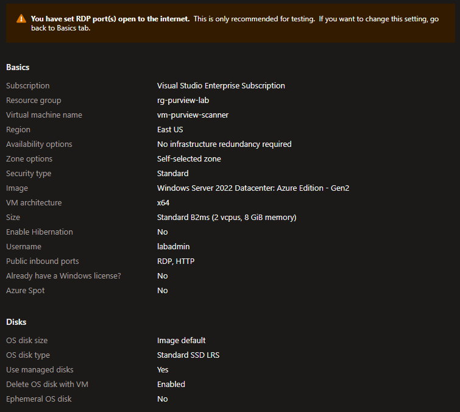
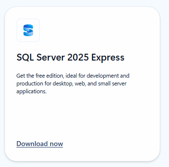
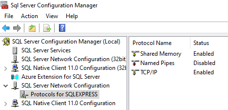
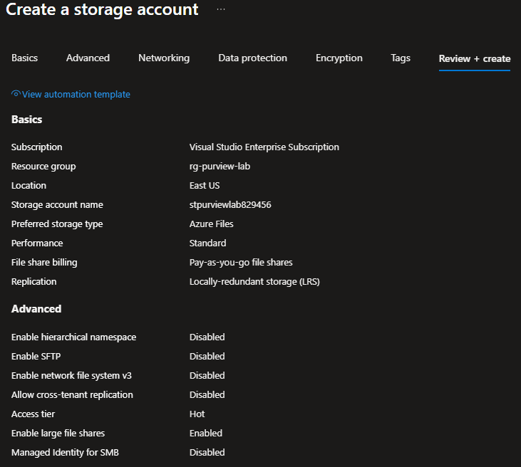
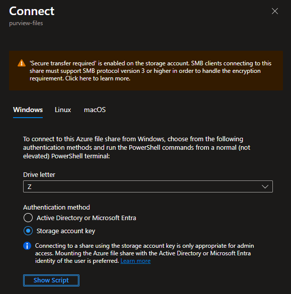
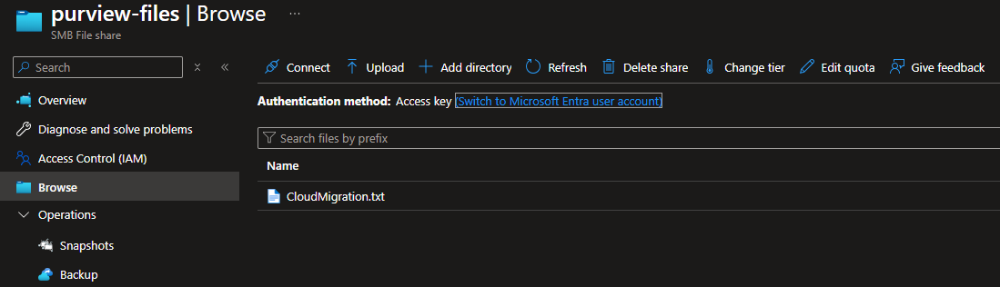

# Setup-02: Azure Infrastructure Deployment

## 🎯 Lab Objectives

- Deploy Azure VM for on-premises scanner simulation.
- Configure SQL Server Express for scanner database.
- Create SMB file shares with sample sensitive data.
- Set up Azure Files as cloud storage simulation.
- Install scanner prerequisites (Office IFilter, Azure CLI).
- Implement cost controls and auto-shutdown policies.

## ⏱️ Estimated Duration

1.5-2 hours

## 📋 Prerequisites

- Azure subscription with Contributor role.
- Basic PowerShell and Azure Portal knowledge.
- Setup-01 completed (M365 licensing and auditing enabled).
- Local machine with RDP client for VM access.

## 💰 Cost Optimization Strategy

**Target Weekend Cost**: $3-5/day

**Cost-Saving Measures**:

- Use Standard_B2ms VM (cost-effective for lab workload).
- Enable auto-shutdown at 10 PM local time.
- Deallocate VM when not actively working.
- Use Standard HDD for OS disk (lab environment only).
- Minimum Azure Files provisioned size (100 GiB).
- Delete all resources after lab completion.

> **⚠️ Cost Impact**: This lab begins the $3-5/day cost accumulation as it deploys the Azure VM and storage resources. Remember to deallocate the VM when not in use.

## 🚀 Lab Steps

### Step 1: Create Azure Resource Group

Using Azure Portal:

- Navigate to [https://portal.azure.com](https://portal.azure.com).
- Sign in with your Azure credentials.
- In the search bar at top, type **Resource groups**.
- Click **Resource groups** in the results.
- Click **+ Create** button.

Configure resource group:

- **Subscription**: Select your subscription
- **Resource group**: `rg-purview-lab`
- **Region**: `East US` (or your preferred region)

Apply tags for cost tracking:

- Click **Next: Tags**.
- Add the following tags:
  - **Project**: `Purview-Lab`
  - **Environment**: `Lab`
  - **Owner**: Your email address

Create the resource group:

- Click **Review + create**.
- Verify settings.
- Click **Create**.
- Wait for "Resource group created" notification.

---

## 🔧 VM Setup and Configuration

### Step 2: Deploy Windows Server 2022 VM

Navigate to VM creation:

- In Azure Portal, enter **virtual machines** in the search bar at the top.
- Under **Services**, select **Virtual machines**.
- On the Virtual machines page, select **Create** and then **Azure virtual machine**.

> **💡 Portal Note**: The Azure Portal interface may vary slightly based on your subscription type and region. The steps below reflect the current portal as of January 2025.

Configure **Basics** tab:

**Project details**:

- **Subscription**: Select your Azure subscription
- **Resource group**: Select `rg-purview-lab` from dropdown

**Instance details**:

- **Virtual machine name**: `vm-purview-scanner`
- **Region**: Same as resource group (East US or your chosen region)
- **Availability options**: No infrastructure redundancy required
- **Security type**: Standard
- **Image**: **Windows Server 2022 Datacenter: Azure Edition - x64 Gen2** (current recommended image)
  - If not visible, click **See all images** to browse the marketplace
- **Size**: **Standard_B2ms** (2 vcpus, 8 GiB memory)
  - Click **See all sizes** if you need to search for this specific size
  - Alternative budget option: **Standard_B2s** (2 vcpus, 4 GiB memory) meets SQL Server Express minimum requirements

> **💡 VM Size Note**: The B-series VMs are burstable virtual machines ideal for workloads that don't need continuous full CPU performance, such as lab environments with SQL Server Express. Standard_B2ms provides 8 GiB memory (recommended for optimal performance), while Standard_B2s with 4 GiB memory is a more budget-friendly option that still exceeds SQL Server Express minimum requirements (1 GB recommended). Both sizes support Windows Server 2022 Datacenter: Azure Edition and offer excellent cost-effectiveness for lab scenarios.

**Administrator account**:

- **Username**: `labadmin`
- **Password**: Create and document a secure password (minimum 12 characters with uppercase, lowercase, numbers, and symbols)
- **Confirm password**: Re-enter the password

**Inbound port rules**:

- **Public inbound ports**: Select **Allow selected ports**
- **Select inbound ports**: Choose **RDP (3389)** and optionally **HTTP (80)** if needed

> **🔒 Security Note**: In production environments, use Azure Bastion, VPN, or private endpoints instead of exposing RDP publicly. For this learning lab environment, public RDP is acceptable.

Configure **Disks** tab:

- Click **Next: Disks**.
- **OS disk type**: Standard HDD (sufficient for lab, reduces cost).
- **Delete with VM**: Checked (ensures cleanup).
- **Encryption type**: (Default) Encryption at-rest with platform-managed key.
- Leave other settings as default.

Configure **Networking** tab:

- Click **Next: Networking**.

**Network interface**:

- **Virtual network**: Click **Create new**.
  - **Name**: `vnet-purview-lab`.
  - **Address space**: 10.0.0.0/16 (default).
  - **Subnet name**: default.
  - **Subnet address range**: 10.0.0.0/24 (default).
  - Click **OK**.
- **Subnet**: default (10.0.0.0/24).
- **Public IP**: Click **Create new**.
  - **Name**: `pip-vm-purview-scanner`.
  - **SKU**: Standard.
  - Click **OK**.
- **NIC network security group**: Basic.
- **Public inbound ports**: Allow selected ports.
- **Select inbound ports**: RDP (3389).
- **Delete NIC when VM is deleted**: Checked.

Configure **Management** tab:

- Click **Next: Management**.

- **System assigned managed identity**: Off (not needed for this lab).
- **Auto-shutdown** (critical for cost savings):
  - **Enable auto-shutdown**: Checked.
- **Shutdown time**: 22:00 (10:00 PM).
- **Time zone**: Select your local timezone.
- **Send notification before auto-shutdown**: Optional (check if desired).
- **Email address**: Your email (if notifications enabled).
- **Notification**: 15 minutes before.

**Monitoring**:

- **Boot diagnostics**: Enable with managed storage account (recommended).
- **Enable OS guest diagnostics**: Off (not needed for lab).

Configure **Advanced**, **Tags** tabs:

- Click **Next: Advanced** - leave all defaults.
- Click **Next: Tags**.
- Tags should inherit from resource group, verify:
  - **Project**: Purview-Weekend-Lab.
  - **Environment**: Lab.
  - **Owner**: Your email.

Review and create:

- Click **Review + create** button at the bottom of the page.
- Azure will run validation checks on your configuration.
- Review all settings carefully in the validation summary.
- Verify the estimated cost per hour (approximately $0.10/hour for Standard_D2s_v3).
- After validation passes, click **Create** at the bottom.
- Wait for deployment to complete (typically 5-7 minutes).
- You'll see deployment progress with status updates.



Post-deployment:

- Once deployment completes, click **Go to resource** button.
- You're now on the VM overview page.
- Click the **Connect** dropdown in the top menu.
- Select **RDP** from the options.
- Click **Download RDP File** button.
- Save the RDP file to your desktop or downloads folder.

- Verify VM is accessible and properly configured.
- All services are running.
- File shares contain sample data.
- Azure Files storage account is operational.

### Step 3: Connect to VM and Initial Configuration

Connect via RDP:

- Double-click the downloaded RDP file.
- Click **Connect** when warned about unknown publisher.
- Enter credentials:
  - **Username**: `labadmin`.
  - **Password**: Your VM password.
- Click **Yes** to accept certificate warning.

Initial VM configuration:

- When Server Manager opens automatically, click **Local Server** in left menu.
- Locate **IE Enhanced Security Configuration**.
- Click **On** next to it.
- Set both Administrators and Users to **Off**.
- Click **OK**.

> **💡 Tip**: This makes it easier to download software in the lab environment

Set timezone:

- Right-click Start menu > **Settings**.
- Go to **Time & language** > **Date & time**.
- Verify timezone is correct for your location.
- Close Settings.

- Create desktop shortcuts for key tools.
- Configure PowerShell environment.
- Verify system readiness.

### Step 4: Install SQL Server Express

Download SQL Server Express:

- Open **Microsoft Edge** browser on the VM.
- Navigate to: [https://www.microsoft.com/en-us/sql-server/sql-server-downloads](https://www.microsoft.com/en-us/sql-server/sql-server-downloads).
- Scroll to the **SQL Server 2025 Express** section.
- Click the **Download now** button under Express edition.
- The file `SQL2025-SSEI-Expr.exe` will download to your Downloads folder.
- Wait for the download to complete.



> **💡 Download Page Note**: The SQL Server downloads page layout is updated periodically. Look for the "SQL Server 2025 Express" card or section with a "Download now" button. As of January 2025, it's typically in the "Get started with SQL Server on-premises or in the cloud" section.

Install SQL Server:

- Navigate to your Downloads folder.
- Run the downloaded `SQL2025-SSEI-Expr.exe` installer.
- Select **Basic** installation type.
- Click **Accept** to agree to license terms.
- **Install location**: Accept default (`C:\Program Files\Microsoft SQL Server`).
- Click **Install**.
- Wait for download and installation (10-15 minutes).

Note connection information:

- When installation completes, note the displayed information:
  - **Instance name**: `SQLEXPRESS`.
  - **Connection string**: `localhost\SQLEXPRESS` or `COMPUTERNAME\SQLEXPRESS`.
- Click **Install SSMS** if you want SQL Server Management Studio (optional for lab).
- Click **Close**.

Configure SQL Server networking:

- Press **Windows key**, search for **SQL Server Configuration Manager**.
- Expand **SQL Server Network Configuration**.
- Click **Protocols for SQLEXPRESS**.



Enable TCP/IP:

- Right-click **TCP/IP** in the right pane.
- Select **Enable**.
- Click **OK** on the warning message.

Restart SQL Server service:

- In Configuration Manager, expand **SQL Server Services**.
- Right-click **SQL Server (SQLEXPRESS)**.
- Select **Restart**.
- Wait for service to restart (Status should show "Running").

Close SQL Server Configuration Manager.

- Service is running.
- SQL Server Express successfully installed.
- Ready for Purview scanner configuration.

### Step 5: Create Local File Shares and Sample Data

> **⚠️ Perform on VM**: All steps in this section must be performed **on the Azure VM** via your RDP session, not on your local PC. The file shares and sample data need to exist on the VM where the Purview scanner will be installed.

Create folder structure:

- Open **File Explorer**.
- Navigate to `C:\`.
- Right-click in empty space > **New** > **Folder**.
- Name it: `PurviewScanner`.
- Press Enter.

Create subfolders:

- Open `C:\PurviewScanner`.
- Create three new folders:
  - `Finance`.
  - `HR`.
  - `Projects`.

Create sample files with sensitive information:

- Open **Windows PowerShell** as Administrator:
  - Press **Windows key**.
  - Type **PowerShell**.
  - Right-click **Windows PowerShell**.
  - Select **Run as administrator**.

Copy and paste the following script to create sample test data files:

```powershell
# =============================================================================
# Create Sample Test Data Files
# =============================================================================

Write-Host "Creating Finance Sample Data..." -ForegroundColor Green

$financeContent = @"
ACME CORPORATION - CUSTOMER PAYMENT RECORDS
Generated: $(Get-Date -Format 'yyyy-MM-dd')
Classification: CONFIDENTIAL

CUSTOMER PAYMENT INFORMATION

Transaction ID: TXN-2024-001
Customer Name: John Smith
Email: john.smith@email.com
Credit Card Number: 4532-1234-5678-9010
Expiration Date: 12/2026
CVV: 123
Amount: `$5,000.00
Date: 2024-10-15

Transaction ID: TXN-2024-002
Customer Name: Jane Doe
Email: jane.doe@email.com
Credit Card Number: 5425-2334-5566-7788
Expiration Date: 03/2027
CVV: 456
Amount: `$3,250.00
Date: 2024-10-16

Transaction ID: TXN-2024-003
Customer Name: Robert Johnson
Email: robert.j@email.com
Credit Card Number: 3782-822463-10005
Expiration Date: 08/2025
CVV: 789
Amount: `$1,875.50
Date: 2024-10-17
"@
$financeContent | Out-File -FilePath "C:\PurviewScanner\Finance\CustomerPayments.txt" -Encoding UTF8
Write-Host "   Created: CustomerPayments.txt (Credit Cards)" -ForegroundColor Green

Write-Host "Creating HR Sample Data..." -ForegroundColor Green

$hrContent = @"
ACME CORPORATION - EMPLOYEE PERSONAL RECORDS
HR Department - RESTRICTED ACCESS
Last Updated: $(Get-Date -Format 'yyyy-MM-dd')

EMPLOYEE INFORMATION DATABASE

Employee ID: EMP-001
Full Name: Sarah Johnson
Social Security Number: 123-45-6789
Date of Birth: 01/15/1985
Home Address: 123 Main Street, Anytown, ST 12345
Phone Number: (555) 123-4567
Email: sarah.johnson@acme.com
Hire Date: 03/10/2020
Department: Engineering
Salary: `$95,000

Employee ID: EMP-002
Full Name: Michael Chen
Social Security Number: 987-65-4321
Date of Birth: 08/22/1990
Home Address: 456 Oak Avenue, Somewhere, ST 67890
Phone Number: (555) 987-6543
Email: michael.chen@acme.com
Hire Date: 06/15/2019
Department: Finance
Salary: `$88,000

Employee ID: EMP-003
Full Name: Emily Rodriguez
Social Security Number: 456-78-9012
Date of Birth: 11/30/1988
Home Address: 789 Pine Road, Another Town, ST 11223
Phone Number: (555) 456-7890
Email: emily.rodriguez@acme.com
Hire Date: 01/20/2021
Department: Marketing
Salary: `$72,000
"@
$hrContent | Out-File -FilePath "C:\PurviewScanner\HR\EmployeeRecords.txt" -Encoding UTF8
Write-Host "   Created: EmployeeRecords.txt (SSN, PII)" -ForegroundColor Green

Write-Host "Creating Projects Sample Data (Archived)..." -ForegroundColor Green

$projectContent = @"
PROJECT PHOENIX - ARCHIVED TECHNICAL DOCUMENTATION
Status: ARCHIVED - DEPRECATED
Last Access: 2020-01-15
Classification: CONFIDENTIAL - DO NOT DISTRIBUTE

LEGACY SYSTEM INFORMATION

Project Code: PHOENIX-2019
Classification Level: Highly Confidential
Data Retention: EXPIRED - CANDIDATE FOR DELETION

TECHNICAL SPECIFICATIONS:
- Internal Server IP: 192.168.100.50
- Database Connection: SERVER=db-prod-01;UID=sa;PWD=P@ssw0rd123
- API Key: SAMPLE_API_KEY_NOT_REAL_12345ABCDEF67890
- Encryption Key: AES256_KEY_0x4B3F9E2D8C1A7F5E

PROPRIETARY ALGORITHMS:
The Phoenix algorithm uses a three-stage processing pipeline:
1. Data ingestion with AES-256 encryption
2. Processing using proprietary compression (Patent Pending)
3. Output to secure storage with versioning

CUSTOMER DATA SAMPLES:
Customer 001: Social Security: 111-22-3333
Customer 002: Credit Card: 4111-1111-1111-1111

WARNING: THIS PROJECT WAS DECOMMISSIONED IN 2020
ALL SYSTEMS SHUT DOWN - DATA SHOULD BE ARCHIVED OR DELETED
RETENTION POLICY: 3 YEARS FROM LAST ACCESS
CURRENT STATUS: PAST RETENTION PERIOD - DELETION CANDIDATE
"@
$projectContent | Out-File -FilePath "C:\PurviewScanner\Projects\PhoenixProject.txt" -Encoding UTF8

# Set file to 3+ years old (simulates old data discovery)
$oldFile = Get-Item "C:\PurviewScanner\Projects\PhoenixProject.txt"
$oldDate = (Get-Date).AddYears(-3).AddMonths(-2)
$oldFile.LastWriteTime = $oldDate
$oldFile.LastAccessTime = $oldDate
$oldFile.CreationTime = $oldDate
Write-Host "   Created: PhoenixProject.txt (timestamped 3+ years old)" -ForegroundColor Green

Write-Host "`nSample files created successfully!" -ForegroundColor Green
```

This script creates:

- **Finance\CustomerPayments.txt** - Credit card data (3 transactions)
- **HR\EmployeeRecords.txt** - PII/SSN data (3 employees)
- **Projects\PhoenixProject.txt** - Old archived data (timestamped 3+ years ago)

Verify file creation:

```powershell
# Verify sample files were created with expected content
Get-ChildItem "C:\PurviewScanner" -Recurse -File | Select-Object FullName, Length, LastWriteTime | Format-Table -AutoSize
```

Create SMB shares:

> **⚠️ Administrator Required**: SMB share creation requires elevated privileges. Ensure your PowerShell window is running as Administrator. If you get "Access is denied" errors, close PowerShell and reopen it by right-clicking **Windows PowerShell** and selecting **Run as administrator**.

Copy and paste the following script to create SMB shares:

```powershell
# =============================================================================
# Create SMB Shares for Scanner Access
# =============================================================================

Write-Host "Creating SMB shares..." -ForegroundColor Green

# Create Finance Share
try {
    New-SmbShare -Name "Finance" -Path "C:\PurviewScanner\Finance" -FullAccess "Everyone" -Description "Finance department files - LAB ONLY" -ErrorAction Stop
    Write-Host "   Created: \\$env:COMPUTERNAME\Finance" -ForegroundColor Green
} catch {
    Write-Host "   Finance share may already exist: $_" -ForegroundColor Yellow
}

# Create HR Share
try {
    New-SmbShare -Name "HR" -Path "C:\PurviewScanner\HR" -FullAccess "Everyone" -Description "HR department files - LAB ONLY" -ErrorAction Stop
    Write-Host "   Created: \\$env:COMPUTERNAME\HR" -ForegroundColor Green
} catch {
    Write-Host "   HR share may already exist: $_" -ForegroundColor Yellow
}

# Create Projects Share
try {
    New-SmbShare -Name "Projects" -Path "C:\PurviewScanner\Projects" -FullAccess "Everyone" -Description "Project archive files - LAB ONLY" -ErrorAction Stop
    Write-Host "   Created: \\$env:COMPUTERNAME\Projects" -ForegroundColor Green
} catch {
    Write-Host "   Projects share may already exist: $_" -ForegroundColor Yellow
}

Write-Host "`nSMB shares created. Verify with:" -ForegroundColor Cyan
Get-SmbShare | Where-Object {$_.Name -in @("Finance", "HR", "Projects")} | Format-Table Name, Path -AutoSize
```

This script creates network shares for Finance, HR, and Projects folders, enabling scanner access via UNC paths.

> **🔒 Security Note**: Using "Everyone" with Full Access is for LAB ONLY. Production environments require proper NTFS and share permissions.

---

## 🌐 Azure Files Setup

### Step 6: Create Azure Files Storage Account

> **💻 Perform on Local PC**: This step is performed on your **local machine** (admin PC), not the VM. You'll switch back to the VM later to mount the share.

Return to Azure Portal on your local machine (not in VM):

- Navigate to [https://portal.azure.com](https://portal.azure.com).
- In search bar, type **Storage accounts**.
- Click **Storage accounts** in results.
- Click **+ Create**.

Configure **Basics** tab:

**Project details**:

- **Subscription**: Your subscription.
- **Resource group**: `rg-purview-lab`.

**Instance details**:

- **Storage account name**: `stpurviewlab` + random 6 digits (e.g., `stpurviewlab829456`).
  - Must be globally unique, lowercase, no special characters.
  - Note this name - you'll need it later.
- **Region**: Same as resource group (East US).
- **Preferred storage type**: **Azure Files**.
- **Performance**: **Standard** (HDD-backed storage).
- **File share billing**: Pay-as-you-go file shares.
- **Redundancy**: Locally-redundant storage (LRS).

> **💡 Cost Optimization**: Standard performance with pay-as-you-go billing is the most cost-effective option for lab environments. You only pay for the storage you actually use, with no minimum provisioning requirements.

Configure **Advanced** tab:

- Click **Next: Advanced**.
- **Require secure transfer for REST API operations**: Enabled.
- **Allow enabling anonymous access on containers**: Disabled.
- **Enable storage account key access**: Enabled.
- **Default to Microsoft Entra authorization**: Disabled.
- Leave other settings as default.

Configure **Networking** tab:

- Click **Next: Networking**.
- **Network connectivity**: Enable public access from all networks (for lab simplicity).

> **🔒 Production Note**: Use private endpoints or selected networks in production

Configure **Data protection** tab:

- Click **Next: Data protection**.
- Leave all defaults (soft delete disabled for cost savings in lab).

Configure **Encryption** tab:

- Click **Next: Encryption**.
- Leave defaults (Microsoft-managed keys).

Configure **Tags** tab:

- Click **Next: Tags**.
- Verify tags inherited from resource group.

Review and create:

- Click **Review + create**.
- Verify configuration.
- Note estimated cost (pay-as-you-go model, billed for actual usage).
- Click **Create**.
- Wait for deployment (2-3 minutes).



Create file share:

- Once deployed, click **Go to resource**.
- In left menu under **Data storage**, click **File shares**.
- Click **+ File share** button.

Configure **Basics** tab:

- **Name**: `purview-files`.
- **Access tier**: **Transaction optimized** (default).
  - **Transaction optimized**: Best for workloads with many read/write operations (default and recommended for scanner).
  - **Hot**: Optimized for general-purpose file sharing.
  - **Cool**: Cost-effective for archive/backup scenarios.

> **💡 Access Tier Note**: For the Purview scanner lab, use **Transaction optimized** (the default). This tier is designed for workloads with high transaction rates, which matches the scanner's file access patterns during discovery scans.

Configure **Backup** tab:

- Click **Next: Backup** (or select **Backup** tab).
- **Enable backup**: Unchecked (optional for lab, reduces cost).
- Click **Review + create**.

> **💰 Cost Note**: Azure Backup for file shares incurs additional costs. For this lab environment, backup is optional and can be disabled to minimize expenses. Production environments should enable backup with appropriate retention policies.

Create the file share:

- Review configuration summary.
- Verify name is `purview-files` and access tier is **Transaction optimized**.
- Click **Create**.
- Wait for file share creation (typically 5-10 seconds).

Get connection script:

- Click on the newly created **purview-files** file share.
- Click **Connect** button in top toolbar.
- Ensure the **Windows** tab is selected.
- Click **Show script**.
- Copy the PowerShell script displayed (it contains your storage account key).



Mount share on VM:

- Switch back to your VM RDP session.
- Open **Windows PowerShell** as Administrator.
- Paste the copied connection script.
- Run the script.
- Verify drive letter assigned (typically Z:).

Create sample data on Azure Files:

Copy and paste the following script to create sample data on the Azure Files share:

```powershell
# =============================================================================
# Create Sample Data on Azure Files Share
# =============================================================================

# Verify Z: drive is mounted
if (-not (Test-Path "Z:\")) {
    Write-Host "ERROR: Z: drive not found - Azure Files share not mounted" -ForegroundColor Red
    Write-Host "Please mount the Azure Files share first using the connection script from Azure Portal" -ForegroundColor Yellow
    return
}

Write-Host "Creating sample data on Azure Files share..." -ForegroundColor Green

$cloudContent = @"
ACME CORPORATION - CLOUD MIGRATION PROJECT
Cloud Infrastructure Team
Classification: Internal Use Only
Last Modified: $(Get-Date -Format 'yyyy-MM-dd')

MIGRATION PROJECT STATUS

Project Name: Cloud Migration Initiative 2024
Status: Phase 2 - In Progress
Lead: Cloud Operations Team

MIGRATION PHASES:
Phase 1: Assessment & Planning - COMPLETE (2024-Q1)
Phase 2: Pilot Migration - IN PROGRESS (2024-Q3)
Phase 3: Full Production Migration - PENDING (2025-Q1)

AZURE RESOURCE INFORMATION:
Subscription ID: 12345678-1234-1234-1234-123456789abc
Resource Group: rg-prod-migration
Location: East US
Storage Account: stprodmigration001

CONTACT INFORMATION:
Project Manager: cloudops@acme.com
Technical Lead: infrastructure@acme.com
Security Contact: security@acme.com

NOTES:
This file simulates data stored on cloud storage (Azure Files, Nasuni, etc.)
accessible via SMB protocol from on-premises scanner.
"@

$cloudContent | Out-File -FilePath "Z:\CloudMigration.txt" -Encoding UTF8
Write-Host "   Created: Z:\CloudMigration.txt" -ForegroundColor Green

# Verify
Write-Host "`nFiles on Azure Files share:" -ForegroundColor Cyan
Get-ChildItem Z:\ | Format-Table Name, Length, LastWriteTime -AutoSize
```

This script:

- Verifies Z: drive is mounted (Azure Files share).
- Creates CloudMigration.txt with sample cloud migration project data.
- Validates file creation.

Verify mount in Azure Portal:

- Switch to your **local machine** (not the VM).
- Navigate to [https://portal.azure.com](https://portal.azure.com).
- Go to your storage account (`stpurviewlab######`).
- In left menu under **Data storage**, click **File shares**.
- Click on **purview-files** file share.
- You should see the file **CloudMigration.txt** listed.
- Click on **CloudMigration.txt** to verify it exists.

> **💡 Verification Tip**: Seeing the file in the Azure Portal confirms that:
> 
> - The file share was successfully mounted on the VM
> - The PowerShell script executed correctly
> - The file was written to the Azure Files share (not just a local drive)
> - The SMB connection is working properly



Alternative verification in File Explorer on VM:

- On the VM, open **File Explorer**.
- In the address bar, type: `\\[storageaccountname].file.core.windows.net\purview-files`.
  - Replace `[storageaccountname]` with your actual storage account name.
- You should see **CloudMigration.txt**.
- Verify the Z: drive also shows the same content.

---

## 🔌 Scanner Prerequisites Installation

### Step 7: Install Scanner Prerequisites

> **⚠️ Perform on VM**: Switch back to your **Azure VM** via RDP for this step. All scanner prerequisites must be installed on the VM.

On the VM, download and install Microsoft Office IFilter:

- In VM, open **Microsoft Edge**.
- Navigate to: `https://www.microsoft.com/en-us/download/details.aspx?id=17062`.
- Click **Download** button.
- Select **FilterPack64bit.exe**.
- Click **Next** to download.
- Run the downloaded installer.
- Click **Yes** on UAC prompt.
- Accept license agreement.
- Click **Install**.
- Wait for completion.
- Click **OK** when finished.

> **📄 IFilter Purpose**: Microsoft Office IFilter is a required component for the Purview Information Protection scanner

Install Azure CLI:

- Navigate to: `https://aka.ms/installazurecliwindowsx64`.
- Download will start automatically (`azure-cli-latest.msi`).
- Run the downloaded MSI installer.
- Click **Next** on welcome screen.
- Accept license terms, click **Next**.
- Use default install location, click **Next**.
- Click **Install**.
- Click **Yes** on UAC prompt.
- Wait for installation.
- Click **Finish**.

> **💡 PowerShell Environment Refresh Required**: After installing Azure CLI, you must close any open Windows PowerShell windows and reopen them **as Administrator** before the `az` command will be recognized. This is because the Azure CLI installer adds the `az` command to the system PATH environment variable, but existing PowerShell sessions do not automatically reload the PATH. Opening a new administrative PowerShell session ensures that the updated PATH is loaded and the Azure CLI commands are available.

Verify Azure CLI installation:

```powershell
# Verify Azure CLI is installed and accessible
az --version
```

If the command is not recognized, ensure you:

1. Closed and reopened PowerShell after installation.
2. Opened PowerShell as Administrator.

> **⚠️ PowerShell Version Requirement**: The Purview Information Protection scanner requires **Windows PowerShell 5.1** and is **not compatible with PowerShell 7**. Windows Server 2022 includes PowerShell 5.1 by default. Do not install PowerShell 7 for this lab, as it will cause scanner installation and authentication failures in later labs.

---

## ✅ Validation Checklist

Before proceeding to Setup-03, verify:

### Azure Resources

- [ ] Resource group `rg-purview-lab` created.
- [ ] VM `vm-purview-scanner` running and accessible via RDP.
- [ ] Auto-shutdown configured for 10 PM local time.
- [ ] Storage account created with Premium file share.
- [ ] All resources tagged appropriately.
- [ ] Estimated daily cost is within budget ($3-5).

### VM Configuration

- [ ] SQL Server Express installed and TCP/IP enabled.
- [ ] SQL Server service running (verify in Services.msc).
- [ ] Connection test: `Test-NetConnection -ComputerName localhost -Port 1433` succeeds.
- [ ] SMB shares created: `\\localhost\Finance`, `\\localhost\HR`, `\\localhost\Projects`.
- [ ] Sample files contain sensitive data (credit cards, SSNs).
- [ ] Phoenix project file shows LastAccessTime > 3 years old.
- [ ] Azure Files share mounted and accessible (Z: drive).
- [ ] Microsoft Office IFilter installed.
- [ ] Azure CLI installed and working (`az --version`).

### Sample Data Validation

### Sample Data Validation

Test sensitive information types detection readiness:

```powershell
cd "c:\REPO\GitHub\Projects\Microsoft\Purview\Purview-Skills-Ramp-OnPrem-and-Cloud\01-Setup\Setup-02-Azure-Infrastructure"
.\Verify-SampleTestData.ps1
```

This script validates:
- Finance file contains credit card patterns.
- HR file contains SSN patterns.
- Phoenix project file is 3+ years old.
- Azure Files share is accessible with sample data.

---

## 🧹 Daily Shutdown Procedure

### Automatic Shutdown (Already Configured)

During VM creation in Step 2, you configured **auto-shutdown** to automatically stop the VM at 10:00 PM local time. This provides baseline cost protection by ensuring the VM doesn't run overnight.

**How auto-shutdown works**:

- VM automatically stops at the configured time (10:00 PM).
- Prevents forgetting to manually stop the VM.
- Reduces compute costs during non-working hours.
- Status changes to **Stopped (deallocated)** after shutdown.

> **💰 Cost Savings**: Auto-shutdown typically saves 12-16 hours of compute costs per day (assuming 8-hour work sessions). For a Standard_B2ms VM, this saves approximately $1.20-1.60 daily.

### Manual Deallocate (Additional Cost Savings)

For **maximum cost savings**, manually deallocate the VM immediately when you finish working, rather than waiting for the 10:00 PM auto-shutdown:

**Using Azure CLI** (from local machine):

```powershell
# Stop and deallocate VM to avoid charges
az vm deallocate --resource-group rg-purview-lab --name vm-purview-scanner

# Verify VM is deallocated
az vm show --resource-group rg-purview-lab --name vm-purview-scanner --query "provisioningState" -o tsv
```

**Using Azure Portal**:

- Navigate to VM `vm-purview-scanner`.
- Click **Stop** button in the top toolbar.
- Wait for status to change to **Stopped (deallocated)**.
- Verify status shows "Stopped (deallocated)" not just "Stopped".

> **💡 Best Practice**: Manually deallocate the VM when you finish your lab session for the day. This maximizes cost savings by not waiting until 10:00 PM auto-shutdown. For example, if you finish working at 3:00 PM, manual deallocation saves an additional 7 hours of compute costs (~$0.70 for Standard_B2ms).

**Restarting the VM**:

When you're ready to resume work:

- Azure Portal: Navigate to VM → Click **Start** button.
- Azure CLI: `az vm start --resource-group rg-purview-lab --name vm-purview-scanner`.
- Wait 2-3 minutes for VM to fully start and become accessible via RDP.

## 🔍 Troubleshooting

### Cannot connect to VM via RDP

**Symptoms**: RDP connection fails or times out

**Solutions**:

1. Verify VM is running (not stopped): Portal > VM > Status should be "Running".
2. Check NSG rules: VM > Networking > Verify port 3389 allowed.
3. Verify public IP: VM > Overview > Copy Public IP address.
4. Reset password: VM > Reset password (in Portal).
5. Check local firewall: Ensure your firewall allows outbound RDP.

### SQL Server not accessible

**Symptoms**: Cannot connect to SQL Server, scanner installation fails

**Solutions**:

1. Verify service running: Open Services.msc, find "SQL Server (SQLEXPRESS)", ensure Status is "Running".
2. Enable TCP/IP: SQL Configuration Manager > Protocols for SQLEXPRESS > TCP/IP should be "Enabled".
3. Restart service: After enabling TCP/IP, restart SQL Server (SQLEXPRESS) service.
4. Test connection: `Test-NetConnection -ComputerName localhost -Port 1433`.
5. Check firewall: Windows Firewall may block SQL (typically not an issue for localhost connections).

### SMB shares not accessible

**Symptoms**: Cannot access `\\vm-name\Finance` shares

**Solutions**:

1. Verify shares created: `Get-SmbShare | Where-Object {$_.Name -in @("Finance", "HR", "Projects")}`.
2. Check Windows Firewall: File and Printer Sharing should be enabled.
3. Test locally first: From VM, access `\\localhost\Finance`.
4. Verify permissions: `Get-SmbShareAccess -Name Finance`.
5. Network discovery: Ensure Network Discovery is enabled (Network and Sharing Center).

### Azure Files mount fails

**Symptoms**: Cannot mount Z: drive, script fails

**Solutions**:

1. Verify storage account key: Portal > Storage Account > Access keys > Copy key1.
2. Check port 445: `Test-NetConnection -ComputerName yourstorageaccount.file.core.windows.net -Port 445`.
3. ISP blocking: Some ISPs block port 445; test from Azure VM directly.
4. Regenerate connection script: Portal > File Share > Connect > Copy fresh script.
5. Manual mount:

   ```powershell
   $connectTestResult = Test-NetConnection -ComputerName yourstorageaccount.file.core.windows.net -Port 445
   if ($connectTestResult.TcpTestSucceeded) {
       cmd.exe /C "cmdkey /add:`"yourstorageaccount.file.core.windows.net`" /user:`"Azure\yourstorageaccount`" /pass:`"STORAGEACCOUNTKEY`""
       New-PSDrive -Name Z -PSProvider FileSystem -Root "\\yourstorageaccount.file.core.windows.net\cloud-storage" -Persist
   }
   ```

### Sample files missing sensitive data

**Symptoms**: Files created but don't contain expected patterns

**Solutions**:

1. Re-run PowerShell scripts from Step 7.
2. Verify file encoding: Should be UTF-8.
3. Check file contents: `Get-Content "C:\PurviewScanner\Finance\CustomerPayments.txt"`.
4. Ensure no anti-malware removed files: Check Windows Defender exclusions if needed.
5. Recreate files manually if needed, ensuring credit card and SSN patterns are present.

## ⏭️ Next Steps

Azure infrastructure deployment complete! You now have:

- ✅ Azure VM ready for scanner installation.
- ✅ SQL Express database platform configured.
- ✅ On-premises file shares simulated with sensitive data.
- ✅ Cloud storage (Azure Files) configured for dual-source scenarios.
- ✅ Scanner prerequisites installed (IFilter, Azure CLI).
- ✅ Cost controls in place (auto-shutdown enabled).

Proceed to **[Setup-03: Service Account Creation](../Setup-03-Service-Account-Creation/README.md)** to create the Entra ID service account with proper licensing and roles for the Purview scanner.

## 📚 Reference Documentation

- [Create Windows VM in Azure](https://learn.microsoft.com/en-us/azure/virtual-machines/windows/quick-create-portal)
- [Install SQL Server Express](https://learn.microsoft.com/en-us/sql/database-engine/install-windows/install-sql-server)
- [Azure Files SMB shares](https://learn.microsoft.com/en-us/azure/storage/files/storage-how-to-use-files-windows)
- [Azure Cost Management](https://learn.microsoft.com/en-us/azure/cost-management-billing/costs/quick-acm-cost-analysis)
- [Microsoft Office IFilter](https://www.microsoft.com/en-us/download/details.aspx?id=17062)

## 🤖 AI-Assisted Content Generation

This lab guide was created with the assistance of **GitHub Copilot** powered by advanced AI language models. The content was generated, structured, and refined through iterative collaboration between human expertise and AI assistance within **Visual Studio Code**.

*AI tools were used to enhance productivity and ensure comprehensive coverage of Azure infrastructure deployment while maintaining technical accuracy for Microsoft Purview scanner prerequisites.*
