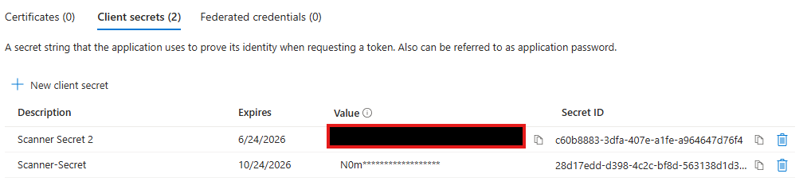

# Setup-03: Service Account and App Registration

## 🎯 Lab Objectives

- Create Entra ID service account for Purview scanner authentication.
- Configure usage location and assign Microsoft 365 E5 Compliance license.
- Assign Compliance Data Administrator role for scanner permissions.
- Create Entra ID app registration for scanner authentication.
- Configure API permissions for scanner operations.
- Generate and secure client secret for app authentication.
- Document all authentication credentials securely.

## ⏱️ Estimated Duration

30-45 minutes

## 📋 Prerequisites

- Microsoft 365 tenant with Global Admin role.
- Microsoft 365 E5 (or E5 Compliance) licenses available (from Setup-01).
- Access to Microsoft Entra admin center and M365 Admin Center.
- Setup-01 and Setup-02 completed.

## 🔐 Authentication Architecture Overview

The Purview Information Protection scanner uses a dual authentication model:

**Service Account (`scanner-svc`)**:

- Cloud-only or synced Entra ID account.
- Requires Microsoft 365 E5 licensing for sensitivity label capabilities.
- Needs Compliance Data Administrator role for scanner operations.
- Used as the primary identity for scanner service.

**App Registration (`Purview-Scanner-App`)**:

- Entra ID application with service principal.
- Provides delegated API access for scanner operations.
- Uses client secret for unattended authentication.
- Requires specific API permissions for Azure Rights Management and Information Protection.

> **💡 Why Both?**: The service account provides the user identity and licensing, while the app registration enables programmatic API access with appropriate permissions. Together, they allow the scanner to run as an unattended service with delegated access to sensitivity labels and DLP policies.

## 🚀 Lab Steps

### Step 1: Create Entra ID Service Account for Scanner

> **💡 Production Note**: Scanner works best with a synchronized Entra ID account from on-premises Active Directory. In this lab, we'll create a cloud-only account since we don't have on-premises AD infrastructure.

On your local machine (not VM), open Microsoft Entra Admin Center:

- Navigate to **Microsoft Entra ID**.
- In left menu, click **Users**.
- Click **+ New user** > **Create new user**.

Configure user:

**Identity**:

- **User principal name**: `scanner-svc@yourtenant.onmicrosoft.com`
  - Replace `yourtenant` with your actual tenant name
- **Display name**: `Purview Scanner Service Account`
- **Mail nickname**: `scanner-svc`

**Password**:

- Select **Let me create the password**.
- **Password**: Create secure password (document it!)
- **Force change password on first sign-in**: Unchecked (critical for service accounts)

**Assignments** (optional for now, we'll configure usage location and licenses next):

- Click **Review + create**.
- Click **Create**.

Set usage location (required for license assignment):

- In **Microsoft Entra ID** > **Users**, find the **scanner-svc** account you just created.
- Click on it to open the user details.
- In left menu, click **Properties**.
- Scroll to **Settings** section.
- Click **Edit** (pencil icon).
- Under **Usage location**, select your country/region (e.g., **United States**).
- Click **Save**.

#### Assign Microsoft 365 E5 Compliance License

Switch to **Microsoft 365 Admin Center** for license management:

- Navigate to [https://admin.microsoft.com](https://admin.microsoft.com).
- Sign in with Global Admin credentials.
- In the left navigation, go to **Users** > **Active users**.
- Find and click on **Purview Scanner Service Account** (scanner-svc).
- In the user details flyout, click the **Licenses and apps** tab.

Check the **Microsoft 365 E5 Compliance** license (or **Microsoft 365 E5** if you have full license):

- Click **Save changes**.
- Wait for the "Licenses updated" confirmation message.

> **⏱️ License Propagation**: License assignment may take 15-30 minutes to fully propagate.

Assign required roles (via Entra ID):

- Return to the **Microsoft Entra admin center** at [https://entra.microsoft.com](https://entra.microsoft.com).
- Navigate to **Identity** > **Users** > **All users**.
- Find and click on **scanner-svc** account.
- In left menu, click **Assigned roles**.
- Click **+ Add assignments**.
- Search for and select:
  - **Compliance Data Administrator**
- Click **Add**.

> **📝 Note**: In production with hybrid AD, you'd use an on-premises service account synced to Entra ID.

---

### Step 2: Create App Registration for Scanner Authentication

Scanner authentication requires an Entra ID app registration with specific API permissions. This enables the scanner to run unattended with service principal credentials.

**On your local machine (Microsoft Entra Admin Center):**

Navigate to Microsoft Entra ID to create the app registration.

- Sign in to the **Microsoft Entra admin center**: [https://entra.microsoft.com](https://entra.microsoft.com).
  - Alternatively, you can access this through **Azure Portal** > **Microsoft Entra ID**
- If you have access to multiple tenants, use the **Settings** icon in the top menu to switch to the correct tenant.
- Browse to **Identity** > **Applications** > **App registrations**.
- Select **+ New registration**.

> **💡 Portal Note**: As of October 2025, Microsoft recommends using the Entra admin center (entra.microsoft.com) for app registrations. The Azure Portal still supports this functionality as well.

**Configure Application Registration:**

- **Name**: `Purview-Scanner-App` (users will see this name; can be changed later)
- **Supported account types**: **Accounts in this organizational directory only** (Single tenant - recommended for most applications)
- **Redirect URI** (optional for scanner): 
  - Platform: **Web**
  - URI: `http://localhost`
- Click **Register** to complete the app registration.

**Save Application Details:**

After registration completes, note the following values (you'll need them in OnPrem-01):

- **Application (client) ID**: Copy and save this GUID
- **Directory (tenant) ID**: Copy and save this GUID

> **⚠️ Important**: Store these values securely. You'll need them for scanner authentication configuration in OnPrem-01.

---

### Step 3: Create Client Secret for Scanner Authentication

The scanner requires a client secret for unattended authentication. You'll configure this in the app registration.

**In the app registration (`Purview-Scanner-App`):**

- Navigate to **Certificates & secrets** in the left menu.
- Click **+ New client secret**.
- **Description**: `Scanner Secret` (or descriptive name of your choice)
- **Expires**: Select appropriate duration (e.g., **180 days**, **12 months**, or **24 months**)
- Click **Add**.

**Save Secret Value (Critical Step):**

After the secret is created, **immediately copy and save the Value (secret string)**:

- Save this securely in a password manager or secure note.
- You cannot retrieve this value later.



---

### Step 4: Configure API Permissions

The scanner requires specific API permissions to read and write content metadata and sync policies.

**Add Azure Rights Management Permissions:**

- In the app registration, go to **API permissions**.
- Click **+ Add a permission**.
- Select **Azure Rights Management Services**.
- Select **Application permissions**.
- Check the following permissions:
  - **Content.DelegatedReader**
  - **Content.DelegatedWriter**
- Click **Add permissions**.

**Add Microsoft Information Protection Sync Service Permissions:**

- Click **+ Add a permission** again.
- Select **APIs my organization uses** tab.
- Search for: `Microsoft Information Protection Sync Service`.
- Select it from the results.
- Select **Application permissions**.
- Check: **UnifiedPolicy.Tenant.Read**.
- Click **Add permissions**.

**Add Azure Storage Permissions (for Azure Files scanning):**

For scanning Azure Files shares (configured in Setup-02):

- Click **+ Add a permission** again.
- Select **APIs my organization uses** tab.
- Search for: `Azure Storage`.
- Select **Azure Storage** from the results.
- Select **Delegated permissions**.
- Check: **user_impersonation**.
- Click **Add permissions**.

> **💡 Azure Files Note**: You'll also need to assign the **Storage File Data SMB Share Contributor** RBAC role to your scanner service account (`scanner-svc@tenant.onmicrosoft.com`) on the Azure Files share in OnPrem-01. This is done in the Azure Portal under the storage account's Access Control (IAM) settings.

**Grant Admin Consent:**

- Click **Grant admin consent for [Your Tenant Name]**.
- Click **Yes** to confirm the consent prompt.
- Verify all permissions show **green checkmarks** under the Status column.

> **📊 Best Practice**: In production environments, document all API permissions granted and review them periodically as part of security audits.

---

## ✅ Validation Checklist

Before proceeding to OnPrem-01 (Scanner Deployment), verify:

### Service Account Created

- [ ] Entra ID user `scanner-svc@yourtenant.onmicrosoft.com` created
- [ ] Display name: "Purview Scanner Service Account"
- [ ] Password created and documented securely
- [ ] "Force change password on first sign-in" is **unchecked**

### Usage Location and Licensing

- [ ] Usage location set (e.g., United States)
- [ ] Microsoft 365 E5 (or E5 Compliance) license assigned
- [ ] License assignment confirmed in M365 Admin Center
- [ ] License status shows as "Active"

### Role Assignment

- [ ] Compliance Data Administrator role assigned in Entra ID
- [ ] Role assignment visible in scanner account's "Assigned roles"
- [ ] No additional unnecessary roles assigned (principle of least privilege)

### App Registration Created

- [ ] App registration `Purview-Scanner-App` created
- [ ] Application (client) ID documented
- [ ] Directory (tenant) ID documented
- [ ] Client secret created and value saved securely
- [ ] Client secret expiration noted (12 months from creation)

### API Permissions Configured

- [ ] Azure Rights Management Services permissions added:
  - [ ] Content.DelegatedReader
  - [ ] Content.DelegatedWriter
- [ ] Microsoft Information Protection Sync Service permission added:
  - [ ] UnifiedPolicy.Tenant.Read
- [ ] Azure Storage permission added:
  - [ ] user_impersonation
- [ ] Admin consent granted for all permissions
- [ ] All permissions show green checkmarks in Status column

### Documentation Complete

- [ ] Service account username documented
- [ ] Service account password stored securely
- [ ] App registration Application ID documented
- [ ] App registration Tenant ID documented
- [ ] Client secret value stored securely
- [ ] All credentials organized for use in OnPrem-01

## 📝 Authentication Credentials Template

Document the following information for use in OnPrem-01 scanner deployment:

```plaintext
Scanner Authentication Credentials
===================================

SERVICE ACCOUNT
---------------
User Principal Name: scanner-svc@[yourtenant].onmicrosoft.com
Display Name: Purview Scanner Service Account
Password: [DOCUMENTED SECURELY]
License: Microsoft 365 E5 (or E5 Compliance)
Roles: Compliance Data Administrator
Created: [Date]

APP REGISTRATION
----------------
App Name: Purview-Scanner-App
Application (client) ID: [GUID from Step 2]
Directory (tenant) ID: [GUID from Step 2]
Client Secret Value: [DOCUMENTED SECURELY - from Step 3]
Client Secret Expires: [Date - 12 months from creation]
Redirect URI: http://localhost

API PERMISSIONS
---------------
✓ Azure Rights Management Services (Application):
  - Content.DelegatedReader
  - Content.DelegatedWriter
✓ Microsoft Information Protection Sync Service (Application):
  - UnifiedPolicy.Tenant.Read
✓ Azure Storage (Delegated):
  - user_impersonation
✓ Admin Consent: Granted on [Date]
```

> **🔐 Security Reminder**: Store all credentials in a secure password manager or encrypted vault. These credentials provide access to sensitive data scanning capabilities.

## 🔍 Troubleshooting

### Cannot create Entra ID user

**Symptoms**: Permission denied when creating user

**Solutions**:

1. Verify you have Global Admin or User Administrator role
2. Check if user creation is restricted by organizational policy
3. Try from Azure Portal instead of Entra admin center
4. Sign out and sign back in to refresh permissions
5. Verify tenant is not in restricted creation mode

### Cannot set usage location

**Symptoms**: Usage location field not available or grayed out

**Solutions**:

1. Ensure user account has been fully created (wait 1-2 minutes)
2. Navigate to Properties page (not Overview)
3. Click Edit (pencil icon) to enable field editing
4. Select appropriate country/region from dropdown
5. Save changes and verify

### Cannot assign Microsoft 365 license

**Symptoms**: License assignment fails or unavailable

**Solutions**:

1. **Verify usage location is set** - This is the most common cause
2. Check license availability: M365 Admin Center > Billing > Licenses
3. Wait 5-10 minutes after usage location assignment
4. Ensure you have available license seats (not all assigned)
5. Try assigning from M365 Admin Center instead of Entra portal
6. Sign out and sign back in to refresh license assignment interface

### Cannot assign Compliance Data Administrator role

**Symptoms**: Role not found or assignment fails

**Solutions**:

1. Verify you have Global Admin or Privileged Role Administrator
2. Search for "Compliance Data Administrator" (exact name)
3. Ensure you're in Entra admin center (not M365 Admin Center)
4. Try from Azure Portal > Microsoft Entra ID > Roles and administrators
5. Verify the role exists in your tenant (should be available by default)

### License shows as "Pending" or not activating

**Symptoms**: License assigned but features not available

**Solutions**:

1. Wait 15-30 minutes for license propagation
2. Have user sign in to M365 portal to trigger provisioning
3. Check service health: M365 Admin Center > Health > Service health
4. Verify no service outages affecting license assignment
5. Remove and reassign license if still pending after 1 hour

### Cannot create app registration

**Symptoms**: Permission denied when creating app registration

**Solutions**:

1. Verify you have Global Admin or Application Administrator role
2. Check if app registration is restricted by organizational policy
3. Navigate to Entra ID > App registrations > Check for policy restrictions
4. Try from Azure Portal instead of Entra admin center
5. Verify tenant allows app registration creation

### Cannot find API permissions

**Symptoms**: Azure Rights Management Services or Information Protection Sync Service not found

**Solutions**:

1. **Azure Rights Management Services**: This should appear in the API list by default
2. **Microsoft Information Protection Sync Service**: Use "APIs my organization uses" tab and search exactly as written
3. If still not found, verify your tenant has appropriate licensing (E5 required)
4. Refresh the API permissions page
5. Try from different browser or clear cache

### Admin consent fails

**Symptoms**: "Grant admin consent" button grayed out or consent fails

**Solutions**:

1. Verify you have Global Admin or Privileged Role Administrator role
2. Check if admin consent is restricted by conditional access policy
3. Ensure all required permissions are added before granting consent
4. Try granting consent from Azure Portal instead of Entra admin center
5. Review Azure AD audit logs for detailed error messages

### Client secret not visible after creation

**Symptoms**: Cannot see or copy client secret value

**Solutions**:

1. **Cannot recover**: Secret values are only shown once at creation
2. Create new client secret: App registration > Certificates & secrets > + New client secret
3. Old secret can be deleted after new one is created and tested
4. Update scanner configuration with new secret value in OnPrem-01
5. Set calendar reminder for secret expiration (11 months from creation)

## ⏭️ Next Steps

Authentication setup complete! You now have:

- ✅ Entra ID service account created for scanner authentication.
- ✅ Microsoft 365 E5 licensing assigned to service account.
- ✅ Compliance Data Administrator role configured.
- ✅ App registration created with client secret.
- ✅ API permissions configured and admin consent granted.
- ✅ All authentication credentials documented securely.

**Setup Section Complete!** All foundational prerequisites are now in place:

- ✅ M365 licensing and auditing (Setup-01).
- ✅ Azure infrastructure and VM (Setup-02).
- ✅ Service account and app registration (Setup-03).

Proceed to **[OnPrem-01: Scanner Deployment](../../02-OnPrem-Scanning/OnPrem-01-Scanner-Deployment/README.md)** to install the Purview Information Protection scanner client and configure your first scanner cluster. You'll use the authentication credentials documented in this lab.

## 📚 Reference Documentation

- [Create Entra ID users](https://learn.microsoft.com/en-us/entra/fundamentals/how-to-create-delete-users)
- [Assign Microsoft 365 licenses](https://learn.microsoft.com/en-us/microsoft-365/admin/manage/assign-licenses-to-users)
- [Entra ID built-in roles](https://learn.microsoft.com/en-us/entra/identity/role-based-access-control/permissions-reference)
- [Register an application with Microsoft Entra ID](https://learn.microsoft.com/en-us/entra/identity-platform/quickstart-register-app)
- [Add credentials to an application](https://learn.microsoft.com/en-us/entra/identity-platform/howto-create-service-principal-portal#option-3-create-a-new-client-secret)
- [Configure API permissions](https://learn.microsoft.com/en-us/entra/identity-platform/quickstart-configure-app-access-web-apis)
- [Purview Information Protection scanner prerequisites](https://learn.microsoft.com/en-us/purview/deploy-scanner-prereqs)

## 🤖 AI-Assisted Content Generation

This lab guide was created with the assistance of **GitHub Copilot** powered by advanced AI language models. The content was generated, structured, and refined through iterative collaboration between human expertise and AI assistance within **Visual Studio Code**.

*AI tools were used to enhance productivity and ensure comprehensive coverage of service account creation and app registration configuration while maintaining security best practices for Microsoft Purview scanner authentication.*
