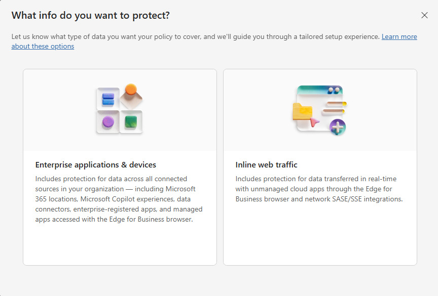
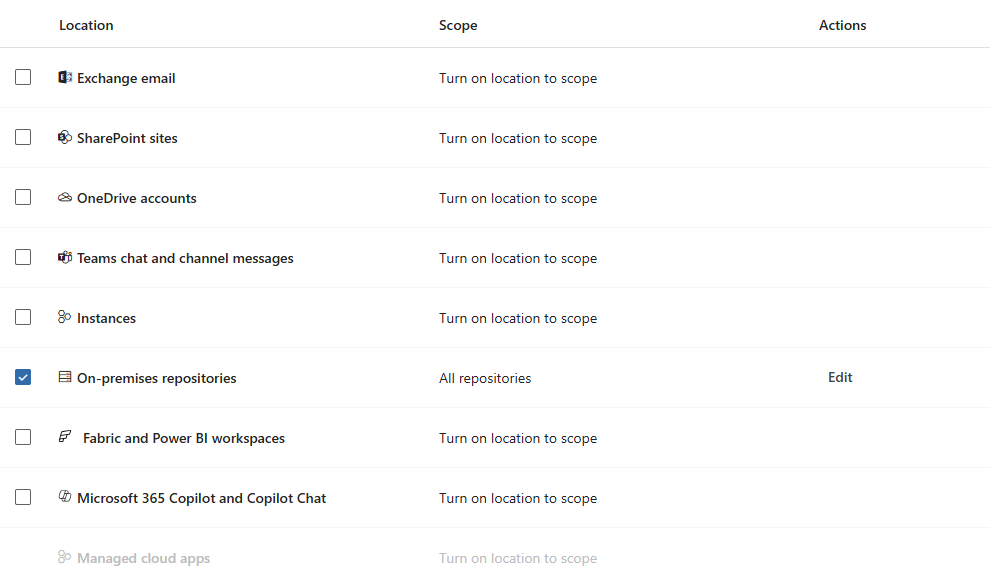
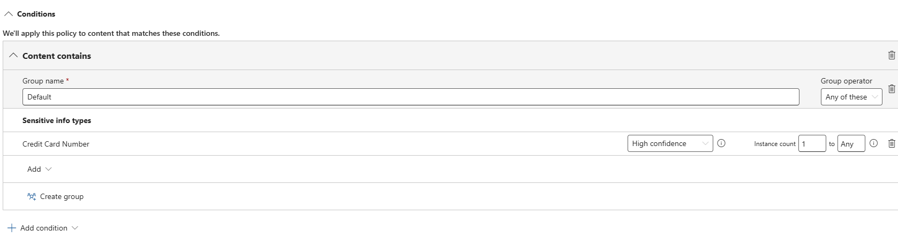
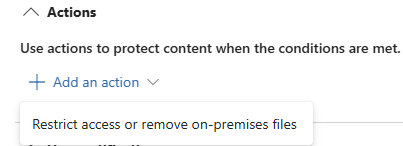
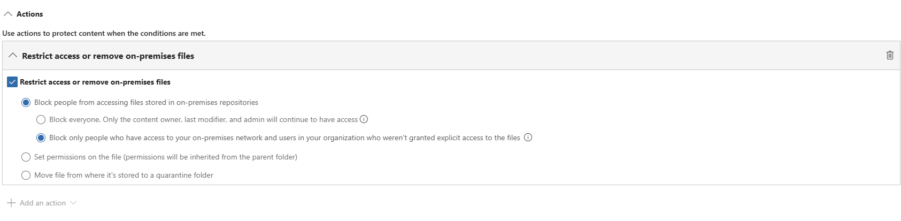

# Lab 02 - Part 1: DLP Policy Creation

## 📋 Overview

**Duration**: 30-45 minutes active work + 1-2 hours wait time for policy sync

**Objective**: Create and configure Data Loss Prevention (DLP) policies in the Purview portal to protect sensitive information on on-premises file repositories.

**What You'll Learn:**

- Create custom DLP policies for on-premises repositories.
- Configure DLP rules with conditions and sensitive information types.
- Understand DLP rule actions (block vs audit).
- Configure user notifications and admin alerts.
- Verify DLP policy creation and sync status.

**Prerequisites from Lab 01:**

- ✅ Information Protection Scanner deployed and operational.
- ✅ Discovery scan completed successfully showing sensitive data.
- ✅ Scanner service running and authenticated.
- ✅ Repositories configured (Finance, HR, Projects, Azure Files).

---

## 🎯 Lab Objectives

By the end of OnPrem-03, you will be able to:

1. Create DLP policies specifically for on-premises file repositories
2. Configure advanced DLP rules with sensitive information type conditions
3. Implement different enforcement actions (block access, audit only)
4. Configure user notifications and admin alerts for DLP matches
5. Understand DLP policy sync timing and requirements
6. Verify DLP policy creation and readiness for enforcement

> **⏳ Important**: This lab ends with a mandatory 1-2 hour wait for DLP policy synchronization. Do NOT proceed to OnPrem-04 until the policy sync completes.

---

## 📖 Step-by-Step Instructions

> **🔀 Already Have DLP Policies?** If you completed this lab previously and already have a DLP policy (`Lab-OnPrem-Sensitive-Data-Protection`) configured in your tenant, skip directly to **[Step 2: Verify DLP is Enabled](#step-2-verify-dlp-is-enabled-in-content-scan-job)**. DLP policies persist at the tenant level and don't need to be recreated.

> **🖥️ Execution Environment**:
>
> - **Step 1** (Policy Creation): Portal-based, can be done from any machine
> - **Steps 2-3** (Enable DLP & Run Scan): Must be executed **on the Purview Scanner VM** where the Microsoft Information Protection Scanner service is installed

### Step 1: Create DLP Policy in Purview Portal

**Navigate to Purview DLP Portal:**

- Open browser and go to the **Microsoft Purview portal**: [https://purview.microsoft.com](https://purview.microsoft.com).
- Sign in with your **admin account**.
- Navigate to **Solutions** > **Data loss prevention**.
- Select **Policies** from the left menu within Data loss prevention.
- Click **+ Create policy** to start policy creation.

> **💡 Portal Note**: The Microsoft Purview portal interface was redesigned in 2024. DLP policies are now accessed through Solutions > Data loss prevention > Policies. The steps below reflect the current portal as of October 2025.
>
> **💡 Background**: DLP policies for on-premises repositories work differently than cloud DLP. The scanner acts as the enforcement agent, applying policies during scan operations.

#### Choose What Type of Data to Protect

The policy creation wizard starts with a splash screen asking "What info do you want to protect?" with two tile options.



- Select the **Enterprise applications & devices** tile (left option).
- Click the tile to proceed.

> **💡 Option Context**:
>
> - **Enterprise applications & devices** = Protection for data across all connected sources including Microsoft 365 locations, Microsoft Copilot experiences, data connectors, enterprise-registered apps, managed apps accessed with Edge for Business browser, and **on-premises repositories**.
> - **Inline web traffic** = Protection for data transferred in real-time with unmanaged cloud apps through Edge for Business browser and network SASE/SSE integrations.
>
> For on-premises file share protection, **Enterprise applications & devices** is the correct choice as it includes all connected sources in your organization.

#### Select Policy Template

- Under **Categories**, select: **Custom**.
- Under **Regulations**, select: **Custom policy** (allows full control over rules and conditions).
- Click **Next**.

> **💡 Template Options**: Microsoft provides pre-built templates for Financial, Medical/Health, and Privacy regulations. Custom policy gives you complete control over sensitive information types, conditions, and actions.

#### Name Your Policy

- **Name**: `Lab-OnPrem-Sensitive-Data-Protection`.
- **Description**: `Protect PII and PCI data on on-premises file shares and Azure Files`.
- Click **Next**.

#### Assign Admin Units

- **Full directory** is selected by default (applies policy to all users and groups).
- You can optionally click **Add or remove admin units** to scope the policy to specific organizational units.
- For this lab, keep the default **Full directory** selection.
- Click **Next**.

> **📚 Note**: Admin units allow scoping DLP policies to specific organizational units within your Microsoft Entra ID (Azure AD) tenant. If you click **Add or remove admin units** and see no options available, this is expected behavior when admin units haven't been configured in your tenant. Full directory applies the policy across your entire organization, which is appropriate for lab scenarios.

#### Configure Locations

DLP policies can apply to multiple locations (Exchange, SharePoint, Teams, on-premises). For this lab, we focus exclusively on on-premises repositories.

By default, several locations are checked (enabled):

- ✅ **Exchange email** (checked by default).
- ✅ **SharePoint sites** (checked by default).
- ✅ **OneDrive accounts** (checked by default).
- ✅ **Teams chat and channel messages** (checked by default).
- ✅ **Instances** (checked by default).
- ✅ **On-premises repositories** (checked by default).

**Uncheck all locations EXCEPT On-premises repositories:**

1. Click to **uncheck** the following locations (toggle them to OFF):
   - **Exchange email** → Uncheck.
   - **SharePoint sites** → Uncheck.
   - **OneDrive accounts** → Uncheck.
   - **Teams chat and channel messages** → Uncheck.
   - **Instances** → Uncheck.

2. Keep **ONLY** this location checked:
   - ✅ **On-premises repositories** → Keep checked (ON).

3. Verify **On-premises repositories** is the ONLY location with a checkmark.



4. Click **Next**.

> **⚠️ Important**: On-premises repository DLP requires the Information Protection Scanner to be deployed and scanning the repositories. Without the scanner, DLP policies cannot be enforced on file shares. We performed this action in lab 01.
>
> **💡 Lab Focus**: We're unchecking cloud locations (Exchange, SharePoint, OneDrive, Teams, Instances) to focus exclusively on on-premises file shares for this lab. In production environments, you would typically enable multiple locations to protect data across your entire organization.

#### Select Rule Configuration Method

- **Create or customize advanced DLP rules**: Selected.
- This allows you to create multiple rules with different conditions and actions.
- Click **Next**.

You'll now create two DLP rules: one for Credit Card data (with blocking) and one for SSN data (with auditing).

#### Add First Rule

- Click **+ Create rule**.
- **Name**: `Block-Credit-Card-Access`.
- **Description**: `Block user access to files containing credit card numbers`.

**Configure Conditions:**

Under **Conditions**, click **+ Add condition**:

- Select: **Content contains**.
- **Content contains**: Click **Add** > **Sensitive info types**.
- Search for and select: **Credit Card Number**.
- Click **Add**.
- **Instance count**:
  - From: `1`.
  - To: `Any`.



This condition triggers when the scanner detects at least one credit card number in a file.

**Configure Actions:**

Under **Actions**, click **+ Add an action** and select **Restrict access or remove on-premises files**.



The Actions panel expands to show the **Restrict access or remove on-premises files** section with a checkbox and radio button options:

1. **Check the box**: ☑️ **Restrict access or remove on-premises files**

2. **Choose restriction method** - Select one of these four radio button options:

   **Option 1: Block people from accessing files stored in on-premises repositories** (selected by default):

   When this option is selected, two sub-options appear:

   - ○ **Block everyone. Only the content owner, last modifier, and admin will continue to have access** - Most restrictive option that removes all permissions except essential accounts.
   - ● **Block only people who have access to your on-premises network and users in your organization who weren't granted explicit access to the files** - Removes broad access groups (Everyone, Domain Users, Authenticated Users) but preserves explicit user/group permissions.

   **Option 2: Set permissions on the file (permissions will be inherited from the parent folder)**:

   - Forces the file to inherit permissions from its parent folder.
   - Useful for standardizing access based on folder-level permissions.

   **Option 3: Move file from where it's stored to a quarantine folder**:

   - Moves original file to a quarantine folder.
   - Replaces original file with a `.txt` stub file.
   - Most restrictive option - completely isolates sensitive files.

3. **For this lab**, select:
   - ☑️ **Restrict access or remove on-premises files** (checkbox checked).
   - ● **Block people from accessing files stored in on-premises repositories** (first radio button).
   - ○ **Block everyone. Only the content owner, last modifier, and admin will continue to have access** (sub-option for most restrictive lab demonstration).



> **💡 Action Explanation**:
>
> - **Block everyone**: Removes all NTFS/SharePoint permissions except file owner, last modifier, admin, and scanner account.
> - **Block only people with network access**: Removes broad access groups (Everyone, Domain Users, Authenticated Users) but preserves explicit user/group permissions.
> - **Set permissions (inherit from parent)**: Makes file inherit parent folder permissions (useful for standardizing access).
> - **Move to quarantine**: Quarantines sensitive files completely - most restrictive option that removes files from their original location.
>
> **💡 Production Consideration**: In production, "Block only people who have access to your on-premises network" is often preferred as it removes broad access while preserving legitimate explicit permissions. "Block everyone" is more restrictive and may require additional permission management.

**Configure User Notifications:**

> **⚠️ On-Premises Limitation**: The **User notifications** option is grayed out (disabled) for on-premises repository DLP policies. Policy tips are NOT available when using the on-premises scanner location. This is a known limitation documented by Microsoft.
>
> User notifications and policy tips are only supported for cloud locations (Exchange, SharePoint, OneDrive, Teams). For on-premises repositories, DLP enforcement happens silently through the scanner without user-facing notifications.

**Skip User Notifications section** - These settings are not available for on-premises repositories:

- ~~User notifications~~ (grayed out).
- ~~Policy tips~~ (not supported).
- ~~Email notifications~~ (not available).
- ~~Notify these people~~ (not available).

**User Overrides:**

- **Allow overrides** will also be grayed out (not available for on-premises repositories).

**Incident Reports:**

Configure alert settings for when this rule matches:

- **Severity level**: Select **High** from the dropdown.
  - Options available: Low, Medium, High.
  - High severity ensures alerts are prioritized and visible in admin dashboards.

**Alert Triggering Options** - Choose one:

**Option 1: Send alert every time an activity matches the rule** (Recommended for lab):

- Select this radio button for immediate alerts on each credit card detection.
- Best for critical data and low-volume monitoring.

**Option 2: Send alert when the volume of matched activities reaches a threshold**:

- Select this radio button for threshold-based alerting.
- Configure the following thresholds:
  - ☐ **Number of matched activities**: Specify minimum count (e.g., 5 activities).
  - ☐ **Number of MB**: Specify data volume threshold (e.g., 10 MB).
  - **During the last X minutes**: Time window for threshold evaluation (e.g., 60 minutes).
- Use for high-volume environments to reduce alert noise.

**For this lab**: Select **"Send alert every time an activity matches the rule"**.

**Email Notifications:**

- **Use email incident reports**: Toggle ON to send email notifications.
  - **Send notification emails to these people**: Add admin email addresses.

> **💡 Severity Level Guidance**:
>
> - **High**: Use for critical sensitive data (credit cards, SSNs) that require immediate attention.
> - **Medium**: Use for moderately sensitive data that needs review but isn't urgent.
> - **Low**: Use for general monitoring and audit purposes.
>
> For this lab, we use **High** severity to ensure credit card detections are immediately visible in the DLP alerts dashboard.

> **💡 Threshold vs Immediate Alerting**:
>
> - **Every time** (immediate): Alert on each individual match - ideal for critical data like credit cards
> - **Threshold-based**: Alert only when volume exceeds limits - reduces noise in high-activity environments
> - You can combine multiple threshold conditions (activities AND/OR data size within time window)

**Review and Save:**

- Click **Save** to create the rule.

#### Add Second Rule for SSN Data (Audit Mode)

- Click **+ Create rule**.
- **Name**: `Audit-SSN-Access`.
- **Description**: `Audit access to files containing Social Security Numbers without blocking`.

**Configure Conditions:**

Under **Conditions**, click **+ Add condition**:

- Select: **Content contains**.
- **Content contains**: Click **Add** > **Sensitive info types**.
- Search for and select: **U.S. Social Security Number (SSN)**.
- Click **Add**.
- **Instance count**:
  - From: `1`.
  - To: `Any`.

This condition triggers when the scanner detects at least one Social Security Number in a file.

**Configure Actions (Audit Only):**

For audit-only monitoring, **do NOT add any actions**:

- Under **Actions**, you will see **+ Add an action** option.
- **Do not click** this for the SSN audit rule.
- Leave the Actions section empty (no actions configured).

> **💡 Audit vs Enforcement**:
>
> - **Audit-only rule** (SSN): No actions configured → Scanner detects and logs SSN files but doesn't modify permissions or block access
> - **Enforcement rule** (Credit Card): Actions configured → Scanner detects files AND applies restrictive actions (block, quarantine, etc.)
>
> Leaving Actions empty creates a monitoring/discovery rule that logs activity in Activity Explorer without disrupting user access.
>
> **💡 Testing Strategy**: Using audit-only for SSN allows you to test DLP without disrupting access, which is ideal for initial deployments and monitoring data usage patterns before implementing restrictive actions.

**Configure User Notifications:**

> **⚠️ On-Premises Limitation**: The **User notifications** option is grayed out (disabled) for on-premises repository DLP policies. Policy tips are NOT available when using the on-premises scanner location.

**Skip User Notifications section** - These settings are not available for on-premises repositories:

- ~~User notifications~~ (grayed out).
- ~~Policy tips~~ (not supported).
- ~~Email notifications~~ (not available).

**User Overrides:**

- **Allow overrides** will also be grayed out (not available for on-premises repositories).

**Incident Reports:**

Configure alert settings for when this rule matches:

- **Severity level**: Select **Medium** from the dropdown.
  - High: Reserved for critical data (credit cards).
  - **Medium**: Appropriate for SSN monitoring and audit scenarios.
  - Low: General monitoring.

**Alert Triggering Options** - Choose one:

**Option 1: Send alert every time an activity matches the rule** (Recommended for lab):

- Select this radio button for immediate alerts on each SSN detection.
- Best for low-volume monitoring and testing scenarios.

**Option 2: Send alert when the volume of matched activities reaches a threshold**:

- Select this radio button for threshold-based alerting.
- Configure the following thresholds:
  - ☐ **Number of matched activities**: Specify minimum count (e.g., 5 activities).
  - ☐ **Number of MB**: Specify data volume threshold (e.g., 10 MB).
  - **During the last X minutes**: Time window for threshold evaluation (e.g., 60 minutes).
- Use for high-volume environments to reduce alert noise.

**For this lab**: Select **"Send alert every time an activity matches the rule"**.

**Email Notifications:**

- **Use email incident reports**: Toggle ON to send email notifications.
  - **Send notification emails to these people**: Add admin email addresses.

> **💡 Audit Rule Alerting**: Even though this rule uses audit-only enforcement (no blocking), incident reports still generate alerts when SSNs are detected. This allows you to monitor SSN data usage and identify potential risks before implementing blocking actions.
>
> **💡 Threshold vs Immediate Alerting**:
>
> - **Every time** (immediate): Alert on each individual match - ideal for critical data or testing
> - **Threshold-based**: Alert only when volume exceeds limits - reduces noise in high-activity environments
> - You can combine multiple threshold conditions (activities AND/OR data size within time window)

**Review and Save:**

- Click **Save** to create the rule.
- Click **Next** to advance to Policy mode.

##### Policy Mode Options

The wizard presents three deployment options:

**Option 1: Run the policy in simulation mode**:

- Policy runs as if enforced but **no actual enforcement occurs**.
- All matched items and alerts are reported in simulation dashboard.
- Use to assess policy impact before full enforcement.
- Optional: **Show policy tips while in simulation mode** (not available for on-premises repositories).
- Optional: **Turn the policy on if it's not edited within fifteen days of the simulation** (auto-activation).

**Option 2: Turn the policy on immediately**:

- Policy enforces immediately with full actions applied.
- Credit card blocking and SSN audit logging active immediately.
- Recommended only after testing in simulation mode.

**Option 3: Keep it off**:

- Policy created but inactive.
- No enforcement, no simulation, no alerts.
- Use when policy configuration is incomplete or requires approval.

**For this lab**, select one of the following:

- **Recommended**: **Run the policy in simulation mode** (safer for initial testing)
  - Allows you to see what would be blocked/audited without actual enforcement
  - Review simulation results before enabling full enforcement
  - Change to "Turn it on right away" later after validation

- **Alternative**: **Turn the policy on immediately** (if you want immediate enforcement)
  - Credit card files will be blocked immediately on next scan
  - SSN files will be audited (logged) but not blocked.

**For this lab, we recommend**: Select **Turn it on right away** to demonstrate active DLP enforcement.

- Click **Next** to advance to Review and finish.

> **✅ Best Practice**: In production environments, always start with **Run the policy in simulation mode** to assess impact, identify false positives, and educate users before full enforcement. For this lab, we use immediate enforcement to demonstrate DLP actions during the enforcement scan.

#### Review and Finish

The final screen displays a comprehensive summary of your policy configuration. Review each section carefully before creating the policy.

**Page Header:** "Create the policy if these details look fine. Otherwise, adjust the settings to better meet your needs."

**Summary Sections Displayed:**

**1. The information to protect**:

- **Type**: Custom policy.
- Click **Edit** to modify policy template selection.

**2. Name**:

- **Name**: Lab-OnPrem-Sensitive-Data-Protection.
- Click **Edit** to change policy name.

**3. Description**:

- **Description**: Protect PII and PCI data on on-premises file shares and Azure Files.
- Click **Edit** to modify description.

**4. Locations**:

- **Selected location**: On-premises repositories.
- Teams suggestion banner may appear: "Consider adding Teams as a location to protect the accidental sharing of sensitive info in Teams messages".
  - You can ignore this for the lab (focused on on-premises only).
- Click **Edit** to modify location selection.

**5. Policy settings**:

- **Rules configured**:
  - Block-Credit-Card-Access.
  - Audit-SSN-Access.
- Click **Edit** to modify rules.

**6. Turn policy on after it's created?**

- **Status**: Yes (if you selected "Turn it on right away").
- **Status**: No (if you selected "Run the policy in simulation mode" or "Keep it off").
- Click **Edit** to change policy mode.

**Verify all settings are correct** - Each section has an **Edit** link to return to that configuration step if changes are needed.

**Submit Policy:**

- Click **Submit** to create the policy.
- Wait for confirmation message: "Your policy was created".
- Click **Done**.

**Policy Created:**

- Policy appears in the **Policies** list.
- **Status column** shows:
  - **On** (if turned on immediately).
  - **In simulation** (if simulation mode selected).
  - **Off** (if kept off).
- **Name**: Lab-OnPrem-Sensitive-Data-Protection.
- **Locations**: On-premises repositories.
- **Policy settings**: The configured policy names.

> **🔄 DLP Policy Sync Timing**: You will likely see a "Sync in progress" message on the policy screen after creation. This is normal behavior as the DLP policy is being distributed to the on-premises scanner infrastructure.
>
> **Expected sync time**: While Microsoft doesn't provide specific SLAs for on-premises scanner DLP policy sync, based on similar Purview services (Endpoint DLP) and real-world testing, policy synchronization typically takes **1-2 hours** to complete across the service.
>
> **⏳ Wait for sync to complete**: Do NOT restart the scanner service or run scans while the policy shows "Sync in progress". Restarting the scanner before sync completes does not speed up the process and may interfere with policy distribution. Simply wait for the sync status to clear.
>
> **How to verify sync completion**:
>
> - Refresh the **Policies** page in Purview portal (or check the **Policy sync status** tab in policy details)
> - The "Sync in progress" message should disappear once sync completes (typically within 1-2 hours)
> - **Only after sync completes**, proceed to Lab 02 - Part 2 for DLP enforcement configuration

---

### Step 2: Verify DLP is Enabled in Content Scan Job

Before running a DLP-enabled scan, verify that **Enable DLP policy rules** was configured correctly in OnPrem-01.

> **📋 Prerequisite Check**: The **Enable DLP policy rules** setting should have been enabled when you created the content scan job in **[OnPrem-01 Step 3](../OnPrem-01-Scanner-Deployment/README.md#step-3-create-content-scan-job)**. This step verifies that configuration.

**Quick Verification in Purview Portal:**

- Navigate to **Settings** > **Information protection** > **Information protection scanner**
- Click on **Content scan jobs** tab > **Lab-OnPrem-Scan**
- Verify **Enable DLP policy rules** is set to **On**
- If not enabled, toggle it **On** and click **Save**

> **⚠️ If DLP was not enabled in OnPrem-01**: Toggle **Enable DLP policy rules** to **On** now, then run `Update-AIPScanner` on the Scanner VM to sync the updated configuration before proceeding.

---

### Step 3: Sync Policies to Scanner and Run DLP-Enabled Scan

With DLP enabled in the content scan job (verified in Step 2), sync the new DLP policies and run a scan to validate DLP detection is working.

> **🖥️ Scanner VM Execution Required**: All three scripts must be run **on the Purview Scanner VM**.

**Sync DLP Policies from Portal:**

1. Open the script on your admin machine:

   ```powershell
   c:\REPO\GitHub\Projects\Microsoft\Purview\Purview-Skills-Ramp-OnPrem-and-Cloud\02-OnPrem-Scanning\OnPrem-03-DLP-Policy-Configuration\Sync-DLPPolicies.ps1
   ```

2. Copy entire script content
3. **RDP to Scanner VM**, open PowerShell as Administrator
4. Paste script content and save as `Sync-DLPPolicies.ps1`
5. Run: `.\Sync-DLPPolicies.ps1`

**Run Full DLP Scan with Reset:**

1. Open the script on your admin machine:

   ```powershell
   c:\REPO\GitHub\Projects\Microsoft\Purview\Purview-Skills-Ramp-OnPrem-and-Cloud\02-OnPrem-Scanning\OnPrem-03-DLP-Policy-Configuration\Start-DLPScanWithReset.ps1
   ```

2. Copy entire script content.
3. In the same PowerShell window on Scanner VM (or open new as Administrator).
4. Paste script content and save as `Start-DLPScanWithReset.ps1`.
5. Run: `.\Start-DLPScanWithReset.ps1`.

> **💡 Why -Reset is Required**: The scanner performs incremental scans by default, only scanning new or changed files. When you add or modify DLP policies, you need to run `Start-Scan -Reset` to apply those policies to all files, including previously scanned ones. This ensures fresh DLP policy evaluation and prevents "Already scanned" status from skipping files.

⏳ **Scan Duration**: Expect 5-15 minutes depending on repository size (same as OnPrem-02 discovery scan)

**Monitor Scan Progress:**

1. Open the script on your admin machine:

   ```powershell
   c:\REPO\GitHub\Projects\Microsoft\Purview\Purview-Skills-Ramp-OnPrem-and-Cloud\02-OnPrem-Scanning\OnPrem-03-DLP-Policy-Configuration\Monitor-DLPScan.ps1
   ```

2. Copy entire script content.
3. In the same PowerShell window on Scanner VM (or open new as Administrator).
4. Paste script content and save as `Monitor-DLPScan.ps1`.
5. Run: `.\Monitor-DLPScan.ps1`.

The monitor script will:

- Display real-time scan status (Running/Idle).
- Show file counts and progress.
- Exit automatically when scan completes (or if no active scan).

**Expected Output (Scan Complete):**

```text
📊 DLP Scanner Status Monitor
=============================
   Refresh: #1
   Time: 14:50:30
   Elapsed: 0 minutes, 0 seconds

🔍 Current Scan Status:
   =====================
   Last Scan Start: 12/26/2025 14:35:00
   Last Scan End: 12/26/2025 14:45:44
   Status: IDLE (Scan Complete)

📊 File Statistics:
   =================
   Files Scanned: 15
   Failed Files: 0

🔐 DLP Configuration:
   ==================
   Mode: Portal-Configured (OnlineConfiguration = On)
   💡 DLP settings managed in Purview portal

💡 No active scan detected.
   Last scan completed at: 12/26/2025 14:45:44

   To start a new scan, run: Start-DLPScanWithReset.ps1

✅ Monitoring Complete
```

**Analyze DLP Results (After Scan Completes):**

1. Open the script on your admin machine:

   ```powershell
   c:\REPO\GitHub\Projects\Microsoft\Purview\Purview-Skills-Ramp-OnPrem-and-Cloud\02-OnPrem-Scanning\OnPrem-03-DLP-Policy-Configuration\Get-DLPScanReport.ps1
   ```

2. Copy entire script content.
3. In the same PowerShell window on Scanner VM (or open new as Administrator).
4. Paste script content and save as `Get-DLPScanReport.ps1`.
5. Run: `.\Get-DLPScanReport.ps1`.

This script will:

- Locate the latest DetailedReport.csv (handles both loose CSV and ZIP archives).
- Extract and analyze DLP matches.
- Show files grouped by repository and sensitive info type.
- Display DLP mode distribution (Test vs Enforce).

> **📦 Report Format**: The scanner may create loose DetailedReport CSV files or ZIP archives containing CSV files. The script handles both formats automatically.

**Expected Output (DLP Detection Working):**

```text
📊 DLP Analysis Summary:
   ====================

   Total files scanned: 3
   Files with DLP matches: 3

   ⚠️  Sensitive data detected!

   📁 Matches by Repository:
      \\VM-PURVIEW-SCAN\HR: 1 files
      \\VM-PURVIEW-SCAN\Finance: 1 files
      \\VM-PURVIEW-SCAN\Projects: 1 files

   📋 Detected Sensitive Information Types:
      Credit Card Number: 2 files
      U.S. Social Security Number (SSN): 1 files

   🔐 DLP Mode Distribution:
      Enforce: 2 files
      Test: 1 files

✅ DLP Scan Report Analysis Complete
```

**Key Success Indicators:**

| Indicator | What to Look For | Meaning |
|-----------|------------------|---------|
| **Files with DLP matches** | Count > 0 | DLP detection is working |
| **Information Types** | Sensitive info types listed | Scanner identified sensitive data |
| **DLP Mode** | "Test" or "Enforce" | DLP policies applied correctly |

✅ **Success**: If you see "Files with DLP matches" > 0 and sensitive information types listed, DLP detection is working correctly.

❌ **If "Files with DLP matches: 0"**:

- Verify **Enable DLP policy rules** is **On** in portal Content Scan Job settings.
- Re-run `Update-AIPScanner` and `Start-Scan -Reset`.
- Wait 1-2 hours and check again (policy sync can be delayed).

---

## 🛑 STOP - Policy Sync Wait Required

**⏳ MANDATORY WAIT PERIOD**: Even though DLP detection is working in the scan report, you must wait **1-2 hours** for complete policy synchronization to Activity Explorer before proceeding to OnPrem-04.

### What Happens During Sync

The scanner has already downloaded basic DLP detection capability (visible in your scan report), but full policy synchronization to Activity Explorer happens asynchronously:

- Scanner downloads basic DLP detection capability immediately (visible as DLP Mode = "Test" or "Enforce" and populated Information Type Name).
- **Full policy sync to Activity Explorer** happens asynchronously and takes 1-2 hours.
- Activity Explorer updates require processing time for DLP events to appear.
- Complete policy distribution ensures DLP events are logged and reportable.

### What You Should Do Now

**✅ DO:**

- Take a break - grab coffee, lunch, or work on other tasks.
- Set a timer for 1-2 hours to check Activity Explorer.
- Review OnPrem-04 overview section to understand enforcement steps.
- Review the DLP policy configuration you just created.
- Verify scan reports show expected sensitive files detected.

**❌ DO NOT:**

- Proceed to OnPrem-04 before Activity Explorer sync completes.
- Restart the scanner service (doesn't help, may interfere).
- Run additional scans during sync period.
- Modify the DLP policy (may reset sync timer).
- Create additional DLP policies (each requires its own sync time).

### How to Verify Sync Completion

**Check Activity Explorer Readiness:**

```powershell
cd "c:\REPO\GitHub\Projects\Microsoft\Purview\Purview-Skills-Ramp-OnPrem-and-Cloud\02-OnPrem-Scanning\OnPrem-03-DLP-Policy-Configuration"
.\Verify-ActivityExplorerSync.ps1
```

The script will:

- Check local prerequisites (scan completion, DLP configuration).
- Provide detailed instructions for Activity Explorer portal verification.
- Display success criteria and troubleshooting guidance.
- Show expected timeline for sync completion.

**Manual Activity Explorer Verification:**

After 1-2 hours, check Activity Explorer for DLP events:

- Navigate to [Purview portal](https://purview.microsoft.com) > **Solutions** > **Data loss prevention** > **Activity explorer**.
- Filter: **Activities** = "File accessed from on-premises repository".
- Look for your repositories (Finance, HR, Projects).
- Verify DLP events appear (sensitive information type matches logged).

> **💡 Activity Explorer Note**: Like the DetailedReport CSV, Activity Explorer may not show detailed DLP rule names for on-premises scanners. The presence of DLP events with matched sensitive information types (Credit Card Number, SSN) confirms the policy sync is complete.

✅ **If Activity Explorer shows DLP events with sensitive info types**: Policy sync complete, proceed to OnPrem-04

❌ **If no Activity Explorer events after 2 hours**: Run Verify-ActivityExplorerSync.ps1 for troubleshooting guidance

### Expected Timeline

- **DLP scan completed**: Immediate (Step 3)
- **DLP detection visible in CSV**: Immediate (Information Type Name populated)
- **Activity Explorer sync starts**: Automatic after scan
- **Typical Activity Explorer sync completion**: 1-2 hours after scan
- **Maximum expected**: 2-3 hours for Activity Explorer events to appear
- **If exceeds 2-3 hours**: Use Verify-ActivityExplorerSync.ps1 for diagnostics

### Troubleshooting Extended Sync Times

If Activity Explorer events don't appear after 2-3 hours, run the verification script for comprehensive troubleshooting:

```powershell
cd "c:\REPO\GitHub\Projects\Microsoft\Purview\Purview-Skills-Ramp-OnPrem-and-Cloud\02-OnPrem-Scanning\OnPrem-03-DLP-Policy-Configuration"
.\Verify-ActivityExplorerSync.ps1
```

The script provides:

- Scanner service status verification.
- Scan completion checks.
- Network connectivity tests.
- Auditing configuration guidance.
- Timeline reference and next steps.

**If Events Still Don't Appear:**

- Verify DLP policy is set to "On" status in portal.
- Confirm EnableDLP = On in scanner configuration.
- Re-run scan with Start-DLPScanWithReset.ps1.
- Contact Microsoft Support if events don't appear after 4+ hours.

---

## ✅ Validation Checklist

Before proceeding to OnPrem-04, verify:

### DLP Policy Creation

- [ ] DLP policy **Lab-OnPrem-Sensitive-Data-Protection** created successfully
- [ ] Policy status set to **On** (not "Off" or "Test only")
- [ ] Policy location set to **On-premises repositories** only (no cloud locations)
- [ ] Two rules created:
  - [ ] **Block-Credit-Card-Access**: Block enforcement action
  - [ ] **Audit-SSN-Access**: Audit-only action
- [ ] Rules configured with correct sensitive information types:
  - [ ] Credit Card Number SIT in Block rule
  - [ ] U.S. Social Security Number SIT in Audit rule
- [ ] Enforcement actions configured appropriately
- [ ] Incident reports configured with appropriate severity levels
- [ ] Email notifications configured for admin alerts

### Scanner DLP Configuration

- [ ] **DLP enabled in content scan job** via Purview portal (**Enable DLP policy rules** = On)
- [ ] Verified setting in portal under **Content scan jobs** > **Lab-OnPrem-Scan**
- [ ] **Scanner synced** using `Update-AIPScanner` after any portal changes
- [ ] **Scanner service restarted** after configuration changes (`Restart-Service MIPScanner`)

> **💡 Note**: PowerShell cmdlets like `Get-ScannerContentScan` return empty values for portal-configured scanners. This is normal - verify DLP settings directly in the Purview portal.

### DLP Detection Validation

- [ ] **DLP scan completed** using `Start-Scan -Reset`
- [ ] **DetailedReport CSV** shows DLP Mode populated ("Test" or "Enforce")
- [ ] **Information Type Name populated** with "Credit Card Number" or "U.S. Social Security Number (SSN)"
- [ ] **Empty columns expected**: DLP Rule Name and DLP Status empty/blank (expected for on-premises scanners)

### Policy Sync Completion

- [ ] **Activity Explorer events appear** (1-2 hours after scan completion)
- [ ] **DLP events visible** in Activity Explorer with filter "File accessed from on-premises repository"
- [ ] **Sensitive info types logged**: Activity Explorer shows matched sensitive information types
- [ ] **Repositories visible**: Finance, HR, and Projects repositories appear in Activity Explorer events
- [ ] **Empty rule names expected**: Activity Explorer may not show detailed DLP rule names (expected for on-premises)

> **🎯 Success Indicator**: The primary success indicator is **Activity Explorer showing DLP events** with matched sensitive information types (Credit Card Number, SSN), even if DLP rule names don't appear. This confirms the on-premises scanner is successfully detecting sensitive data and logging events for compliance reporting.

---

## 🚀 Next Steps

### Summary: You're Ready for OnPrem-04

Congratulations! You've successfully configured DLP policy detection for on-premises repositories:

**✅ What You've Accomplished:**

- Created comprehensive DLP policy **Lab-OnPrem-Sensitive-Data-Protection** with blocking and auditing rules.
- Configured DLP policy to protect on-premises repositories (Finance, HR, Projects).
- Enabled DLP in scanner content scan job configuration.
- Ran DLP-enabled scan and validated detection in reports.
- Confirmed DLP Mode populated ("Test" or "Enforce") and Information Type Name populated (Credit Card Number, SSN).
- Understood empty DLP Rule Name/Status columns are expected for on-premises scanners.
- Waited for Activity Explorer sync to complete (DLP events now visible).

### Immediate Next Step

**⏳ WAIT for Activity Explorer sync** (if not already complete - allow 1-2 hours after scan)

Verify Activity Explorer shows DLP events with matched sensitive information types using the verification method in the "How to Verify Sync Completion" section above.

### After Sync Completes

**Proceed to OnPrem-04: DLP Activity Monitoring & Reporting**:

In OnPrem-04, you will:

- **Navigate Activity Explorer** and filter for on-premises DLP activity
- **Interpret DLP activity data** including file counts, sensitive info types, and timestamps
- **Export Activity Explorer data** to CSV for stakeholder reporting
- **Generate compliance audit trails** combining Activity Explorer and DetailedReport CSV sources
- **Establish monitoring cadence** for ongoing DLP compliance

**Location**: `OnPrem-04-DLP-Activity-Monitoring/README.md`

**Duration**: 15-20 minutes (monitoring and reporting focus)

---

## 📚 Reference Documentation

- [Microsoft Purview DLP for On-Premises Repositories](https://learn.microsoft.com/en-us/purview/dlp-on-premises-scanner-learn)
- [DLP Policy Configuration](https://learn.microsoft.com/en-us/purview/dlp-create-deploy-policy)
- [Sensitive Information Types Reference](https://learn.microsoft.com/en-us/purview/sensitive-information-type-entity-definitions)
- [DLP Policy Tips and Notifications](https://learn.microsoft.com/en-us/purview/use-notifications-and-policy-tips)
- [Information Protection Scanner Overview](https://learn.microsoft.com/en-us/purview/deploy-scanner)

---

## 🤖 AI-Assisted Content Generation

This lab guide was created with the assistance of **GitHub Copilot** powered by advanced AI language models. The content was generated, structured, and refined through iterative collaboration between human expertise and AI assistance within **Visual Studio Code**.

*AI tools were used to enhance productivity and ensure comprehensive coverage of DLP policy configuration while maintaining technical accuracy for on-premises data protection scenarios.*
