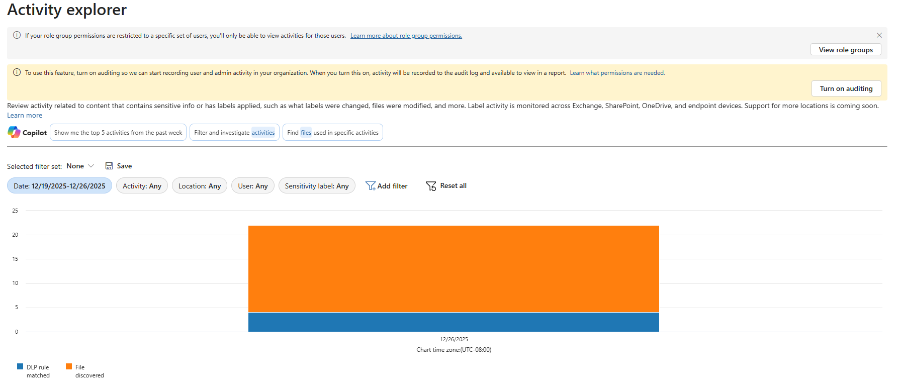
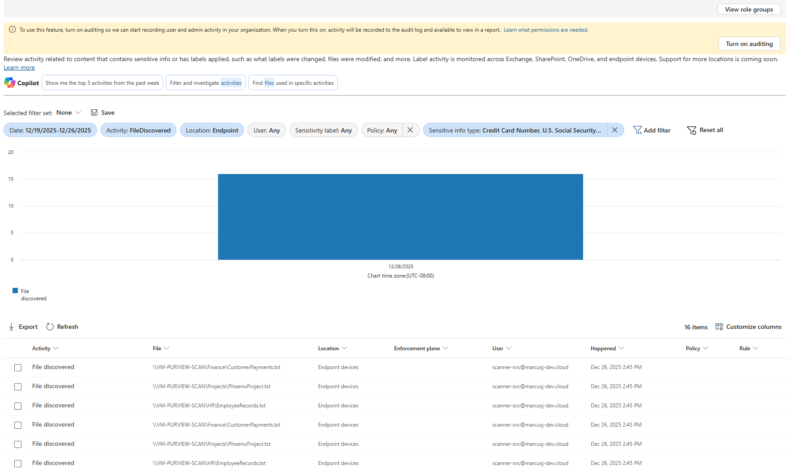

# Lab 02 - Part 2: DLP Activity Monitoring & Reporting

> **🛑 BEFORE YOU BEGIN**: You MUST complete OnPrem-03 (DLP Policy Configuration) and verify that DLP detection is working before starting this lab.
>
> **Required Prerequisites**:
>
> - ✅ OnPrem-03 completed with DLP scan showing **Information Type Name** populated
> - ✅ Microsoft 365 auditing enabled (covered in Lab 00 - Step 2)
> - ✅ At least **15-30 minutes** have passed since completing OnPrem-03 DLP scan
> - ✅ Scanner reports confirm DLP detection is working (Credit Card, SSN detected)
>
> **If OnPrem-03 not complete**: Return to OnPrem-03 and complete DLP policy configuration and initial scan validation. This lab focuses on **monitoring and reporting** DLP activity, not running scans.

---

## 📋 Overview

**Duration**: 15-20 minutes

**Objective**: Learn how to monitor on-premises DLP activity using Activity Explorer, interpret DLP audit data, and generate compliance reports for stakeholders.

**What You'll Learn:**

- Navigate Activity Explorer and filter for on-premises DLP activity.
- Configure filters to isolate on-premises scanner events from cloud workloads.
- Interpret DLP activity data and understand what appears for on-premises scanners.
- Identify the three primary DLP reporting sources and their purposes.
- Export DLP activity data for compliance reporting.
- Generate stakeholder-ready audit trails showing sensitive data discovery.
- Establish regular monitoring cadence for ongoing compliance.

**Prerequisites from OnPrem-03:**

- ✅ DLP policy **Lab-OnPrem-Sensitive-Data-Protection** created and synced.
- ✅ DLP scan completed showing Information Type Name populated in scanner reports.
- ✅ Microsoft 365 auditing enabled (Lab 00 - Step 2).
- ✅ 15-30 minutes elapsed since DLP scan completion (for Activity Explorer data sync).

> **💡 What This Lab Covers**: This lab teaches how to use **Activity Explorer for real-time DLP monitoring**, complemented by local DetailedReport CSV files and Audit Log for comprehensive compliance reporting. Scanning operations were covered in OnPrem-03. Cloud data monitoring will be covered in dedicated cloud modules.
>
> **📚 Microsoft Learn Context**: According to [Use the data loss prevention on-premises repositories location](https://learn.microsoft.com/en-us/purview/dlp-on-premises-scanner-use), on-premises DLP activity is available through three primary sources:
>
> 1. **Activity Explorer** (Portal) - Real-time monitoring and filtering
> 2. **DetailedReport CSV** (Local scanner) - Complete technical details with DLP Mode, DLP Status, DLP Rule Name columns
> 3. **Audit Log** (Portal/PowerShell) - Long-term compliance records via `Search-UnifiedAuditLog`

---

## 🎯 Lab Objectives

By the end of this lab, you will be able to:

1. **Access Activity Explorer** and locate on-premises DLP activity data in the Purview portal
2. **Filter and analyze** DLP events to isolate on-premises scanner activity from cloud workloads
3. **Interpret DLP activity data** including file counts, sensitive info types, timestamps, and understand realistic expectations for on-premises scanners
4. **Export Activity Explorer data** to CSV for stakeholder reporting and compliance documentation
5. **Generate compliance audit trails** combining Activity Explorer, DetailedReport CSV, and Audit Log sources
6. **Establish monitoring cadence** for ongoing DLP compliance with daily/weekly/monthly schedules

---

## 📖 Step-by-Step Instructions

### Step 1: Access Activity Explorer

Activity Explorer provides comprehensive DLP activity monitoring and audit trail visualization for compliance reporting.

> **⚠️ PREREQUISITE - Auditing Must Be Enabled**: Activity Explorer requires Microsoft 365 auditing to be enabled to display DLP activity data from the scanner. If you followed **Lab 00 - Step 2: Enable Microsoft 365 Auditing**, auditing should already be active and you can proceed immediately.
>
> **If you see a banner** stating *"To use this feature, turn on auditing"*:
>
> 1. Click **Turn on auditing** on the banner
> 2. Wait for confirmation: *"We're preparing the audit log. It can take up to 24 hours..."*
> 3. **Auditing activation takes 2-24 hours** (typically 2-4 hours for initial data)
> 4. **After auditing activates**: Return to **OnPrem-03** and re-run the scan (`Start-Scan -Reset`) to generate audit records
> 5. **Then wait 15-30 minutes** for Activity Explorer data to sync
>
> **💡 Banner May Persist Even When Data Is Flowing**: In some cases, the "To use this feature, turn on auditing" banner may remain visible even after auditing is enabled and Activity Explorer data is flowing. **If you see DLP activity events in the timeline and activity list below the banner, ignore the banner and proceed** - your auditing is working correctly.
>
> **Note**: Audit data is only collected from the point auditing is enabled forward. Any scanner activity before auditing was enabled will not appear in Activity Explorer.

**Navigate to Activity Explorer:**

- Navigate to [Purview Portal](https://purview.microsoft.com).
- Go to **Data loss prevention** (in left navigation).
- Select **Explorers** (in left submenu).
- Click **Activity explorer**.

> **💡 Portal Note**: The Activity Explorer navigation was updated in 2024-2025. Activity Explorer is now located under **Data loss prevention > Explorers > Activity explorer**, not under **Solutions > Data classification** as in earlier portal versions.

**Understand Activity Explorer Interface:**

When Activity Explorer loads, you'll see:

- **Activity timeline**: Graphical view of DLP events over time
- **Filter panel** (left side): Configure filters for location, date range, activity types
- **Activity list**: Detailed view of individual DLP events
- **Export button**: Download activity data to CSV for reporting

---

### Step 2: Filter and Analyze On-Premises DLP Activity

Activity Explorer provides real-time monitoring of DLP events. This step teaches you how to filter for on-premises scanner activity and interpret the results.

> **📚 Microsoft Learn Reference**: According to [Use the data loss prevention on-premises repositories location](https://learn.microsoft.com/en-us/purview/dlp-on-premises-scanner-use), on-premises DLP activity is available through Activity Explorer, Audit logs, and local DetailedReport CSV files. Activity Explorer provides the most user-friendly real-time monitoring interface.

#### Configure Filters



Apply the following filters to isolate on-premises scanner activity (excluding cloud data):

**Primary Filters** (Required):

- **Location**: Select **Endpoint devices**
  - Excludes SharePoint, OneDrive, Exchange data
  - Focuses only on file share scanner activity

- **Date range**: Select **Last 7 days** (or custom range)
  - Start date: Date of OnPrem-03 DLP scan
  - End date: Today

- **Activity type**: Select **File discovered**
  - Primary activity type for on-premises scanner detection events
  - Click individual events to see sensitive info type details

> **💡 Activity Type Note**: Unlike cloud workloads (SharePoint, OneDrive) which show "File scanned" or "DLP policy matched", on-premises scanners generate **"File discovered"** events. Sensitive information type details (Credit Card Number, SSN) are visible when you open individual activity event details.

**Optional Filters** (May Not Populate):

- **DLP policy**: Lab-OnPrem-Sensitive-Data-Protection (may appear as generic or blank)
- **Sensitive info type**: Credit Card Number, U.S. Social Security Number (SSN)

**Apply Filters:**

- Click **Apply** or **Refresh**.
- Activity timeline and list will update to show filtered results.

#### Analyze Activity Explorer Results

After applying filters, review the Activity Explorer interface to validate DLP detection.

**Activity Explorer Data Visible for On-Premises Scanners:**

| Data Point | What You'll See | Expected Values (OnPrem-03 Lab) |
|------------|-----------------|----------------------------------|
| **Files with DLP matches** | Total count of files with sensitive info detected | 3 files (CustomerPayments.txt, EmployeeRecords.txt, PhoenixProject.txt) |
| **Sensitive info types** | Types detected in scanned files | Credit Card Number, U.S. Social Security Number (SSN) |
| **Activity timestamps** | When files were scanned | Date/time of OnPrem-03 DLP scan completion |
| **File locations** | Repositories/paths containing matches | C:\ScannerTestRepos\Finance, C:\ScannerTestRepos\HR, C:\ScannerTestRepos\Projects |
| **Location filter** | Endpoint devices (not SharePoint/OneDrive) | Endpoint devices |
| **Activity type** | File discovered | File discovered |

**Activity Explorer Limitations for On-Premises Scanners:**

> **⚠️ Expected Behavior**: The following metadata may appear as generic or blank. This is **normal for on-premises scanners** and does NOT indicate a problem.

| Data Point | Expected Limitation | Why This Occurs |
|------------|---------------------|-----------------|
| **DLP policy names** | May show as generic or blank | On-premises scanner metadata not fully populated in Activity Explorer |
| **DLP rule names** | Typically not displayed | Scanner reports provide this detail instead |
| **Enforcement actions** | Shows "Detected" instead of "Blocked"/"Allowed" | Test mode scanners detect but don't enforce |
| **User context** | Shows scanner service account | Scanner runs as service, not individual users |

#### Success Validation



✅ **Validation Criteria:**

- DLP events present in Activity Explorer timeline (time period after OnPrem-03 scan).
- Sensitive info types identified (Credit Card Number and/or SSN).
- File counts match DetailedReport CSV from OnPrem-03 (3 files expected).
- Location filter = Endpoint devices (confirms on-premises, not cloud).

> **💡 Primary Validation**: The presence of **File discovered** events with matched **sensitive information types** (Credit Card Number, SSN) confirms DLP detection is working correctly and generating audit trails. Policy/rule names being generic or missing is expected for on-premises scanners.

#### Complementary Reporting Sources

Activity Explorer is one of three DLP reporting sources. Use these complementary sources for different reporting needs:

| Reporting Source | Access Method | Best Use Case | Key Data Available |
|------------------|---------------|---------------|---------------------|
| **Activity Explorer** | Purview portal > Data loss prevention > Explorers | Real-time monitoring and filtering | Files with matches, sensitive info types, timestamps, location |
| **DetailedReport CSV** | `%localappdata%\Microsoft\MSIP\Scanner\Reports\DetailedReport\` | Technical troubleshooting | DLP Mode, DLP Status, DLP Rule Name, DLP Actions, file paths |
| **Audit Log** | Purview portal > Audit (PowerShell: `Search-UnifiedAuditLog`) | Long-term compliance records | Complete audit trail with all DLP events and metadata |

> **📊 Reporting Strategy**: Use Activity Explorer for **daily monitoring**, DetailedReport CSV for **technical validation**, and Audit Log for **compliance documentation**. Each source provides different detail levels for different audiences.

---

### Step 3: Export Activity Data for Compliance Reporting

Activity Explorer data can be exported to CSV for stakeholder reporting, compliance audits, and trend analysis. The export captures the filtered activity data visible in the current view.

**Export Activity Data to CSV:**

- Ensure filters are applied (Location = **Endpoint devices**, Activity = **FileDiscovered**).
- Click **Export** (located above the activity list, below the chart).
- The CSV file downloads automatically to your Downloads folder.

> **💡 Tip**: Apply a **Sensitive info type** filter before exporting to focus on specific data types. While the export won't include a sensitive info type column, filtering first ensures you're exporting only relevant activities.

**Review Exported Data Structure:**

Open the exported CSV file in Excel or a text editor. Activity Explorer exports contain the following columns:

**Activity Explorer CSV Export Columns:**

| Column Name | Sample Data | Use in Reporting |
|-------------|-------------|------------------|
| **Activity** | File discovered | Activity type for filtering and grouping |
| **File** | `\\YOURSERVER\Share\FileName.txt` | Full UNC path to scanned file |
| **Location** | Endpoint devices | Confirms on-premises vs cloud workloads |
| **Enforcement plane** | (Empty for discovery scans) | Shows enforcement context if applicable |
| **User** | scanner-svc@yourdomain.com | Service account running scanner |
| **Happened** | YYYY-MM-DDTHH:MM:SS.000Z | ISO 8601 timestamp of detection event |
| **Policy** | (Empty for on-premises scanners) | DLP policy name (typically empty for on-prem) |
| **Rule** | (Empty for on-premises scanners) | DLP rule name (typically empty for on-prem) |

> **⚠️ Important**: The Activity Explorer CSV export does **not** include a **Sensitive info type** column. To determine what sensitive data was detected in each file, use the **DetailedReport CSV** from the scanner's local Reports directory (see [OnPrem-02](../OnPrem-02-Discovery-Scans/README.md)), which includes DLP rule matches and sensitive info type details.

**Expected Export Data (OnPrem-03 Lab Files):**

Based on the OnPrem-03 lab, your Activity Explorer export should show multiple "File discovered" events for your test files:

- `\\YOURSERVER\Finance\CustomerPayments.txt`
- `\\YOURSERVER\HR\EmployeeRecords.txt`
- `\\YOURSERVER\Projects\PhoenixProject.txt`

> **💡 Multiple Events Per File**: You may see duplicate entries for the same file with different timestamps. This occurs when the scanner runs multiple times (e.g., manual scans, scheduled rescans). Each scan generates new activity events.

**Create Stakeholder-Ready Reports:**

**Combine Data Sources for Complete Reporting:**

Since Activity Explorer exports don't include sensitive info types, combine multiple data sources:

#### Option 1: Activity Explorer for Activity Tracking

Use Activity Explorer exports to track:

- **When** files were discovered (timestamps)
- **Where** files are located (UNC paths)
- **Who** ran the scan (service account)
- **How many** times files were scanned

#### Option 2: DetailedReport CSV for Sensitive Info Types

The scanner's local DetailedReport CSV (from OnPrem-02) includes:

- **Sensitive info types** detected in each file
- **DLP Mode** and **DLP Status**
- **DLP Rule Name** that matched
- **Match confidence** and **count**

**Combine Both Sources:**

```text
Activity Explorer → Activity tracking, timestamps, scan history
DetailedReport CSV → Sensitive info types, DLP rules, technical details
```

#### Compliance Audit Trail Template

For compliance documentation, combine Activity Explorer exports with local scanner reports:

**Executive Summary Template:**

- **Report Date**: [Current date]
- **Scope**: On-premises file repositories (Endpoint devices only)
- **Detection Summary** (from DetailedReport CSV):
  - Credit Card Numbers: X unique files detected
  - Social Security Numbers: Y unique files detected
  - Total sensitive files: Z unique files
- **Activity Tracking** (from Activity Explorer):
  - Total scan events: N events
  - Date range: [Start date] to [End date]
  - Files scanned: [List of UNC paths]

**Supporting Documentation:**

- **Activity Explorer CSV**: Shows scan activity, timestamps, file paths (no sensitive info types)
- **DetailedReport CSV** (Local scanner): Shows DLP Mode, DLP Status, DLP Rule Name, **Sensitive Info Types**
- **Audit Log**: Long-term compliance records accessible via Purview portal > Audit

> **📊 Best Practice**: Use **Activity Explorer** for scan activity tracking and timestamps. Use **DetailedReport CSV** from the scanner for sensitive info type details and stakeholder-ready summaries. Use **Audit Log** for regulatory compliance documentation requiring long-term retention.

---

### Step 4: Schedule Regular Activity Monitoring

For ongoing compliance monitoring, establish a regular Activity Explorer review cadence.

**Recommended Monitoring Cadence:**

**Daily Monitoring** (High-Risk Environments):

- Check Activity Explorer daily for new DLP matches.
- Focus on "File discovered" activity type.
- Alert stakeholders for unexpected sensitive data discovery.

**Weekly Monitoring** (Standard Environments):

- Review Activity Explorer weekly for trends.
- Export activity data for weekly compliance reports.
- Compare DetailedReport CSV from scanner for sensitive info type breakdowns.

**Monthly Monitoring** (Low-Risk Environments):

- Generate monthly DLP activity summary.
- Compare month-over-month trends.
- Identify repositories with recurring sensitive data issues.

> **💡 Monitoring Tip**: Combine Activity Explorer monitoring with scanner DetailedReport CSV reviews for comprehensive visibility. Activity Explorer provides activity tracking (when/where), while DetailedReport CSV provides sensitive info type details (what was detected).

---

## ✅ Validation Checklist

Complete the following validation steps to ensure successful lab completion:

### Activity Explorer Access (Step 1)

- [ ] Activity Explorer accessible in Purview portal under **Data loss prevention > Explorers**
- [ ] Microsoft 365 auditing enabled and active (no banner prompting to enable auditing)
- [ ] Activity Explorer interface loads without errors

### Filter and Analyze On-Premises DLP Activity (Step 2)

- [ ] **Location filter** set to **Endpoint devices** (excludes cloud workloads)
- [ ] **Date range filter** configured to include OnPrem-03 scan date
- [ ] **Activity type filter** shows **File discovered** for on-premises scanner events
- [ ] DLP events visible in Activity Explorer timeline after applying filters
- [ ] **Sensitive info types identified** via Activity Explorer filters (Credit Card Number, SSN)
- [ ] **File count matches scanner reports** from OnPrem-03 (3 test files expected)
- [ ] Activity timestamps correspond to OnPrem-03 scan completion time

> **✅ Success Indicator**: If Activity Explorer shows **File discovered** events for **Endpoint devices** location with files from your on-premises repositories, DLP monitoring is working correctly. Use the **Sensitive info type** filter to verify specific data types were detected. Policy/Rule columns are typically empty for on-premises scanners.

### Activity Data Export (Step 3)

- [ ] Activity data exported to CSV successfully from Activity Explorer
- [ ] CSV contains expected columns: Activity, File, Location, Enforcement plane, User, Happened, Policy, Rule
- [ ] CSV filtered to show only on-premises repository data (Endpoint devices)
- [ ] Understand that sensitive info type details require **DetailedReport CSV** from scanner (not Activity Explorer export)

### Monitoring Cadence (Step 4)

- [ ] Reviewed recommended monitoring cadence options (daily, weekly, monthly)
- [ ] Understand Activity Explorer provides activity tracking (when/where)
- [ ] Understand DetailedReport CSV provides sensitive info type details (what was detected)
- [ ] Regular monitoring schedule established for ongoing compliance

---

## 🔍 Troubleshooting Common Issues

### Issue: Activity Explorer Shows No Data

**Symptoms**: Activity Explorer appears empty after completing OnPrem-03

**Common Causes**:

1. **Data Sync Timing**: Activity data takes 15-30 minutes to appear after scan completes
2. **Incorrect Filters**: **Location** filter must be set to **On-premises repositories**
3. **Prerequisite Not Met**: Verify OnPrem-03 scan completed successfully with DLP detections

**Quick Resolution**:

- Wait 30 minutes after OnPrem-03 scan completion, then refresh Activity Explorer (Ctrl+F5).
- Apply **Location = Endpoint devices** filter.
- Verify OnPrem-03 scanner reports show populated **Information Type Name** column.

---

### Issue: Activity Explorer Shows Cloud Data Instead of On-Premises

**Symptoms**: Activity Explorer shows SharePoint or OneDrive activity instead of file share scanner activity

**Resolution**:

1. Click **Filters** in Activity Explorer
2. Set **Location** = **Endpoint devices** (not SharePoint, OneDrive, Exchange, Teams)
3. Click **Apply** to refresh results

---

### Issue: Need Sensitive Info Type Details Not in Activity Explorer Export

**Symptoms**: Activity Explorer export CSV doesn't include sensitive info type data needed for stakeholder reports

**Resolution**:

Activity Explorer exports don't include a Sensitive info type column. Use these alternatives:

1. **Use DetailedReport CSV** from the scanner VM: `%localappdata%\Microsoft\MSIP\Scanner\Reports\DetailedReport\`
2. **Apply Sensitive info type filter** in Activity Explorer before exporting to limit results to specific data types
3. **Combine sources**: Activity Explorer for timestamps/activity tracking + DetailedReport CSV for sensitive info type details

---

## 📊 Lab Completion Summary

After completing this lab successfully, you should have:

### ✅ Activity Explorer Monitoring Skills

- **Access**: Navigated to Activity Explorer and located DLP activity monitoring interface in Microsoft Purview portal
- **Filter and Analyze**: Configured filters to isolate on-premises scanner events (Endpoint devices location, File discovered activity type) and interpreted DLP activity data
- **Export and Reporting**: Exported activity data and understand how to combine with DetailedReport CSV for complete compliance documentation
- **Monitoring Cadence**: Established regular monitoring schedule for ongoing DLP compliance tracking

### ✅ DLP Reporting Automation Capabilities

- **Reporting Sources**: Understand the three primary DLP reporting sources for comprehensive compliance validation:
  - **Activity Explorer** (Portal) - Real-time activity monitoring, timestamps, file paths
  - **DetailedReport CSV** (Local scanner) - Sensitive info types, DLP rules, technical details
  - **Audit Log** (Portal/PowerShell) - Long-term compliance records

- **Combined Reporting Strategy**:
  - Use Activity Explorer for **when/where** questions (timestamps, file locations, scan history)
  - Use DetailedReport CSV for **what** questions (sensitive info types detected, DLP rule matches)
  - Use Audit Log for regulatory compliance documentation requiring long-term retention

### ✅ On-Premises vs Cloud Data Distinction

- **Filtered** Activity Explorer to show only on-premises scanner activity (Endpoint devices)
- **Excluded** cloud workload data (SharePoint, OneDrive, Teams) from on-premises reporting
- **Recognized** Activity Explorer behavior differences between on-premises scanners and cloud workloads
- **Prepared** for cloud workload DLP monitoring in future dedicated modules

---

## 🚀 Next Steps

**Immediate Next Actions:**

1. **Establish Regular Monitoring**: Set up weekly Activity Explorer reviews for ongoing DLP compliance
2. **Create Report Templates**: Build Excel templates for monthly DLP detection summaries
3. **Document Reporting Workflow**: Combine Activity Explorer exports with DetailedReport CSV for complete compliance documentation

**Future Learning Paths:**

- **Cloud Workload DLP**: Dedicated modules will cover SharePoint, OneDrive, Teams DLP monitoring
- **Advanced Reporting**: Power BI integration for executive-level DLP dashboards
- **Incident Response**: Using Activity Explorer for DLP incident investigation and forensics

---

## 🤖 AI-Assisted Content Generation

This lab guide was created with the assistance of **GitHub Copilot** powered by advanced AI language models. The content was generated, structured, and refined through iterative collaboration between human expertise and AI assistance within **Visual Studio Code**.

*AI tools were used to enhance productivity and ensure comprehensive coverage of Activity Explorer monitoring and DLP validation while maintaining technical accuracy for on-premises enforcement scenarios.*
