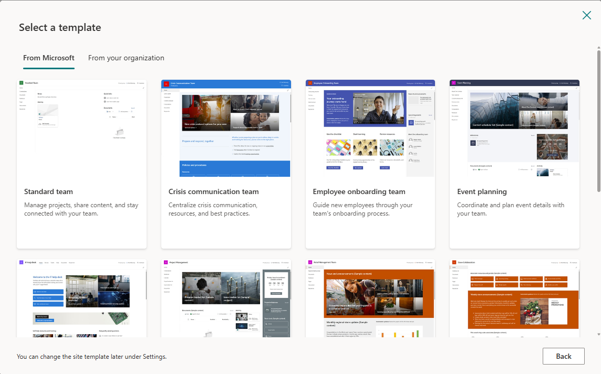
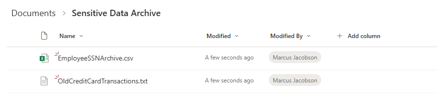

# Cloud-01: SharePoint Online Foundation Setup

## 🎯 Lab Objectives

- Create SharePoint Online team site for retention testing.
- Upload sample documents to SharePoint document library.
- Verify SharePoint site accessibility and permissions.
- Establish cloud repository for retention label testing.
- Understand SharePoint Online vs. on-premises capabilities.

## ⏱️ Estimated Duration

30-45 minutes

## 📋 Prerequisites

- Microsoft 365 tenant with SharePoint Online.
- Global Admin or SharePoint Admin role.
- OnPrem-01 and OnPrem-02 completed (understand scanner discovery results).

---

**Critical Understanding**:

> **⚠️ Important**: Retention labels with auto-apply policies work in **SharePoint Online** and **OneDrive for Business**, but **NOT on-premises file shares** scanned by the Information Protection Scanner.

**Why This Lab Uses SharePoint**:

- Demonstrates retention label technology and capabilities.
- Shows auto-apply policies based on sensitive information types.
- Provides cloud-based alternative for long-term data lifecycle management.
- Complements on-premises scanner discovery from OnPrem-02.

**On-Premises File Remediation Options**:

- Manual label application through scanner (limited capabilities).
- PowerShell scripting for bulk file operations.
- Cloud migration to SharePoint enables full retention features.
- Hybrid approach: Scanner discovers, SharePoint applies retention.

## 🚀 Lab Steps

### Step 1: Create SharePoint Team Site

> **💡 Site Type Selection**: This lab uses a **Team site** because it's designed for collaborative file storage and document sharing—the typical scenario where users save content that requires retention policies. Team sites provide full collaboration features (edit, share, co-author) that align with retention testing workflows. Communication sites are optimized for broadcasting information (news, announcements) with limited collaboration features, making them less suitable for this lab's file-based retention testing.

**Navigate to SharePoint Admin Center**:

- Open browser and go to: [https://admin.microsoft.com](https://admin.microsoft.com).
- Sign in with your **admin account**.
- Navigate to **Admin centers** > **SharePoint** (left menu or All admin centers).
- In SharePoint admin center, select **Sites** > **Active sites**.
- Click **Create** button at the top.

**Create Team Site**:

- Select **Team site** (to create a Microsoft 365 group-connected team site).
- Alternatively, you can select **Browse more sites** to see additional templates.

- Browse and select a template: Choose **Standard team** template.
- Click **Use template**.

**Site Details**:

- **Site name**: `Retention Testing`
- **Site description**: `Sample SharePoint site to test Retention Labels`
- **Group email address**: `RetentionTesting` (auto-populated from site name)
- **Site address**: Verify it shows as available (e.g., `/sites/RetentionTesting`)
- **Group owner**: Your admin account (start typing to search and select)
- Click **Next**.

**Privacy and Additional Settings** (next page):

- **Privacy settings**: **Private** (recommended for lab environment)
- **Language**: English (or your preferred language)
- Click **Create site**.

**Add Site Owners and Members** (final page):

- **Add members**: Skip this for the lab - no additional members needed.
- Click **Finish** to complete site creation.

> **⚠️ Site Address Note**: If you enter "Retention Testing" as the site name and another site already exists at `/sites/RetentionTesting`, the site address will be automatically changed to an available address like `/sites/RetentionTesting2`. The wizard will show a warning: "This site address is available with modification".
>
> **💡 Portal Note**: The SharePoint admin center interface may vary based on your tenant configuration. Some tenants show "New site" instead of "+ Create". The core functionality remains the same.

**Wait for Site Creation**:

- Site creation typically takes 1-2 minutes.
- You'll see a notification when the site is ready.
- Click on the site name to open it in a new tab.

### Step 2: Create Folder and Upload Sample Files with Sensitive Data

**Create a Dedicated Folder for Sensitive Data**:

- In your new Retention Testing site, click **Documents** from the left menu.
- Click **+ New** > **Folder**.
- **Folder name**: `Sensitive Data Archive`
- Click **Create**.
- Open the newly created **Sensitive Data Archive** folder.

> **💡 Folder Purpose**: Using a descriptive folder name helps organize test data and makes it easier to identify files during auto-apply policy validation in Cloud-03.

**Upload Sample Files with Sensitive Information**:

Sample files are provided in this lab's `sample-files` folder. Upload them to the **Sensitive Data Archive** folder:

- Click **Upload** > **Files**.
- Navigate to: `03-Cloud-Scanning\Cloud-01-SharePoint-Foundation\sample-files\`
- Select both files:
  - `EmployeeSSNArchive.csv` - Contains sample SSN data patterns
  - `OldCreditCardTransactions.txt` - Contains sample credit card number patterns
- Click **Open** to upload.

**Verify Upload**:

- Both files should appear in the **Sensitive Data Archive** folder.
- Click on each file to verify content is visible.

> **💡 Sample File Contents**: These files contain fictitious sensitive data patterns (SSNs: `123-45-6789`, Credit Cards: `4532-1234-5678-9010`) that Microsoft Purview's sensitive information type detection will recognize. This ensures auto-apply policies in Cloud-03 will correctly identify and label these files.
>
> **⚠️ Lab Files Only**: These are sample files for lab purposes only. Never use real sensitive data in test environments.

### Step 3: Configure Site Permissions (Optional)

**Review Default Permissions**:

- Click **Settings** (gear icon) > **Site permissions**.
- Verify your admin account has Full Control.
- For lab purposes, default permissions are sufficient.

**Add Additional Users** (if testing with colleagues):

- Click **Invite people**.
- Enter email addresses.
- Select permission level (Edit or Read).
- Click **Share**.

> **Note**: For this lab, you can work as the sole site owner. Multi-user testing is optional.

---

## ✅ Validation Checklist

Before proceeding to Cloud-02 (Retention Labels), verify:

### SharePoint Site Foundation

- [ ] SharePoint Online team site created successfully
- [ ] Site name: "Retention Testing"
- [ ] Site URL accessible: `https://[tenant].sharepoint.com/sites/RetentionTesting`
- [ ] Site owner: Your admin account
- [ ] No access errors or permission issues

### Document Library and Files

- [ ] Documents library exists and accessible
- [ ] **Sensitive Data Archive** folder created in Documents library
- [ ] Folder visible with folder icon
- [ ] `EmployeeSSNArchive.csv` uploaded with SSN data
- [ ] `OldCreditCardTransactions.txt` uploaded with credit card transaction data
- [ ] Both files display with correct icons (Excel icon, text file icon)
- [ ] Files can be opened in SharePoint (Excel Online, browser preview)
- [ ] Sensitive data patterns visible (SSN format: 123-45-6789, credit card numbers)
- [ ] File metadata visible (name, modified date, file size)
- [ ] Edit capability tested (can modify and save files)
- [ ] Changes persist after save and refresh

### Permissions and Access

- [ ] Admin account has Full Control
- [ ] Site permissions reviewed in Settings
- [ ] No unexpected users or broken permissions
- [ ] Site accessible from browser without errors

---

## 🔍 Troubleshooting

### Cannot create SharePoint site

**Symptoms**: "Create" button disabled or permission error when accessing SharePoint admin center

**Solutions**:

1. **Verify admin role assignment**:
   - Navigate to Microsoft 365 admin center > **Users** > **Active users**
   - Select your account and verify **Global Admin** or **SharePoint Admin** role is assigned
   - If recently assigned, wait 15-30 minutes for role propagation

2. **Check site creation settings**:
   - SharePoint admin center > **Settings** > **Site creation**
   - Verify **Users can create SharePoint sites** is enabled
   - This setting controls whether users can create sites from SharePoint admin center

3. **Sign out and sign back in**:
   - Clear your browser cache
   - Sign out of Microsoft 365 completely
   - Sign back in to refresh permissions

### Site creation fails or times out

**Symptoms**: Site creation wizard errors, never completes, or stops at provisioning stage

**Solutions**:

1. **Check Microsoft 365 service health**:
   - Microsoft 365 admin center > **Health** > **Service health**
   - Look for active incidents affecting SharePoint Online
   - If service degradation exists, wait and retry after resolution

2. **Verify SharePoint Online license**:
   - Microsoft 365 admin center > **Users** > **Active users**
   - Select your account > **Licenses and Apps**
   - Ensure SharePoint Online license is assigned and active

3. **Use different site name**:
   - Site address conflicts can cause failures
   - Try a different site name (e.g., "RetentionTesting2", "RetentionLab")
   - Avoid special characters in site names

4. **Wait and retry**:
   - Temporary service issues may resolve automatically
   - Wait 5-10 minutes and retry site creation
   - If persistent, contact Microsoft 365 support

### Cannot upload files or create files in library

**Symptoms**: Upload button grayed out, "New" button disabled, or upload fails

**Solutions**:

1. **Verify Edit permissions**:
   - Click **Settings** (gear icon) > **Site permissions**
   - Confirm your account has **Edit** or **Full Control** permissions
   - Team site owners have Full Control by default

2. **Check file name characters**:
   - Avoid special characters in file names: `\ / : * ? " < > | # %`
   - Use simple names like "EmployeeSSNArchive.csv" (already follows this pattern)
   - SharePoint automatically blocks invalid characters

3. **Try alternative upload method**:
   - Instead of **+ New**, try drag-and-drop directly into Documents library
   - Drag files from Windows File Explorer into the browser window
   - Modern browsers (Edge, Chrome) support drag-and-drop upload

4. **Refresh browser and retry**:
   - Press Ctrl+F5 to hard refresh the page
   - Clear browser cache if issues persist
   - Try a different browser (Edge or Chrome recommended)

### Files won't open in SharePoint

**Symptoms**: Files appear in library but error when opening

**Solutions**:

1. **Wait for file processing**:
   - After upload, wait 1-2 minutes for SharePoint to process files
   - Excel files need time to prepare for Excel Online viewing
   - Refresh the page and try opening again

2. **Verify Office Online licensing**:
   - Microsoft 365 admin center > **Billing** > **Licenses**
   - Confirm Office 365 apps license is active
   - Excel Online requires active Office licensing

3. **Try "Open in app" vs browser**:
   - Click the file's **...** (More options) menu
   - Select **Open in app** to open in desktop Excel
   - If desktop app works but browser doesn't, check browser compatibility

---

## 💡 SharePoint Foundation Best Practices

**For Lab Environment**:

- Keep site simple with minimal customization.
- Use clear naming: "Retention Testing" immediately indicates purpose.
- Use descriptive folder/file names for easy tracking: "Sensitive Data Archive", "EmployeeSSNArchive.csv".
- Include sensitive data patterns (SSNs, credit cards) to test Purview detection in Cloud-03.
- Acknowledge lab-friendly naming is intentionally unrealistic but optimal for learning scenarios.

**For Production Deployments**:

- Plan site structure and governance before creating sites.
- Implement naming conventions for sites and libraries.
- Configure site lifecycle policies for abandoned sites.
- Enable versioning on document libraries for data protection.
- Establish clear ownership and permission management.

---

## ⏭️ Next Steps

SharePoint foundation ready! You now have:

- ✅ SharePoint Online team site created.
- ✅ Document library with **Sensitive Data Archive** folder structure.
- ✅ Sample files with sensitive data patterns uploaded (`EmployeeSSNArchive.csv`, `OldCreditCardTransactions.txt`).
- ✅ Site accessible and permissions configured.
- ✅ Cloud repository ready for retention label testing.

Proceed to **[Cloud-02: Retention Labels](../Cloud-02-Retention-Labels/README.md)** to create retention labels with time-based deletion policies that will be applied to your test files in Cloud-03.

## 📚 Reference Documentation

- [Create a team site in SharePoint](https://support.microsoft.com/en-us/office/create-a-team-site-in-sharepoint-ef10c1e7-15f3-42a3-98aa-b5972711777d)
- [SharePoint team sites vs communication sites](https://learn.microsoft.com/en-us/sharepoint/plan-your-permissions-strategy)
- [SharePoint Online limits](https://learn.microsoft.com/en-us/office365/servicedescriptions/sharepoint-online-service-description/sharepoint-online-limits)
- [Manage site permissions](https://support.microsoft.com/en-us/office/customize-sharepoint-site-permissions-b1e3cd23-1a78-4264-9284-87fed7282048)
- [Upload files to SharePoint](https://support.microsoft.com/en-us/office/upload-files-and-folders-to-a-library-da549fb1-1fcb-4167-87d0-4693e93cb7a0)

## 🤖 AI-Assisted Content Generation

This lab guide was created with the assistance of **GitHub Copilot** powered by advanced AI language models. The content was generated, structured, and refined through iterative collaboration between human expertise and AI assistance within **Visual Studio Code**.

*AI tools were used to enhance productivity and ensure comprehensive coverage of SharePoint site creation and configuration while maintaining technical accuracy for cloud data governance scenarios.*
